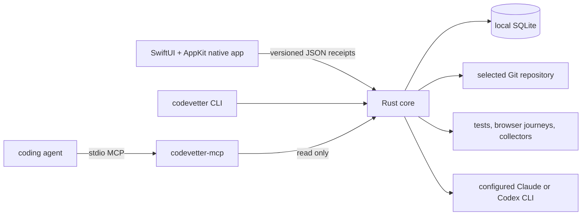

# How CodeVetter works: end-to-end

CodeVetter is a local-first macOS verification system for agent-generated
code. The core loop is task, agent change, executable verification, evidence,
and measurable verdict. There is no CodeVetter-hosted review server.

## The four things to hold in your head

1. The native SwiftUI/AppKit app is the sole desktop UI.
2. The Rust core owns privileged execution, SQLite, verdicts, and versioned
   receipts.
3. The `codevetter` CLI and native UI can execute explicitly authorized work;
   repository-scoped MCP is read-only.
4. Structural graph and history are navigation evidence, not proof that code
   works.

## Components

### Native app

`apps/macos` contains the Xcode workspace, minimal app shell, feature Swift
package, assets, and XCUITest targets. The UI presents six primary workspaces:
Usage, Repo Unpack, Review, Testing, Performance, and Settings, plus the bounded
Runs evidence ledger.

Swift does not open SQLite, traverse Git history, rank findings, or reinterpret
verdicts. It starts supervised companion commands and decodes exact Rust-owned
receipt schemas.

### Rust core

`crates/codevetter-core` contains:

- deterministic verification and review commands;
- CLI and MCP binaries;
- SQLite schema, migrations, and queries;
- graph, history, repository scanning, and exports;
- performance, browser, watcher, and collector supervision;
- provider usage and availability normalization.

The core is platform-neutral and contains no Tauri, Wry, WebKit, GTK, window,
or WebView runtime. A small internal transport facade preserves source-level
command annotations while old module names are retired gradually; it has no UI
or production window authority.

### SQLite

One local CodeVetter database stores reviews, findings, repository snapshots,
graph/history indexes, usage evidence, QA runs, and bounded preferences. The
native replacement retains `com.codevetter.desktop`, preserving the existing
Application Support location. See [Data model](data-model.md).

### CLI and MCP

The `codevetter` CLI is the machine-readable execution surface. The native
app invokes the same commands rather than recreating policy in Swift.

`codevetter-mcp` is an opt-in stdio server scoped to one explicitly enabled
repository. It can project bounded graph, history, archaeology, preparation,
capability, and persisted-verification evidence. It cannot write files, call
providers, execute verification, refresh indexes, or listen on the network.
See [MCP sidecar](mcp-sidecar.md).

## Verification flow

1. The operator selects a repository, exact change, task, and acceptance
   criteria.
2. Rust resolves a bounded evidence scope and reports gaps before execution.
3. The operator explicitly authorizes the UI or CLI to run admitted checks.
4. Rust supervises repository tests, browser journeys, performance workloads,
   collectors, or configured agent CLIs with timeouts and bounded output.
5. Every result is tied to repository and revision identity.
6. Rust builds the canonical receipt and verdict. Missing evidence remains
   unavailable; it is never converted to zero or pass.
7. The native app renders the receipt, while CLI exports the same machine
   contract and MCP may inspect only persisted read-only projections.

Review can request independent sequential Claude and Codex passes over the same
immutable target. Neither reviewer sees the other's output. Rust reconciles
only exact source-qualified identities and preserves unique or conflicting
findings.

The fix loop uses an app-owned detached worktree. It never commits, merges,
pushes, or modifies the selected checkout. Re-review labels each selected
finding fixed, reproduced, or unchecked from executable evidence.

## Context is not proof

The structural graph and release-history index can show that a symbol exists, a
path connects two nodes, or a commit changed a file. They cannot establish
runtime correctness. Review prompts receive this context with revision,
freshness, trust, and limitation metadata.

The same distinction applies to external tools: Gitleaks, cargo-audit,
cargo-llvm-cov, ccusage, Playwright, Git, and provider CLIs remain separately
identified evidence sources. Tool presence alone is not a passing claim.

## Security and privacy boundaries

- User-selected repositories are the only file scope granted to the app.
- Credentials are excluded from non-secret settings and machine receipts.
- Raw source leaves the Mac only when the operator invokes a configured
  provider or an admitted network journey.
- MCP is local stdio and read-only.
- Watcher execution and GitHub status posting require explicit foreground
  consent; credentials are resolved ephemerally.
- Destructive retention actions are unavailable to agents and require a
  separate UI or CLI confirmation.

## Distribution

The production application is a sandboxed, hardened native macOS bundle. It
ships the exact `codevetter`, `codevetter-mcp`, and ccusage companions and
uses Sparkle for updates.

Publication fails closed unless the exact archive passes Developer ID signing,
Apple notarization and stapling, Sparkle EdDSA and appcast identity, Gatekeeper,
installed upgrade, stable-record continuity, native relaunch, and rollback.
The old signed Tauri archive is retained only as that upgrade/rollback fixture;
no WebView application is shipped.

## Where to go next

- [Architecture overview](overview.md)
- [IPC and commands](ipc-and-commands.md)
- [Review pipeline](review-pipeline.md)
- [Graph and history](graph-and-history.md)
- [Native Rust boundary](native-rust-boundary.md)
- [Capability glossary](../product/capabilities.md)
- [Release pipeline](../operations/release-pipeline.md)
