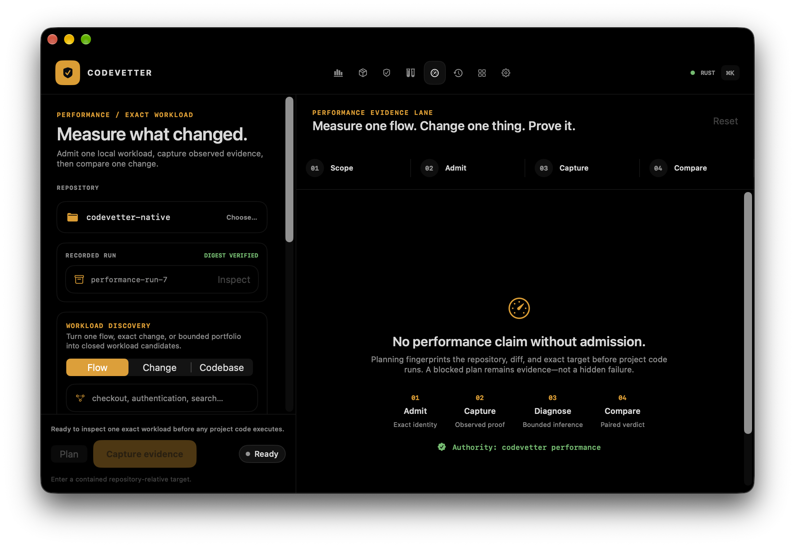

# Native macOS package qualification

## Verdict

The native packaging mechanism is locally qualified. It is not production
signed, notarized, installed, update-enabled, or approved to replace Tauri.

The final checked package-only run staged a fresh copy at
`artifacts/native-package/qualification-5r7JG4/CodeVetter.app`; the stable
reproduction command is:

```bash
pnpm native:build:release
pnpm native:package:qualify
```

The repository-owned `pnpm native:build:release` command pins XcodeBuildMCP,
arm64, isolated DerivedData, and coverage-off settings at the workspace command
boundary so Swift package products cannot silently retain test instrumentation.
Its checked default invocation completed in 34.0 seconds, produced a
5,667,872-byte coverage-free host, and `pnpm native:package:qualify` consumes
that default output. The run never
opened, changed, stopped, or replaced
`/Applications/CodeVetter.app`.

## Package evidence

| Check | Observed result |
| --- | --- |
| Bundle | `CodeVetter.app`, version 1.11.0, build 11100, arm64 |
| Preview identity | `com.codevetter.desktop.native-preview` |
| Host executable | `CodeVetterNative`, distinct from lowercase `codevetter` on case-insensitive macOS |
| Release authority | Hardened Runtime, no App Sandbox |
| Embedded updater | Sparkle 2.9.6; no `SUFeedURL`; no `SUPublicEDKey`; updater disabled |
| Companions | `codevetter` 43,853,088 bytes; `codevetter-mcp` 7,506,752 bytes; `ccusage` 3,178,064 bytes |
| Runtime capsule | 32 non-test ESM modules under `Contents/Resources/runtime-failure-capsule` |
| Bundle size | 62,060 KiB after companions and Sparkle |
| ZIP | 17,427,235 bytes; SHA-256 `d5dc651c85ac064b932e233bb96d11e18e3f332a8c30693cae1866e7548f98ea` |
| DMG | 20,034,510 bytes; SHA-256 `63f5ad84ce3239b4b9c45ac67ceef6a6c677c498bcbf0c7223bf07f79584fb8a` |
| Deep signature check | Passed after preserving framework symlinks and signing nested Sparkle components before the outer app |
| Release instrumentation | Shipped host contains no LLVM coverage/profile sections, is postprocessed and stripped, and retains a matching adjacent 34,144 KiB dSYM in the isolated build output; the package gate rejects coverage-instrumented hosts |
| Smoke checks | CLI help exit 0; MCP bounded usage exit 1; ccusage 20.0.20 exit 0; runtime bounded usage receipt exit 2 |
| MCP contract qualification | Byte-identical packaged sidecar (SHA-256 `0f000679f481ae313f77fdead93ae79cb00e43f75389f5f221b92c4ca517aee1`); 50 starts and 200 workload rounds; 28 unique tools; strict schemas; read-only annotations; no TCP listeners; 8.52 ms cold-initialize p95, 30.11 MiB ending RSS, 2.64 MiB second-half growth, and all repository budgets passed |
| Fix parity | Packaged CLI exposes confirmed `execute`, `inspect`, and confirmed `discard` operations |
| Repo Unpack parity | Packaged CLI exposes `scan`, `compare`, `export`, `query`, and internal supervised `query-worker`; a package gate requires graph/history domain, rich mode, target, direction, depth, and causal-selector flags |
| Ops boundary | Packaged CLI returns `codevetter.ops-status/v1` from isolated app data, exposes the exact secret-exclusion set, and leaves the fresh directory empty |
| Earlier packaged launch | Five clean, accessibility-confirmed Performance launches; 117,424 KiB median settled process-tree RSS |

The generated receipt contains SHA-256 identities for each companion and both
archives. It remains under ignored `artifacts/` because it records one local
run directory; this checked note preserves the stable claim and reproduction
boundary.

## Failures caught by the gate

The qualifier found and fixed three release-real defects before acceptance:

1. `CodeVetter` and `codevetter` collide on the default case-insensitive
   filesystem. The visible bundle remains CodeVetter while the host executable
   is now `CodeVetterNative`.
2. Node recursive copy rewrote Sparkle's relative framework symlinks to source
   absolute paths, invalidating its seal. Staging now uses `ditto`.
3. The host initially lacked `@executable_path/../Frameworks`, then ad-hoc
   Sparkle embedding hit Library Validation because ad-hoc code has no shared
   Team ID. The Release build now has the correct runpath. The artifact-scoped
   ad-hoc preview disables Library Validation so local launch can be tested.
   Debug uses the same local-only exception for XCUITest; the checked-in Release
   entitlement remains empty.

The last exception is not a shipping design. Production must sign the host,
Sparkle components, and companions with one Developer ID identity and prove
Library Validation remains enabled.

## Visual inspection



The earlier launch-qualified staged package rendered the intended true-black workbench, amber
evidence hierarchy, native toolbar, split-pane workflow, explicit admission
empty state, and green Rust authority marker. The screenshot is 2184 x 1504;
its SHA-256 is
`855d176aa5d2cb4432404dc997168b58479f3302f9c923ae6ff25f1a0f4e1ec3`.
The current-source `qualification-5r7JG4` rerun rebuilt the Release host after
the isolated fix-attempt engine, native Review receipt, native Repo Unpack scan,
comparison, and export boundaries, persistent macOS repository permission, and
explicit watcher Retry were added. It additionally includes the compact
repository-query worker, native explain/impact/path/causal-trace desk, and the
stdin-first cancellation repair qualified by the 80-test Swift package lane.
It also contains the final true-black hierarchy correction: the canvas and
chrome remain black while working planes use only 1--4% near-black separation,
and the standalone Review proof-map and intent captures now own an opaque
canvas. Both search-only and rich repository-query states are independently
reproducible in the 33-state owner packet, alongside current-tree light
counterparts for Review, Testing, Performance, Runs, history recovery, memory
inspection, Agent Island configuration, and read-only Ops status. Agent Island
configuration now has dark and light evidence
with all 12 shared preferences, a non-activating preview, and the live-config /
pending-runtime boundary. The query worker's shutdown path now
closes stdin, grants a bounded 200 ms termination grace, and uses a final kill
only for its exclusively owned read-only child; its cancellation test requires
settlement within one second.
At the supported 980-point minimum, compact navigation now keeps the selected
workspace label visible while inactive destinations remain icon-only. The
Testing and Performance dark/light rerenders fit without clipping or content
movement, closing the one P2 orientation finding from the 33-state pixel audit;
no P0 or P1 visual finding remains in the packet.
The native Ops desk and `codevetter ops` now share the bounded
`codevetter.ops-status/v1` receipt. It exposes fixed-window local aggregates
and configuration presence while excluding credentials, webhook URLs, provider
calls, webhook sends, writes, and agent/MCP authority.
The retained Tauri startup path now attempts the sanitized WebView-local rubric
handoff until Rust owns a canonical preference. Existing canonical state wins,
invalid legacy state writes nothing, and isolated frontend/Rust tests cover the
bridge; installed custom-pack qualification remains open.
The same Release candidate separates bright action-fill amber from an
appearance-aware evidence foreground and gives success, warning, and failure
states darker light-mode counterparts. The checked semantic tokens meet a
4.5:1 normal-text contrast floor against true black, the warm light canvas, and
white evidence planes.
Its embedded Rust-generated glossary also keeps external collectors honest:
collector execution is available in the CLI, the native workflow remains
planned, and agent authority is unavailable. A deterministic capabilities
render binds that projection to the 33-state owner packet.

The exact candidate also applies Release-only fat LTO with one Rust codegen
unit and native postprocessing. Relative to `qualification-60JfB0`, the bundle
is 31.6% smaller, the host 77.0% smaller, the CLI 14.6% smaller, the MCP
sidecar 27.5% smaller, the ZIP 18.8% smaller, and the DMG 21.9% smaller. The
retained Tauri comparison is now a 62.4% smaller bundle and a 92.4% smaller
host. This costs materially slower Release linking: the measured CLI and MCP
links took 200 and 159 seconds, while Debug and test profiles remain
unchanged. The exact receipt is
`evidence/performance/native-release-optimization.json`.
The native Usage desk also gained aligned
1w, 30d, 90d, and all-time windows for its chart, totals, models, and sessions,
plus a separate indexed Devin projection that follows the selected window.
Its Usage settings also expose the bounded Rust history-root receipt: selected
Codex session directories normalize to their canonical home, unrelated
directories fail closed, and removal affects future discovery without reading
or deleting transcripts. The new dark and light owner captures caught an
appearance-dependent system button-label truncation; the final text-only amber
action style renders the complete label in both appearances.
Native Review now routes through the correlated verification-command,
progress-v2, request-scoped cancellation, and terminal-receipt application
service. The qualifier then repeated deep-signature, archive, companion, and
rich repository-query CLI smokes. Its separately invoked exact packaged
sidecar smoke proved the 28-tool contract, including read-only persisted
local-check receipt access, without opening a listener. It deliberately did
not launch the app on the operator's active desktop. The earlier matched Release
harness launched `qualification-jUbwnc` five times and confirmed the Performance
surface before every settled sample; the current package-only run does not
supersede that foreground launch evidence or the inspected screenshot.

The exact current package also contains the read-only Memories parity slice.
Native Settings and `codevetter memories` consume the same bounded Rust receipt;
only existing sources are returned, source identities are opaque, absolute
paths are omitted, and secret-like content and Git-diff lines are redacted
heuristically. Memory editing and agent/MCP content authority remain absent.
It also contains the Agent Island configuration slice: native UI and CLI share
the retained helper's exact 12 non-secret preferences, while helper launch,
live session presentation, speech execution, and provider actions remain
incumbent authority and off by default.

## Validation receipts

- The feature-complete Rust lane passed 1,105 tests with 31 explicitly ignored,
  zero failures, strict Clippy, and `cargo fmt --check`.
- The native lane passed 80 Swift tests and a fresh Debug application build.
- The retained frontend passed 680 unit tests with one intentional skip, its
  separate 20-scenario live warm-verification qualification, package-scoped
  TypeScript, and a production Vite build.
- Biome lint, Knip, changed-file complexity, import cycles, clone-regression,
  capability sync, docs, package tests (6), release-inspector tests (7), and
  the 33-state owner-gallery manifest-sync test passed.
- The cleanup audit correctly requires manual review because dependency files
  are part of the migration. Manual inspection found no new direct npm package;
  the Cargo change is Release-profile configuration, the feature package has no
  external dependency, and the workspace lock pins the one native framework,
  Sparkle 2.9.6. The npm audit has one low-severity transitive
  `postcss-selector-parser` advisory and no moderate, high, or critical finding.
  No dependency upgrade was applied during this qualification.

## Storage observation

The latest read-only measurement after the complete background regression run
reports 130 GiB available on the 926 GiB data volume. Ignored local artifacts
are about 6.4 GiB, the Rust target is about 46 GiB, and the machine-wide Xcode
DerivedData directory is about 11 GiB. The earlier bounded workspace report
classified the large findings as review-required and estimated zero
automatically safe releasable bytes. No cleanup or deletion was performed.

## Remaining release gates

The read-only
[native release-readiness receipt](native-release-readiness-2026-09-02.md)
now machine-checks these boundaries. The current preview passes 7 of 16 checks
and remains blocked by nine exact production gates:

- production bundle identifier transfer and owner approval;
- Developer ID signing of the host and companions with one team;
- Library Validation in the production-signed application;
- Apple notarization, stapling, and Gatekeeper acceptance;
- real HTTPS appcast and canonical 32-byte Sparkle EdDSA public key;
- installed incumbent-to-native update, data migration, relaunch, rollback, and
  updater-channel proof;
- workload-execution, energy, and long-session comparison beyond the qualified
  startup-parity, settled-RSS, and package-footprint claims;
- complete retained feature, accessibility, keyboard, no-confidence, and owner
  visual acceptance.

No release, deployment, installation, production signing, notarization, or
ticket closure was performed.
