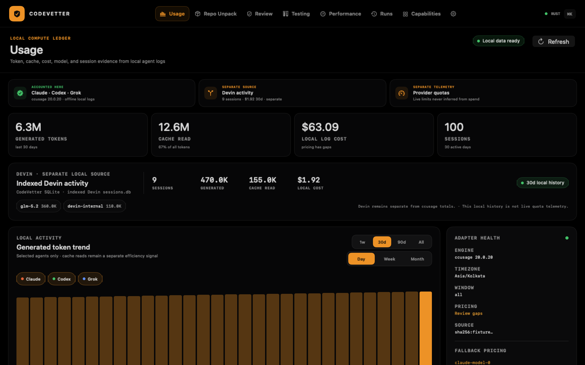

# Native Usage time-window qualification

Date: 2026-09-01
Surface: native macOS Usage workspace

## Result

The native Usage workspace now matches the incumbent 1w, 30d, 90d, and
all-time windows through the Rust-owned `LocalUsageReport` contract.
One selected window consistently scopes the activity chart, generated/cache/
cost totals, model aggregation, active-day count, and recent sessions. The 1w
window selects daily granularity so a weekly bucket cannot hide the boundary.

The same receipt now projects indexed Devin sessions, generated/cache tokens,
cost, and model rows for each range. The native Devin desk follows the selected
window while remaining a visibly separate SQLite source, and `codevetter usage`
prints the same bounded window summaries. Devin is never folded into ccusage.

The range projection remains local and read-only. It does not query provider
quotas or turn spend telemetry into verification evidence.

## Executable proof

- Rust Devin projection contract: 1 passed, 0 failed;
- Swift time-boundary and Devin-window projection tests: passed inside the
  complete 63-test package suite, with 0 failures and 0 skipped;
- complete Rust library: 1,042 passed, 0 failed, 31 ignored; CLI: 28 passed;
  MCP integration: 3 passed;
- native macOS Debug and Release builds: passed through XcodeBuildMCP;
- fresh Release host and local package qualifier: passed at
  `artifacts/native-package/qualification-2qmH4t/CodeVetter.app`;
- docs, generated capability registry, strict Swift formatting, and diff
  whitespace checks: passed.

The boundary test fixes the reference time and checks exact 1w/30d/90d/all
totals, overlapping weekly/monthly buckets, session timestamps, missing
timestamps, and agent selection. The large-report render gate uses 365 valid
rolling dates and 100 sessions so the default 30d view cannot pass as an empty
chart.

## Visual evidence

The current 2560 x 1600 true-black render has SHA-256
`3422bf1a081a28e389867aa6e1262669b59bd2c01947d6d0586ca2425f46a57d`.
It shows 30 populated daily buckets, coherent 30d ccusage metric details, the
compact window and granularity controls, a separate 30d Devin projection, the
quota boundary, and the Rust adapter-health inspector.

## Remaining boundary

Live provider quota telemetry remains separate credential-sensitive parity
work. The previously exported Tauri session scorecard has no mounted caller and
is not a retained visible surface. This receipt does not authorize installation,
production signing, notarization, update cutover, Tauri retirement, or ticket
closure.
