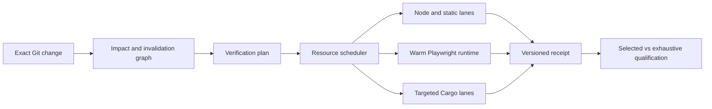

## Context

See `proposal.md` for motivation. CodeVetter currently has three relevant but disconnected paths: broad package scripts, a Playwright suite fixed at one worker, and `verify changed` backed by one warm server/browser but configured for only `shell-navigation`. The existing warm runtime already enforces fresh contexts, bounded parallelism, explicit process ownership, additive selection hints, and fail-closed evidence. The new workflow must reuse those boundaries, preserve the current dirty UI change, and avoid another runtime or production dependency.

## Goals / Non-Goals

**Goals:**

- Give CodeVetter one exact changed-verification command with focused and exhaustive modes.
- Reduce warm wall time and CPU/RSS cost per verified change while preserving verdict agreement.
- Parallelize independent I/O waits without overlapping CPU-heavy work or shared mutable state unsafely.
- Make blast-radius evidence and interaction-stage timing actionable and auditable.
- Produce a CodeVetter dogfood corpus and receipts that can later inform cross-project design.
- Reach a measured 10x improvement for the representative warm UI changed path, targeting p95 at or below 1.5 seconds against the checked 16.3-second focused Playwright baseline.

**Non-Goals:**

- Reimplement Playwright, Chromium protocols, locators, auto-waiting, tracing, or assertions.
- Generalize configuration or publish a cross-project SDK in this change.
- Make AI-generated impact edges authoritative.
- Add remote workers, cloud caches, cross-browser coverage, or release bypasses.
- Split the Rust crate before profiling proves that architectural work is necessary.

## Decisions

### 1. Add a repository planner above existing executors

A small Node entrypoint will resolve the exact Git change, load a checked CodeVetter lane map, combine authoritative path rules with qualified additive impact hints, and emit a stable execution plan. It will invoke existing Node, Playwright, Cargo, OpenSpec, and `verify changed` commands rather than embed their test logic.

The warm daemon remains browser-only and continues to avoid Cargo, Tauri, and production builds. The planner owns cross-lane scheduling, so CPU-heavy compilation cannot accidentally overlap browser qualification unless the active profile explicitly has capacity.

Alternatives considered:

- Extending Playwright Test to launch Cargo and Node lanes couples unrelated runners and cannot own the whole resource envelope.
- Extending `verifyd` to compile Rust violates its warm-runtime contract and makes browser verification depend on cold native builds.
- Shell-only orchestration is difficult to test, cannot emit a typed receipt reliably, and encourages unsafe process handling.

### 2. Treat impact evidence as a safety lattice

Checked path-to-capability and path-to-lane rules are authoritative. Current exact graph, import, coverage, and historical test-impact evidence may add or rank work. Any invalid, stale, truncated, unmatched, or shared-infrastructure input widens the plan. A plan can omit a lane only when every changed path and invalidation boundary has current complete coverage.

The first corpus will include representative frontend leaf changes, shared shell changes, test/config changes, Rust leaf changes, IPC boundary changes, lockfile changes, and deliberately stale impact evidence. Each case records the expected lanes and also runs exhaustive verification to measure selector recall.

Alternatives considered:

- Caller counts alone are too syntactic to prove test coverage.
- Learned selection without an exhaustive backstop can optimize away the only failing check.
- Always running every lane preserves confidence but does not solve the feedback-cost problem.

### 3. Schedule resource vectors, not worker counts

Each lane and browser scenario declares a bounded resource vector: CPU-intensive slots, estimated memory, browser contexts, target-origin request tokens, and optional exclusive state identities. Profiles define total budgets. Work starts only when every declared resource is available and releases reservations in `finally` paths.

Within the warm browser runtime, independent fresh contexts may make progress while another waits on its application or declared network condition. The result array remains scenario-ordered, while the receipt reports actual queue and execution order.

Alternatives considered:

- A fixed higher Playwright worker count ignores bandwidth, memory, and shared-state contention.
- Global serialization is predictable but leaves network and application wait time idle.
- Live adaptive control without checked maximums is harder to reproduce; this slice uses deterministic profiles and measured resource declarations first.

The initial same-suite comparison measured 16.3 seconds with one worker and 9.8 seconds with two workers, a 1.66x improvement. That result proves bounded parallelism is useful, but also proves it cannot produce the required 10x feedback loop by itself. The target therefore composes three reductions: avoid repeated server/browser startup through the warm daemon, avoid irrelevant scenarios through qualified invalidation, and overlap only independent application or network waits. Worker count is a secondary control, not the headline mechanism.

### 4. Measure click-to-settle before changing interactions

Interaction evidence will separate the public Playwright actionability-and-dispatch operation, declared application or response completion, assertion, and cleanup. Playwright does not expose a reliable public boundary between actionability completion and input dispatch, so the receipt will not invent one. Existing fixed waits become candidates only when their measured stage can be replaced by a deterministic condition. Direct CDP input or context reuse is experimental unless evidence shows this combined operation dominates and an alternative preserves isolation.

Alternatives considered:

- Lowering timeouts makes slow applications fail sooner but does not make successful interactions faster.
- Skipping actionability checks reduces reliability.
- Waiting for generic network idleness makes behavior depend on unrelated background requests; scenarios should declare the visible state or specific response that proves completion.

### 5. Gate optimization on cost and correctness receipts

The benchmark records both selected and exhaustive outcomes plus wall time, process CPU time, peak RSS, target bytes, process/context peaks, queue time, cache identity, and interaction stages. Initial budgets will be derived from a resource-capped baseline rather than guessed. A selector or concurrency profile cannot become the default unless the corpus has complete verdict agreement and no leaked processes or contexts.

For the representative UI leaf-change class, promotion additionally requires warm p95 at or below 1.5 seconds and at least a 10x ratio against the checked 16.3-second focused Playwright baseline. The target is intentionally scoped: it is not a promise that cold native builds, exhaustive runs, or every repository change become ten times faster.

### 6. Run measured research spikes behind the correctness gate

The implementation may compare dependency-aware scenario slicing, persistent page-state checkpoints, protocol-level observation, response virtualization, and other browser-runtime ideas. Each experiment must use the same corpus case and receipt contract, remain opt-in, and preserve Playwright-equivalent actionability, fresh mutable state, bounded artifacts, and failure behavior before it can influence the qualified path.

This separates research from product claims: a faster click primitive is not valuable if setup or selection dominates, and an apparently instant scenario is invalid if it starts after the behavior under test or hides a regression.

## Risks / Trade-offs

- [The corpus overfits current changes] -> Include multiple change classes and keep periodic exhaustive comparison as an ongoing gate.
- [Static mappings become maintenance burden] -> Emit unmatched paths clearly and fail toward broader verification; use observed coverage only as additive evidence.
- [Parallel contexts overload the Vite target] -> Reserve origin tokens and qualify each profile with p95 latency and failure-rate measurements.
- [Resource estimates drift] -> Include profile and machine identities in receipts and reject results outside declared bounds.
- [Focused verification creates false confidence] -> Preserve mandatory smoke, broad fallback, explicit exhaustive mode, and selected-versus-exhaustive verdict qualification.
- [The planner itself adds complexity] -> Keep it repository-local, model-free, dependency-free, and limited to composing existing commands.
- [A 10x claim overfits one favorable path] -> State the exact UI leaf-change corpus, baseline, p95 sample, assertions, and non-claims in every promoted receipt.

## Migration Plan

1. Add receipt contracts and a resource-capped baseline command without changing existing defaults.
2. Add the representative change corpus and exhaustive comparison gate.
3. Add deterministic lane selection and keep it opt-in until the corpus passes.
4. Add resource scheduling and interaction-stage timings behind the opt-in profile.
5. Promote the qualified interactive profile to the documented local default while preserving explicit exhaustive commands.
6. Roll back by removing the new entrypoint from the default workflow; all underlying commands and existing `verify changed` behavior remain available.
