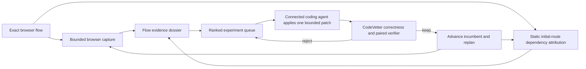

## Context

See [proposal.md](proposal.md) for motivation. The current autonomous
performance lab chooses one next action across the repository inventory and
stops when the first source-bounded candidate becomes eligible. Qualified Vite
browser capture intentionally disables repository configuration and package
scripts, while the existing optimization campaign expects an external agent to
invent each hypothesis.

The design must preserve those safety boundaries while making CodeVetter own
substantially more of the investigation and iteration. The target product loop
is one exact local browser flow, not a repository-wide promise and not an
embedded coding model.

## Goals / Non-Goals

**Goals:**

- Gather a bounded breadth of evidence for one selected browser flow before
  proposing an edit.
- Detect initial-route dependency and supported Vite chunk-rule problems that a
  config-disabled development trace cannot observe directly.
- Give an external coding agent a deterministic sequence of bounded experiments
  and automatically govern rejection, promotion, replanning, and stopping.
- Preserve exact snapshot identity, evidence/inference separation, correctness
  authority, local-only execution, and compact machine output.

**Non-Goals:**

- Executing repository package scripts or arbitrary Vite configuration inside
  CodeVetter.
- Letting CodeVetter generate or apply source patches.
- Combining several speculative edits into one unverifiable candidate.
- Claiming production impact, application-wide optimality, or support for every
  bundler.
- Adding a desktop UI, hosted service, production dependency, or paid model.

## Decisions

### 1. Plan breadth-first for one flow, then experiment sequentially

The new planner accepts one statically qualified Playwright flow and an
experiment budget. It completes the already-supported browser capture and
projects the capture's loading, main-thread, memory, React, action, and source
evidence into one flow dossier. It then runs bounded static dependency
attribution for the same entry route before returning any edit action.

The planner does not measure every discovered repository flow. That would spend
the budget broadly and recreate the current Anime List failure mode. Flow
selection is explicit or comes from the caller's verification failure.

Experiments remain sequential because independent attribution and rollback are
more valuable than applying a batch of interacting guesses. "Maximum juice at
once" means maximizing evidence and hypothesis coverage in the first plan, not
shipping several unverified edits together.

The alternative—changing repository-level action priority so browser flows
always precede benchmarks—was rejected. It would merely reverse which valid
signal can starve another and would still stop at the first finding.

### 2. Build dependency attribution from inert evidence

The first Vite implementation combines three read-only inputs:

1. literal import and lazy-import edges reachable from the selected route,
   retaining multiline declarations and separate static/deferred importer sets;
2. repository/package-manager resolution and real paths for those imports;
3. initial resources and repository modules observed by the qualified browser
   capture.

When present, an explicitly declared build directory can add HTML/chunk import
closure and byte evidence. Existing artifact content is hashed, but it is
`unverified` unless a separate caller-owned build receipt binds it to the same
source snapshot. An unattested artifact can prioritize an experiment but can
never confirm one.

When independently trusted baseline and candidate artifacts are both bound to
their exact source snapshots, CodeVetter compares the closed initial-route gzip
set as the experiment's primary metric. Correctness remains mandatory, and the
paired browser run must be stable and show no protected timing or memory
regression. CodeVetter does not produce the build attestation itself: a
repository Vite build evaluates arbitrary code and may load environment files.

The Vite-config detector statically recognizes only a closed expression subset
for `manualChunks`: literal package tests, `includes`, `startsWith`, exact
equality, boolean composition, and literal returned chunk labels. It never
imports or evaluates `vite.config.*`. It tests rules in first-return order and
reports surprising matches such as deferred `nuqs` or Radix modules matching a
broad `react-dom` peer-path substring rule. The import graph traverses bounded
deferred route modules separately so it can distinguish initially reachable
packages from modules that a manual chunk rule may accidentally pull forward.
Unsupported syntax is retained as an explicit coverage gap.

Development loading verification uses the selected navigation action's complete
response cohort when that action has zero failed resources. Requests started by
later diagnostic evaluation, analytics, or teardown actions cannot change that
cohort. If the navigation cohort is incomplete, the verifier falls back to the
whole-capture completed-response inventory and requires an identical failed
resource boundary across every paired sample.

Executing the repository build or Vite configuration was rejected because it
is arbitrary code and can read secrets, spawn processes, mutate files, or make
network calls. A future sandbox adapter may earn that capability separately.

### 3. Normalize evidence into cause groups before ranking

Each detector emits observations with an evidence family, source relationship,
affected initial bytes when known, snapshot identity, completeness, and
provenance. The planner groups observations by a stable cause key derived from
the source relationship and mechanism rather than by line number alone.

The planner also calls the existing performance review-evidence selector with
the exact current changed-file inventory. A matching digest-bound receipt or
repository-owned source binding becomes supporting evidence on that source's
experiment and can supply its correctness scope. Review evidence does not create
a performance cause and does not outrank measured bytes or runtime share. Stale
accepted evidence remains a reverification plan, never current speedup proof.

One experiment contains:

- stable experiment and cause identities;
- observed evidence references;
- inferred hypothesis and confidence basis;
- one bounded set of allowed files;
- predicted primary metric and direction;
- correctness and paired-performance scopes;
- rejection conditions and protected secondary metrics;
- prerequisites, limitations, and verification cost.

Ranking is lexicographic rather than an opaque score:

1. exactness and completeness of evidence;
2. measured initial-route byte effect, then measured runtime share;
3. uniqueness of source attribution;
4. smaller edit boundary and lower verification cost;
5. stable identity as the deterministic tie-breaker.

This would have placed Anime List's measured initial-route chunk contamination
ahead of a low-share recommendation allocation hotspot while preserving both in
the queue.

### 4. Compose the queue with the existing campaign ledger

The queue is stored append-only beside an optimization campaign and bound to
the campaign manifest, selected flow, incumbent snapshot, evidence digests, and
planner version. Queue entries are never silently rewritten. A rejected entry
records its result; a kept candidate creates a new incumbent generation and a
new plan because prior byte and runtime estimates may now be stale.

The public protocol adds three high-level operations over existing primitives:

- `plan_browser_optimization_loop`: capture the flow and create the queue;
- `get_next_browser_experiment`: return one untried bounded experiment;
- `evaluate_browser_experiment`: run correctness/screen/promotion, record the
  decision, and return the next action.

CLI and repository-scoped MCP call the same service. The existing low-level
capture, campaign, and verifier operations remain available for debugging and
reproducibility.

### 5. Let the host agent mutate; keep authority in CodeVetter

CodeVetter never accepts a patch, model prompt, or shell command. The returned
experiment is a work order for the connected coding agent. Before evaluation,
CodeVetter verifies that only allowed files changed and that protected workload,
configuration, ledger, and evidence files did not.

For a rejection, CodeVetter returns `restore_incumbent` with the required
incumbent identity. The host must use a disposable worktree or another
recoverable checkout mechanism. CodeVetter verifies restoration before serving
the next experiment; it does not run reset or checkout itself.

This keeps the product more than a skill: the agent supplies creativity and
edits, but cannot fabricate evidence, skip a failed verifier, promote an
unstable result, repeat a rejected cause, or silently expand scope.

### 6. Budget every loop and report coverage, not certainty

The manifest bounds evidence passes, queued experiments, elapsed local time,
consecutive crashes, consecutive non-improvements, artifact bytes, and paired
samples. Browser networking remains loopback-only. Every terminal state reports
verified wins, rejected experiments, remaining queue entries, unavailable
evidence families, unsupported config syntax, and local resource usage.

The final state is `queue_exhausted`, `plateau`, `budget_exhausted`,
`operational_failure`, or `blocked_on_host`. None means the application is
globally optimal.

## Risks / Trade-offs

- **Static import analysis can miss dynamic framework behavior** → Merge it
  with captured module/resource evidence and label incomplete closures.
- **Multiline imports or lazy routes can inflate the source boundary** → Parse
  multiline declarations and preserve static versus deferred importers before
  producing the sealed allowed-file set.
- **Later analytics failures can hide stable navigation loading** → Prefer the
  complete zero-failure navigation action cohort and fail closed when it is not
  available.
- **Existing build artifacts can be stale** → Hash and label them unverified;
  require paired current/incumbent evidence for promotion.
- **Recognizing only a Vite-config subset limits coverage** → Fail closed per
  rule and expose unsupported syntax instead of evaluating arbitrary code.
- **A large byte opportunity may not improve user timing** → Rank bytes as an
  opportunity, then require the declared browser metrics and correctness gates.
- **Replanning after every keep costs local compute** → Reuse compatible
  evidence, bound passes, and stop on plateau; never use cloud execution.
- **The external agent can restore the wrong checkout** → Verify exact incumbent
  revision and source snapshot before advancing the queue.
- **The queue can encourage benchmark overfitting** → Protect evaluator files,
  retain holdout correctness scopes, and report the tested flow boundary.

## Migration Plan

The capability is opt-in and additive. First ship the planner and read-only
queue behind repository-local CLI/MCP operations, qualify it against fixtures
and Anime List, then connect automatic campaign advancement. Existing campaign
manifests and ledgers remain valid and do not gain implicit browser planning.

Rollback removes the new operations and queue artifacts; existing performance
captures, campaigns, and verifier receipts remain readable.
