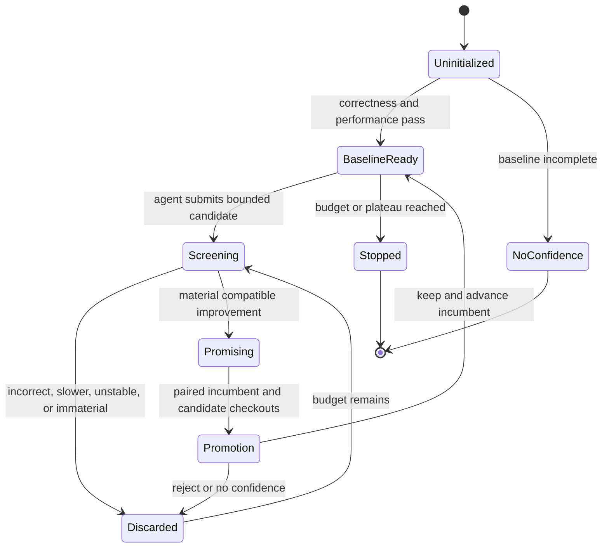

## Context

The runtime tooling already provides exact Node/Vitest/Go execution,
performance capsules, deterministic diagnosis, persistent-session flow capture,
paired verification, redaction, and Git identity. Those operations are
single-attempt primitives: they do not retain an incumbent, compose correctness
with performance, or tell an agent whether to continue. See `proposal.md` and
the `autonomous-optimization-campaigns` specification for the new behavior.

## Goals / Non-Goals

**Goals:**

- Make repeated optimization resumable, attributable, and safe enough for an
  unattended local agent.
- Preserve existing runtime capsules as evidence instead of introducing a
  parallel profiler or benchmark format.
- Give an agent one deterministic next action and one controlling verdict after
  every experiment.
- Keep the campaign portable across repositories that already expose one exact
  supported correctness and performance scope.

**Non-Goals:**

- Generating patches, choosing models, or embedding an autonomous coding agent.
- Arbitrary project commands, dependency installation, Git reset, production
  traffic, cloud execution, or desktop UI.
- Treating one synthetic workload as a universal product optimization.
- Distributed campaigns, multi-agent scheduling, or a public leaderboard.

## Decisions

### 1. Keep strategy in an agent program and authority in CodeVetter

The campaign engine owns immutable scope, workload execution, evidence,
decisions, and history. A small checked-in agent program owns hypothesis
generation and the repeated edit/evaluate loop. This follows autoresearch's
useful separation while keeping CodeVetter materially more than a skill: the
skill cannot fabricate or weaken the evidence used for promotion.

An embedded model-driven optimizer was rejected because it would combine idea
quality with evaluator authority, add cost, and make the first release harder
to reproduce.

### 2. Use an append-only campaign directory

One explicit repository-relative directory contains a canonical manifest,
baseline/incumbent evidence, and newline-delimited experiment records. Each
record includes hashes of its manifest and evidence. New records use atomic
write-and-rename; existing records are never updated in place.

SQLite was rejected for the first slice because the artifacts should remain
inspectable by agents, portable between local checkouts, and independent of the
desktop database. A single mutable JSON document was rejected because it makes
partial writes and history rewriting harder to detect.

### 3. Use a two-stage decision instead of one noisy score

Screening reuses a stored incumbent capsule and a small repeated candidate
sample. It can cheaply discard regressions or mark material movement as
`promising`. Promotion uses independently runnable incumbent and candidate
checkouts through the existing paired interleaved verifier and the configured
shipping sample floor.

The verdict is lexicographic, not a weighted score:

1. exact correctness must pass;
2. workload and manifest identity must match;
3. performance must be mechanically confirmed and materially useful;
4. secondary resource regressions and evidence limitations must remain within
   policy;
5. only promotion-quality evidence can advance the incumbent.

This prevents a large speedup from compensating for wrong behavior, excessive
memory, or insufficient evidence.

### 4. Reuse only closed adapters

Correctness uses the existing exact Node or Go diagnostic runner and imported
browser/Worker receipts where applicable. Performance uses the existing
Node-test, Vitest, and Go-benchmark adapters. The campaign manifest references
structured scopes rather than shell strings. Unsupported repositories fail
closed and can add a project-owned exact adapter later.

An arbitrary command field was rejected because it would turn the MCP into a
remote shell and make containment, reproducibility, and redaction unverifiable.

### 5. Require external checkout isolation for paired promotion

CodeVetter records incumbent and candidate identities but does not reset source
or manufacture a runnable checkout. The calling agent supplies independently
runnable contained checkout paths for paired promotion. A reference agent
program uses recoverable branches or worktrees and never relies on destructive
reset.

Automatically cloning dependencies was rejected because repositories differ
in setup cost, network policy, generated artifacts, and secret requirements.

### 6. Make stop conditions deterministic

The manifest declares maximum experiments, elapsed campaign time, consecutive
non-improvements, and consecutive crashes. Campaign status derives from the
ledger and never depends on an in-memory timer. A process restart therefore
cannot reset the experiment budget.

## Risks / Trade-offs

- **A declared benchmark can be unrepresentative** → require explicit scope,
  record limitations, and support holdout correctness/performance scopes before
  broad claims.
- **Sequential screening can be noisy** → screening never returns `keep`; paired
  promotion remains authoritative.
- **External checkouts may drift or lack dependencies** → bind revision and
  workload hashes, fail closed, and leave setup to the agent program.
- **Append-only artifacts can grow** → bound record count and normalized
  evidence size; retain summaries rather than raw profiles.
- **An agent can optimize against the visible metric** → protect evaluator
  files, preserve correctness scopes, and add holdout flows as a later earned
  extension.
- **Continuous loops can waste local compute** → explicit budgets, plateau and
  crash stops, no production endpoints, and no implicit paid or cloud path.

## Migration Plan

The campaign engine is an opt-in CLI/MCP capability over existing experimental
runtime modules. It requires no migration of desktop or runtime data. Removing
the feature means deleting its generated campaign directory and ceasing to call
the new operations; existing performance capsules and receipts remain valid.
