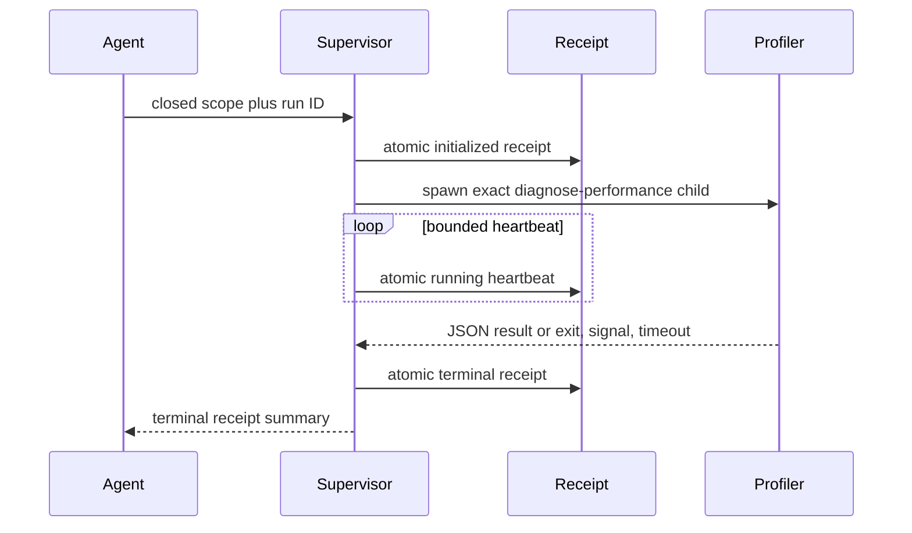

## Context

The current performance CLI owns both orchestration and diagnosis. If that process is killed under memory or CPU pressure, no caller-visible JSON survives. The PostTrainLLM WASM trial demonstrated this failure after completing only part of its declared benchmark matrix. Existing capsules already provide closed adapters, redaction, bounded evidence, and disposable raw profiles; the missing layer is outside that process.

## Goals / Non-Goals

**Goals:**

- Preserve an attempted run's identity before resource-intensive work begins.
- Distinguish workload, runner, timeout, signal, spawn, and invalid-output failures.
- Keep supervision local, dependency-free, bounded, and usable through CLI/MCP.
- Reuse the existing diagnosis implementation rather than duplicating profiling logic.

**Non-Goals:**

- Surviving termination of the supervisor itself or a full machine restart during an atomic write.
- Applying OS-level memory, CPU, or cgroup limits in this slice.
- Resuming a partially completed profile.
- Passing arbitrary benchmark arguments, starting services, or provisioning fixtures.
- Automatically changing source or opening pull requests.

## Decisions

### 1. Put the durability boundary in a separate parent process

The supervisor launches the existing diagnosis CLI as a direct child. The parent writes receipts and owns deadlines; the child retains all current profiling behavior. A kill of the profiling process therefore does not erase the run record.

Alternative considered: add more `try/finally` blocks inside the profiler. Rejected because in-process cleanup cannot execute after SIGKILL, OOM termination, or host enforcement.

### 2. Treat the run directory as append-bounded evidence, not a cache

Each safe run ID gets one new directory under `.codevetter/performance-runs/`. Existing directories are immutable from the start operation. The receipt is replaced atomically through a sibling temporary file; a validated result is written once. Inspection never mutates evidence.

Alternative considered: one shared ledger. Rejected for this slice because per-run ownership makes concurrency, byte bounds, recovery, and manual cleanup easier to audit.

### 3. Validate child output before preserving it as a result

The parent captures bounded stdout/stderr, requires one JSON document, validates the diagnosis schema, writes the result, and records its SHA-256. Invalid or excessive output becomes operational evidence, not a partially trusted capsule.

Alternative considered: store arbitrary stdout and let the agent interpret it. Rejected because this would bypass CodeVetter's evidence contract and could retain secrets or huge logs.

### 4. Heartbeats are evidence of liveness, not progress

The first slice records PID, start time, and last heartbeat. It does not claim an inner phase because the child has no progress protocol yet. Phase-level durable progress can be added later through a closed side channel without changing terminal receipt semantics.

Alternative considered: parse console text for phases. Rejected because log wording is not a stable machine contract.

### 5. Derive one outer deadline from the closed inner policy

The supervisor deadline covers all declared warmup, measurement, metrics, and profile passes plus a fixed bounded orchestration allowance, capped by a supervisor maximum. Tests may inject a smaller deadline through the module API; the public CLI accepts no arbitrary kill timer.

Alternative considered: reuse the per-process timeout directly. Rejected because a complete diagnosis intentionally performs several bounded child executions.

### 6. Keep MCP start-time repository authority

The read-only MCP inspection tool accepts only a run ID. Starting a supervised run remains a CLI operation in the first slice because it writes durable artifacts and can consume material local resources. This preserves the current MCP repository boundary and avoids presenting a read tool as cheap execution.

Alternative considered: expose start through MCP immediately. Rejected until receipt behavior is qualified on real resource-heavy workloads.

## Risks / Trade-offs

- **Supervisor is also killed by machine-wide pressure** → The initialized/running receipt survives, but terminal state may remain stale; later reconciliation is a follow-up capability.
- **Frequent atomic heartbeats cause disk churn** → Use a multi-second default interval, tiny fixed receipt, and stop immediately at terminal state.
- **Diagnosis JSON exceeds its bound** → Finalize `invalid_result`, record truncation, and retain no partial trusted result.
- **Target repository does not ignore `.codevetter`** → Disclose the local artifact path and dirty-state impact; never add ignore rules automatically.
- **Signals differ across platforms** → Test portable exit/signal fields and keep platform-specific termination inside the existing owned-process pattern.

## Migration Plan

The capability is additive. Add contracts and a supervisor module, expose closed CLI start/inspection plus read-only MCP inspection, qualify fixtures, then retry one bounded real workload. Existing direct profiling remains available. Rollback removes the new operations and leaves existing local run directories as inspectable JSON; no production data migration is required.
