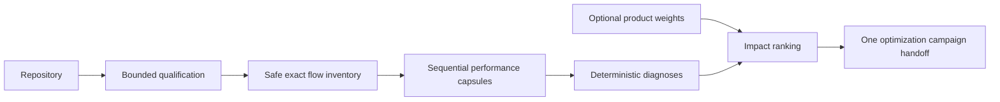

## Context

The runtime tooling already discovers exact performance workloads, captures and
diagnoses one workload, exposes local flow evidence, and governs repeated
candidate evaluation. The missing layer is deterministic portfolio selection
inside one repository. See `proposal.md` for motivation and the
`flow-optimization-campaigns` specification for observable behavior.

## Goals / Non-Goals

**Goals:**

- Compose existing qualification and performance evidence instead of creating
  another profiler or benchmark format.
- Make absolute cost and explicit product context control which flow receives
  optimization effort.
- Produce one bounded handoff to the existing optimization-campaign engine.
- Remain useful without production telemetry while making that missing context
  impossible to overlook.

**Non-Goals:**

- Production frequency collection, distributed traces, or App Health ingestion.
- Generating or applying source patches.
- Cross-repository ranking in the first slice.
- Running generic tests, browser suites, networked workloads, or arbitrary
  commands as automatic flow candidates.

## Decisions

### 1. Treat qualification candidates as the discovery inventory

The planner reuses `runtime-qualification/v1` and admits only candidates with
direct timing evidence, a supported performance adapter, and no unsafe safety
flags. `local_service_signal` remains eligible for Node and Vitest because the
closed runtime adapter and flow capture intentionally support loopback HTTP;
remote network, database, browser, integration, and required-argument signals
remain excluded. This keeps automatic discovery bounded and auditable. A new
repository-wide AST or framework route scanner was rejected because it would
discover many non-runnable flows and duplicate the qualification engine.

### 2. Screen sequentially through existing performance capsules

Each admitted candidate is profiled with one shared bounded sample policy. The
planner consumes the resulting diagnosis and explicit console or Go benchmark
metric; it does not interpret raw V8 or pprof data. Sequential execution was
chosen over parallel screening because parallel CPU workloads contaminate one
another and make the ranking less reproducible.

### 3. Rank only comparable application metrics

The preferred cost is the largest explicit `ms/op` scale point. Go `ns/op` is
converted to milliseconds. A raw runner wall-time measurement is not promoted
to product cost because startup can dominate it. Flows without a comparable
domain metric remain measured but receive a workload-improvement action rather
than a fabricated rank.

### 4. Keep frequency and impact explicit

An optional closed JSON manifest binds candidate IDs to `frequency_weight`
from 1 through 10 and `user_impact_weight` from 1 through 5, plus a short
rationale. Missing entries use 1 and are marked unverified. Source heuristics
and test names were rejected as proxies for production frequency because they
would make precision look stronger than the available evidence.

The deterministic score is:

`supported_scale_ms × frequency_weight × user_impact_weight`

The score orders local experiments; it is not a latency SLO or production cost
estimate.

### 5. Keep the planner stateless in the first slice

The result is one versioned JSON document. Durable experiment state begins only
after handoff to the existing campaign engine, which already owns immutable
manifests and append-only ledgers. Creating a second campaign store was rejected
because selection can be repeated cheaply and has no incumbent to protect.

## Risks / Trade-offs

- **[Only authored benchmarks are discoverable]** → Report excluded and missing
  flow coverage; add project-owned exact workloads rather than guessing routes.
- **[Neutral weights under-rank common flows]** → Mark weights unverified and
  support a small reviewable project manifest.
- **[Sequential screening costs local CPU time]** → Bound flows, samples,
  warmups, and timeout; never contact cloud or production resources.
- **[Microbenchmarks can diverge from user experience]** → Preserve exact scope
  and limitations, and require the optimization campaign's correctness and
  shipping verification before promotion.

## Migration Plan

The planner is an opt-in CLI/MCP operation over experimental local runtime
modules. It adds no stored migration. Removing it leaves qualification,
performance capsules, flow captures, and optimization campaigns unchanged.
