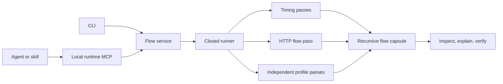

## Context

See [proposal.md](./proposal.md) for motivation. The current dependency-free Node runtime engine already owns closed Node/Vitest/Go adapters, bounded processes, redaction, V8 and pprof normalization, Git identity, and before/after capsules. Its public surface is a repository script; the packaged Rust MCP server is intentionally read-only and tied to an authorized CodeVetter SQLite repository scope.

The first HTTP qualification produced a 123–135 ms root workload but only 64–80 V8 samples. Its leading four-sample candidate changed between independent invocations, yet the deterministic diagnosis labeled each invocation actionable. This slice must correct that trust failure while adding real flow evidence.

## Goals / Non-Goals

**Goals:**

- Make runtime capture a transport-independent product capability usable through a closed local MCP interface.
- Add a small recursive flow IR with observed timing, parent/causal relationships, evidence references, and explicit unaccounted time.
- Capture local Node HTTP client and server flows without modifying the target repository.
- Capture built-in Node SQLite executions only while an observed HTTP server flow is active.
- Compute covered and unaccounted time only between parent and child observations from the same diagnostic execution.
- Capture repository-owned application function execution counts without modifying source and keep them separate from duration evidence.
- Require repeatable and material source evidence before an actionable diagnosis.
- Preserve exact-scope comparison and cleanup guarantees.

**Non-Goals:**

- Production capture, App Health integration, distributed traces, arbitrary commands, third-party database libraries, filesystem interception, source rewriting, complete function entry/exit timing, values, React Fiber state, record/replay, or persistent multi-user storage.
- Adding runtime execution to the existing read-only Rust history MCP server before the local tool contract is qualified.
- Claiming that HTTP timing alone explains CPU, database, filesystem, scheduler, or network wait.

## Decisions

### 1. Keep the evidence engine transport-independent and add a dedicated local runtime MCP

The MCP server is a thin JSON-RPC transport over the same modules used by the CLI. It is repository-scoped at startup, holds a bounded in-memory capture registry, and exposes `capture_local_flow`, `inspect_local_flow`, `explain_local_flow`, and `verify_local_optimization`.

Alternative considered: immediately port the experimental engine into the bundled Rust CLI and existing MCP. Rejected because it would duplicate an unsettled evidence contract, require shipping a much larger Rust change, and mix side-effecting runtime execution into a server whose current authorization and annotations promise read-only queries.

### 2. Model every operation as a flow, with partial evidence represented honestly

`runtime-flow-capsule/v1` contains one root flow and bounded child flows. A flow has an opaque ID, kind, name, observed start/duration when available, parent ID, evidence IDs, children, and limitations. Relationships describe causal matches separately from containment.

The root duration comes from unprofiled measurements. Child HTTP durations come from one separate flow-capture execution and are labeled as diagnostic rather than directly subtractable from the median root timing. CodeVetter reports unaccounted coverage instead of forcing those distinct executions into a false additive breakdown.

Alternative considered: reuse CPU hotspots as child flows. Rejected because sampled stacks are evidence about code cost, not observed semantic operations with complete wall time.

### 3. Inject a bounded Node diagnostic preload only for the flow pass

For Node test and Vitest adapters, one diagnostic pass loads a CodeVetter-owned ESM preload through `NODE_OPTIONS`. The preload observes loopback `fetch` calls and Node HTTP server requests, buffers only method, normalized pathname, status, timestamps, and duration, then writes one bounded per-process JSON file in the owned temporary directory.

The normal timing and CPU profile passes remain unchanged by the preload. Query strings are discarded, variable-looking path segments are normalized, output is size bounded, and raw event files are removed with the temporary directory after normalization.

Alternative considered: require OpenTelemetry or framework middleware in the target. Rejected because the local first slice must work without source changes or a new production dependency.

### 4. Use two independent profile passes and a conservative actionability gate

Each diagnostic profile is normalized independently. A source candidate is repeatable only when both passes have the same leading repository-owned application file and corrected function anchor. The default candidate gate additionally requires at least five samples, ten milliseconds of captured self time, and ten percent sample share in each pass. The recorded policy makes future calibration explicit.

Deterministic domain metrics such as exact Go benchmark allocation or application scale curves remain independently eligible for hypotheses, but a V8 source candidate cannot borrow confidence from runner wall time.

Alternative considered: merely raise the existing five-percent share threshold. Rejected because one noisy profile can still pick a different source location on every invocation.

### 5. Keep the skill thin and test tool-only usefulness

Qualification starts with only the MCP tool schemas. The investigating agent may inspect target source only after `explain_local_flow` returns a material candidate. The report records whether the tool produced the candidate, whether post-candidate source inspection agreed, and whether identical-scope verification confirmed an improvement.

Alternative considered: ship a detailed profiling skill first. Rejected because it would hide missing product capability behind model instructions.

### 6. Preserve the existing comparison engine but add product-impact fields

`verify_local_optimization` uses compatible stored in-memory capsules and returns the existing comparison plus three explicit decisions: `mechanically_confirmed`, `materially_useful`, and `shipping_recommended`. The latter two require the recorded practical threshold and no high-risk limitations; statistical confidence remains disclosed rather than implied by three samples.

The MCP response keeps the opaque baseline/current capture identifiers and the
bounded comparison, but omits both complete source capsules. The capsules remain
available in the service for inspection; duplicating them in one verification
response makes a small decision payload grow with every captured flow event.

### 7. Propagate request context and instrument one database primitive deeply

The Node preload reserves the HTTP server event before user handlers run and
enters an `AsyncLocalStorage` context carrying that event ID. When available,
the preload wraps `node:sqlite` `DatabaseSync.exec` and `StatementSync`
execution methods. It records only operations executed inside the request
context: operation kind, a normalized value-free SQL shape, start, duration,
outcome, and parent event ID.

Normalization removes comments and literal values, collapses whitespace, caps
the statement length, and never captures arguments or returned rows. Startup
migrations and test-runner database activity remain outside the request context
and are ignored. The engine groups these events beneath their HTTP server flow
and computes child interval union, not a naive duration sum, so concurrent child
operations cannot manufacture more accounted time than the parent duration.

Alternative considered: generic monkey-patching for popular database clients.
Rejected for this slice because their APIs and async semantics differ, and a
wide adapter with weak attribution would recreate the confidence problem this
change just fixed. The built-in Node API provides one dependency-free real
cross-project proof before an adapter registry is earned.

### 8. Add deterministic function frequency before invasive function tracing

One additional diagnostic execution sets `NODE_V8_COVERAGE` to an owned
temporary directory. CodeVetter normalizes only repository-contained
application functions, maps source offsets to original line anchors, records
call counts, and deletes the raw coverage documents with the other artifacts.
The pass captures no arguments, return values, or function duration.

Frequency remains observed evidence. A repeated-work hypothesis is eligible
only when a named function has a material call count and intersects a
repository-owned CPU candidate in the same file/function family. A frequent
function without timing support is reported as `observed_frequency_only`; a CPU
candidate without repeatable coverage remains subject to the existing strict
profile gate. This lets an agent see avoidable recomputation while preventing
"called often" from becoming "slow" by assertion.

Alternative considered: rewrite every loaded function to add entry/exit timers.
Rejected because parser-free source transforms are unsafe across JavaScript and
TypeScript, blanket instrumentation materially perturbs short flows, and values
or control flow could be changed. Deterministic V8 coverage earns the next
candidate with substantially lower risk.

### 9. Treat Vitest selection and coverage as runner-specific contracts

Vitest evaluates `--testNamePattern` against a space-joined full test name. A
user-supplied leaf name is therefore escaped and matched only at the end of that
full name; the run is accepted only when exactly one assertion executes. This
supports nested `describe` blocks while duplicate leaf names fail closed.

Vitest executes transformed modules in workers that do not expose application
functions through the parent process's `NODE_V8_COVERAGE` document. Its
coverage pass instead enables the repository-local V8 provider, writes only a
JSON report into CodeVetter's owned temporary directory, and overrides coverage
thresholds to zero for this diagnostic execution. The normalizer keeps only
positive named application functions with original TypeScript anchors. Missing
local coverage support is an explicit optional limitation and does not erase
otherwise valid timing or CPU evidence.

## Risks / Trade-offs

- **Node preload changes diagnostic behavior** → Never use its execution for baseline timing; record it as a distinct evidence pass.
- **Monkey-patched fetch or HTTP misses framework/runtime paths** → Report supported mechanisms and unaccounted coverage; do not claim universal HTTP capture.
- **Two profiles increase local run time** → Keep exact scopes and hard time/sample bounds; pay the cost only in diagnosis, not ordinary verification.
- **Strict stability suppresses real small hotspots** → Return `no_confidence` with a scale-up experiment rather than lowering the trust gate.
- **In-memory MCP captures disappear on restart** → Treat this as an experimental session boundary; persistence waits until schema qualification.
- **Separate runtime MCP creates another executable surface** → Share all behavior modules with the CLI and gate Rust packaging on cross-project results.
- **SQL text may contain sensitive literals** → Store only normalized statement shapes; never capture bind arguments, rows, comments, or full statements beyond the bounded preview.
- **Async context can be absent or cross an unsupported boundary** → Capture database events only with a known request parent and report mechanism coverage instead of attaching them to the root.
- **High call count is mistaken for high cost** → Keep coverage frequency independent, require CPU intersection for a repeated-work hypothesis, and never assign duration from coverage.

## Migration Plan

1. Add the flow contract, preload, service, and tests without changing existing failure or performance capsule schemas.
2. Add the dedicated local MCP and package script while retaining the direct CLI operations.
3. Tighten actionability and update documentation after focused unit tests pass.
4. Qualify against the local HTTP target and at least one existing algorithm or Go target.
5. Add request-scoped built-in SQLite child operations and same-execution interval accounting, then requalify the HTTP target.
6. Add bounded V8 function coverage and requalify whether deterministic repeated work explains the remaining application boundary.
7. Rollback removes the additive flow/MCP files and restores the previous actionability rule; no database or target-repository migration is involved.
