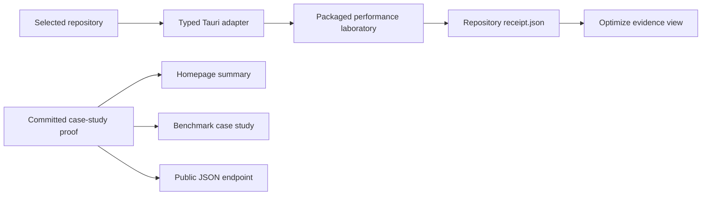

## Context

See [proposal.md](proposal.md). CodeVetter already packages
`scripts/runtime-failure-capsule/` into the Tauri application, and the
`codevetter performance-lab` CLI adapter invokes that resource with bounded
arguments. The React application has a shared repository workspace and picker,
but no Optimize route or IPC projection. The landing site already has a public
benchmark route for review catch-rate evidence.

## Goals / Non-Goals

**Goals:**

- Reuse the packaged performance laboratory rather than create a second engine.
- Make repository selection, execution state, steps, terminal reason, and prior
  receipts understandable in the desktop app.
- Publish one real proof record from a canonical committed artifact and keep its
  limitations visually inseparable from the headline movement.
- Keep the UI usable in browser development mode with a clearly labelled sample
  receipt and no false execution affordance.

**Non-Goals:**

- Generate or apply source patches inside the desktop application.
- Stream raw subprocess output, run several laboratories concurrently, or build
  a hosted job system.
- Claim production or application-wide improvement from the Anime List trial.
- Deploy, publish, or mutate a selected repository beyond the performance
  runtime's existing bounded artifact directory.

## Decisions

### 1. Add a thin Tauri adapter over the packaged runtime

A new local-only command canonicalizes the selected repository, generates or
validates a bounded lab ID, resolves the already-packaged runtime resource, and
invokes `node ... run-performance-lab --json`. Output and stderr remain byte
bounded and stdout must parse as a versioned JSON receipt before crossing IPC.

The alternative—reimplementing the JavaScript laboratory in Rust—would create
contract drift. Calling the external CLI sidecar would make development and
resource resolution less predictable than using the same packaged entry the
sidecar already resolves.

### 2. Read receipt history from the repository-owned artifact directory

The adapter enumerates only immediate directories below
`.codevetter/performance-labs`, reads only `receipt.json`, rejects symlinks and
oversized files, parses JSON, and returns a bounded newest-first list. This lets
the desktop remain a viewer over durable evidence and survive app restarts.

The alternative—copying receipts into SQLite—would create a second authority
and complicate identity and cleanup.

### 3. Present the laboratory as an evidence process, not a magic optimizer

The Optimize page inherits the existing Evidence Bench visual system. Its first
view shows the repository and one intentional action. While running, a fixed
stage rail explains discovery, profiling, candidate screening, verification,
and decision; after completion, actual receipt steps replace promises. Stopped,
blocked, failed, and completed are written states. The receipt's stop reason and
limitations sit beside the verdict.

The browser-development fallback renders the committed Anime receipt as a
labelled case-study preview and disables local execution. This makes UI review
possible without implying that a web page can access a repository.

### 4. Derive both public surfaces from one canonical proof artifact

Astro components import the committed Anime proof JSON directly at build time.
The homepage uses a compact proof strip; `/benchmark` expands the rejected and
retained experiments, repeated-sample methodology, correctness boundary, and
production check. A prerendered endpoint returns the same imported object.

This avoids manually retyping numbers across surfaces. Copy still explicitly
states that the host agent generated the patch while CodeVetter owned evidence,
boundaries, verification, decisions, and replanning.

### 5. Make source growth a shipping gate

The existing bounded Git snapshot inspection also derives a small change-cost
record: file count, added and removed lines, gross and net movement, binary and
untracked files, and added JavaScript or Go production dependencies. Acceptance
compares that record with a conservative default budget and the exact proposed
source boundary before running expensive paired verification. Missing or
incomplete cost evidence fails closed; a budget violation rejects the candidate.

The receipt keeps the observed cost, policy, and violations separate. This is
preferable to a single opaque “efficiency score”: reviewers can inspect the
facts, while agents receive an enforceable instruction to find a smaller patch.

## Risks / Trade-offs

- **A long laboratory has no step-level streaming** → Show an honest running
  stage model, keep execution bounded, and render only receipt-backed steps when
  the command returns; streaming can be added after the process contract earns it.
- **A selected repository may not contain a measurable supported flow** → Show
  the receipt's stopped reason and coverage gaps instead of a generic failure.
- **Old or malformed receipts can confuse the viewer** → Bound enumeration and
  parsing, skip invalid artifacts, and display immutable identity for valid ones.
- **A large local byte percentage can dominate perception** → Pair it directly
  with the -0.313% production gzip qualification and a “local development” label.
- **Adding another top-level destination increases navigation density** → Place
  Optimize in Workbench beside Review and Testing, reuse the existing keyboard
  pattern, and avoid adding secondary navigation concepts.
- **One universal line limit can reject a legitimate refactor** → Keep the
  default conservative and bounded, record every violation, and allow a future
  explicit task policy to replace it without weakening evidence collection.

## Migration Plan

The route, commands, and case-study content are additive. Existing receipts and
CLI/MCP operations remain unchanged. Rollback removes the UI and IPC adapter;
repository evidence remains readable through the existing CLI/MCP surfaces.
