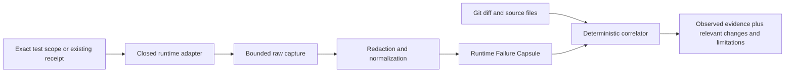

## Context

See [proposal.md](./proposal.md) for motivation. CodeVetter already has
fail-closed browser receipts, bounded process ownership, Git identity, redacted
evidence contracts, and machine-first repository scripts. The new layer needs
to connect a reproduced failure to changed source without duplicating T-Rex,
warm verification, or the agent-task runner.

The Fleet concentration informs adapter priority but is not itself failure-rate
evidence: Vitest, Playwright, Cloudflare Worker `fetch`, Node tests, and Go tests
cover the common executable boundaries. Cloudflare Workers are not ordinary
Node processes, so Worker support must reuse Worker-native Vitest/Wrangler
execution and receipts rather than `node:inspector`.

## Goals / Non-Goals

**Goals:**

- Deliver a real, dependency-free machine interface that can diagnose one exact
  Node, Vitest, Playwright, or Go test scope.
- Keep one small normalized IR across executed and imported evidence.
- Prove the contract with hermetic fixtures and selected real Fleet smoke runs.
- Preserve target repositories and keep raw sensitive values out of capsules.

**Non-Goals:**

- Complete function entry/exit, arguments, returns, React Fiber/hook state,
  Delve, record/replay, production flight recording, distributed tracing, or
  patch generation.
- A desktop UI, SQLite migration, packaged Rust CLI command, or MCP execution
  tool in this first implementation slice.
- Installing dependencies or creating test configuration in target projects.

## Decisions

### 1. Start with a repository-owned Node CLI and library

The first slice lives under `scripts/runtime-failure-capsule/`, matching the
existing benchmark and agent-task corpus pattern. It uses Node built-ins only,
keeps the contract easy to test, and avoids changing the packaged desktop or
adding a production dependency. A later change can lift the stable contract
into the Rust CLI after corpus evidence justifies packaging.

Alternative considered: implement directly in the Rust `codevetter` binary.
Rejected for the first slice because adapter behavior and the evidence schema
need rapid fixture-driven calibration before expanding the release surface.

### 2. Use a closed adapter registry

The CLI accepts `detect`, `run`, and `import` operations. `run` accepts exactly
one of `node-test`, `vitest`, `playwright`, or `go-test`; there is no arbitrary
command string.

- `node-test` launches the current Node executable with `--test` and a bounded
  TAP reporter.
- `vitest` resolves the target repository's local Vitest executable and asks
  its JSON reporter to run one file and optional name.
- `playwright` resolves the local Playwright executable and requests its JSON
  reporter for one file and optional grep.
- `go-test` launches `go test -json` for one package and optional exact run
  pattern; the test file is used to prove repository scope and derive package.

Browser and Worker specificity is discovered from repository config and
preserved in capsule lane metadata. A Worker Vitest project therefore uses its
own configured pool and runtime; CodeVetter does not emulate it.

Alternative considered: infer and run package scripts. Rejected because script
names do not prove scope and can hide installers, networks, or shell behavior.

### 3. Normalize evidence into an event graph, not an invocation tree

Observations have stable IDs, kinds, timestamps when available, source frames,
bounded summaries, and provenance. Relationships refer to observation and
source IDs. This represents partial evidence honestly and permits later
invocation projections without claiming complete call capture.

Alternative considered: make nested function invocations the IR spine.
Rejected because neither Node, Worker, nor Go provides lossless semantic calls
without invasive instrumentation.

### 4. Correlate source frames with an explicit Git diff

Git is invoked with separated arguments. The correlator parses unified diff
hunks into changed-line sets, filters dependency/generated paths, and ranks:

1. exact changed-frame intersection;
2. same changed file with nearest changed line;
3. no match with an explicit limitation.

The ranker emits reasons and distances, not a root-cause assertion. Dirty and
range identities remain explicit in subject metadata.

### 5. Redact before normalization and persistence

The process runner bounds stdout and stderr while draining them. Redaction
removes repository prefixes, credential-shaped assignments, authorization and
cookie values, URL query values, and explicitly configured sensitive field
names before parsers create observations. Capsules retain only redacted text;
raw output is not written to disk by default.

Alternative considered: parse first and redact selected fields afterward.
Rejected because unknown runner formats could copy secrets into intermediate
or error paths.

### 6. Treat diagnosis as failure-only evidence

A reproduced failure exits `1` and produces `failed`. A clean diagnostic rerun,
missing executable, unsupported output, timeout, incomplete imported receipt,
or cleanup failure produces `no_confidence` and exits `2`. Detection alone
exits `0`. No diagnostic result creates overall pass evidence.

## Risks / Trade-offs

- **Runner JSON formats drift** → version adapters, retain unknown-field
  tolerance only inside bounded runner payloads, and fail closed when terminal
  identity is missing.
- **Exact-name filters differ across runners** → record complete arguments and
  require the selected failure identity to appear in the result.
- **A diagnostic rerun changes timing or concurrency** → record adapter and
  rerun identity and never equate non-reproduction with a fix.
- **Output redaction hides a useful value** → retain safe type/shape summaries
  and explicit redaction counts rather than raw secrets.
- **Fleet smoke tests are not hermetic** → keep committed tests fixture-only;
  report real-project smokes separately and never require siblings in CI.
- **The Node prototype becomes a permanent second CLI** → gate packaged CLI
  integration on corpus results and archive or lift the prototype contract in
  the next change.

## Migration Plan

1. Add the new library, CLI, and package scripts without changing existing
   verification commands.
2. Qualify hermetic Node/Go/import fixtures and run selected read-only Fleet
   smokes where dependencies already exist.
3. Keep the feature experimental and repo-owned; rollback removes the additive
   scripts and package entries with no stored-data migration.
4. Propose packaged CLI/desktop/MCP integration only after measured attribution
   and redaction results justify it.
