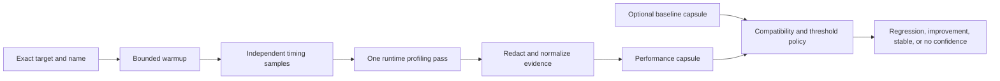
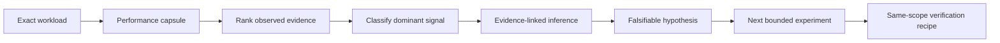

## Context

See [proposal.md](./proposal.md) for motivation. The experimental runtime CLI
already owns target containment, closed Node/Vitest/Go adapters, process cleanup,
redaction, Git identity, and bounded JSON output. It currently treats successful
runs as non-reproduced failures and captures no runtime profile or compatible
baseline comparison.

App Health contains useful credential-free Node middleware and Go benchmarks,
but remains an external qualification target. CodeVetter must neither depend on
that sibling checkout nor change its privacy and production boundaries.

## Goals / Non-Goals

**Goals:**

- Measure exact workloads with a robust multi-sample wall-time distribution.
- Capture repository-owned V8 CPU hotspots and Go benchmark/allocation metrics.
- Compare compatible current and baseline capsules deterministically.
- Preserve the distinction between observed measurements, deterministic
  findings, and unverified optimization ideas.
- Give coding agents one compact diagnosis with evidence references and the
  next experiment, without adding an LLM dependency.

**Non-Goals:**

- Whole-application continuous monitoring, arbitrary commands, production
  ingestion or load, heap leak diagnosis, distributed traces, automatic source
  rewriting, or universal function-call recording.
- Treating process startup time or a single CPU sample as proof of a source-level
  bottleneck.

## Decisions

### 1. Add a performance schema and operation beside failure capsules

The existing CLI gains `profile`; it does not overload failure verdicts.
`runtime-performance-capsule/v1` carries measurement-specific outcomes while
reusing runner and redaction primitives.

Alternative considered: rename the entire prototype around a general Execution
IR now. Rejected because the evidence contracts are still experimental and a
large rename would obscure the measured product change.

### 2. Separate timing passes from the diagnostic profiling pass

Wall-time samples run without profiler overhead. One separate diagnostic pass
collects V8 CPU or Go profile evidence. Every required pass must succeed; timing
and profiling executions remain visible in the capsule.

Alternative considered: time only the profiled execution. Rejected because V8
and Go profilers perturb the measurement and make comparisons less trustworthy.

### 3. Use runtime-native profiles without new dependencies

Node and Vitest receive V8 CPU profiling through bounded `NODE_OPTIONS` pointing
at an owned temporary directory. All emitted `.cpuprofile` files are merged by
sample duration. Node test children flush repository profiles reliably. The
Vitest diagnostic pass additionally uses one fork, disables file parallelism,
and passes the CPU profile arguments to the worker; measurement passes preserve
the project's normal exact-scope topology. Vitest also contributes exact JSON
test durations and bounded `[benchmark]` console metrics. Only decoded `file:`
URLs contained by the target repository are eligible for hotspots. Test and
benchmark paths are retained but labeled as harness work.

Vitest console benchmark metrics run in one additional exact, unprofiled verbose
pass. JSON measurement passes remain responsible for assertion timing, while
the CPU-profiled pass remains responsible only for source attribution. This
prevents profiler perturbation from being mistaken for an input-scale curve.

Go uses exact `go test -run '^$' -bench` execution with `-benchmem`; a separate
pass writes `-cpuprofile` into the owned temporary directory. The first slice
parses benchmark measurements and records whether the CPU artifact existed; Go
symbol attribution can follow once real corpus evidence justifies a pprof
parser or closed `go tool pprof` call.

Alternative considered: Inspector Protocol sampling controlled by CodeVetter.
Rejected for this slice because Vitest worker/fork coverage and lifecycle
coordination are more invasive than V8's runtime-native profile files.

### 4. Compare capsules, not mutable ambient baselines

`--baseline` accepts one bounded prior performance capsule. Compatibility
requires the same schema major version, adapter, target, and exact name. The
default materiality policy requires at least 20% and 25 ms median wall-time
movement; both values are recorded and can be changed only within safe CLI
bounds.

Alternative considered: maintain an implicit machine-local baseline database.
Rejected because the prototype has no stable packaged storage identity and an
ambient baseline would make results harder to reproduce.

### 5. Rank evidence conservatively

Repository hotspots are observed samples, not causes. A deterministic
`application_hotspot_candidate` finding requires a non-harness source location
and a minimum sample share. Dependency-only or runner-only profiles explicitly
state that source attribution is incomplete. No model generates findings.

### 6. Treat browser evidence as a bounded local journey

Browser qualification uses a local production build served on loopback, one
warmup plus at most three measured reloads, and a browser-request deny boundary
for non-loopback origins. Core Web Vitals, long tasks, network resources, and
accessibility observations remain observed evidence. If the configured Chrome
trace connector is unavailable, the lane records an operational blocker and no
browser claim is made.

### 7. Exercise algorithms at representative deterministic scales

Consumer recommendation code is measured inside the repository's existing
runner at fixed generated sizes. The fixture seed, catalogue sizes, selected
function, and result checksum are recorded so startup overhead cannot be
mistaken for algorithm cost and optimized implementations can be compared
against identical inputs.

### 8. Normalize Go profiles through the installed toolchain

The diagnostic Go pass writes CPU and allocation profiles plus its owned test
binary. CodeVetter invokes `go tool pprof` without a shell, retains only bounded
repository-owned rows, and removes the raw profiles and binary with the existing
temporary directory. Timing passes remain unprofiled because allocation-rate
profiling materially perturbs benchmark latency.

### 9. Diagnose by deterministic evidence routing

`diagnose-performance` runs the existing exact profiling operation, then routes
the resulting capsule through a bounded deterministic diagnosis layer.

The router recognizes demonstrated regression, Go allocation pressure,
repository-owned CPU concentration, deterministic input-size scaling,
startup-dominated scopes, unstable measurements, and incomplete evidence. A
scale curve is eligible only when at least two console metrics use a shared
unit and names ending in an integer input size. The report records its formula
inputs and never upgrades correlation into source-level causation.

The diagnosis embeds the originating capsule so an agent can inspect raw
bounded evidence without a second tool call. Inferences reference evidence IDs;
unverified hypotheses include a falsification step. The verification recipe is
structured adapter/target/name/sample data, not a shell command.

Alternative considered: ask an LLM to summarize every capsule. Rejected because
the first layer should be reproducible, free, and independently testable. A
model may later consume this report, but it is not part of the verdict.

### 10. Inspect only runtime-selected source windows

Source-aware diagnosis does not scan an entire repository. It reads at most
three repository-owned files already selected by runtime evidence, bounds each
regular file and line window, rejects traversal and escaping symlinks, and
redacts the resulting excerpt. The first JavaScript/TypeScript pattern family
detects a full collection sort followed by bounded slicing, eager mapping before
that sort, repeated collection passes, repeated traversal, nested lookup,
splitting a string only to retain its first segment, and repeated linear
membership checks over materialized object keys. Function-bounded inspection
recognizes declarations and TypeScript class methods so adjacent methods cannot
contribute patterns. A pattern becomes relevant only when it intersects a
measured application hotspot and an input-size curve.

The source pattern is observed; the claim that changing it improves performance
remains an inference and a falsifiable hypothesis. This lets an agent see the
specific expensive construct without CodeVetter pretending to understand all
program semantics.

Alternative considered: repository-wide static performance linting. Rejected
because it would produce generic advice disconnected from the measured path.

### 11. Verify domain metrics, not only process wall time

`verify-optimization` accepts a repository-contained baseline capsule or full
diagnosis, profiles the identical scope, and compares the metrics that motivated
the optimization. Catalogue-scale verification compares identical inputs,
shared units, largest-input cost, and endpoint exponent. Go allocation
verification compares the same benchmark's B/op, allocs/op, and ns/op. A result
is `confirmed`, `rejected`, `inconclusive`, or `no_confidence`; successful test
execution is required before any improvement claim.

The operation returns both bounded capsules and exact deltas. It never treats a
different target, workload name, input set, unit, or failed execution as a
valid optimization comparison.

### 12. Prefer interleaved evidence when two runnable revisions exist

A paired verification lane accepts two independently runnable contained
checkouts and alternates baseline/current execution order across bounded
samples. Each side must execute the same adapter, relative target, exact
workload identity, and metric family. The report records the schedule and
per-side distributions before applying the existing domain verifier.

This is additive: saved-capsule verification remains available when only one
checkout can run. A sequential capsule comparison cannot claim paired
provenance. Open-source qualification uses an owned temporary clone and never
publishes changes or contacts a hosted application.

### 13. Use self-hosting as both performance and accuracy evidence

A deterministic workload may exercise a real CodeVetter runtime-evidence
operation at fixed scales, provided it asserts the normalized product output
and times only the operation after fixture construction. The normal diagnosis
and identical-scope verifier remain authoritative; source review may falsify an
inference when captured workload identity proves that the proposed dimension
did not vary. The qualification must record both the confirmed product change
and any incorrect causal inference exposed by the run.

## Risks / Trade-offs

- **Short workloads yield sparse CPU samples** → use repeated timing plus one
  profile pass and disclose low sample counts instead of inventing a hotspot.
- **Vitest topology creates multiple profiles** → merge all bounded valid files
  and record file/sample counts; when workers do not flush, retain structured
  test and benchmark measurements and state that source attribution is absent.
- **Process startup dominates wall time** → label wall time as exact-scope
  end-to-end latency; use runtime hotspots only for within-run attribution.
- **Machine load creates noisy baselines** → require multiple samples and both
  relative and absolute thresholds; record platform, runtime, host load, and
  sample spread, refuse regression claims when spread exceeds the policy, and
  prefer alternating baseline/current order when two runnable checkouts exist.
- **Go profile attribution depends on toolchain text stability** → parse only
  repository-contained rows, retain raw benchmark measurements, and report
  parser or command failure as incomplete attribution.
- **Browser connector is unavailable or locked** → stop the browser lane and
  continue non-browser qualifications without substituting a hosted audit.
- **Deterministic routing overstates a cause** → label all causal language as
  inferred or unverified, reference the exact observations, and require a
  same-scope comparison after any change.
- **Lexical source patterns miss semantics** → keep the first pattern family
  small, expose the bounded excerpt and exact matched lines, and make runtime
  intersection plus before/after measurement mandatory.
- **Temporary cleanup fails** → return `no_confidence` rather than leaving raw
  runtime evidence silently retained.

## Migration Plan

1. Add the schema, parser, closed profile operation, and tests without changing
   existing `detect`, `run`, or `import` behavior.
2. Qualify hermetic fixtures and selected local App Health benchmarks.
3. Keep the operation experimental and repository-owned; rollback removes the
   additive module, script entry, and OpenSpec change with no stored migration.
4. Propose packaged CLI/MCP integration only after attribution and overhead are
   measured across representative consumer projects.
