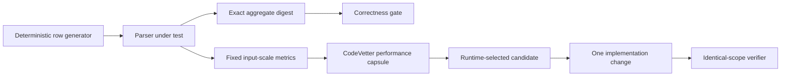

# Design: Scaled parsing challenge

## Architecture

## 1. Generate representative data without a giant fixture

The challenge builds one deterministic block of `station;temperature` rows and
repeats it to exact row counts. The largest default case remains bounded for a
laptop, while the minimum and maximum inputs differ by at least 40x so
CodeVetter can measure an endpoint exponent. No random seed, clock, network,
database, environment secret, or checked-in generated dataset affects input.

## 2. Preserve the official result contract

The parser returns station aggregates containing count, minimum, maximum, and
sum in integer tenths. A compatibility test covers variable UTF-8 station
names, full temperature bounds, alphabetical output, min/mean/max formatting,
and round-toward-positive mean behavior. The scale test compares a stable digest
against a separately derived expected result at every size. Timing is emitted
only after correctness passes, so a faster parser that drops or approximates
rows cannot verify.

## 3. Measure parsing rather than fixture construction

Dataset construction happens outside the timed region. Each size is parsed in
the same process with a short untimed warmup and repeated timed iterations. The
test emits one existing console benchmark line with `size<N>` metrics in
`ms/op`, allowing CodeVetter to use its current scale-curve and comparison
contracts without a challenge-specific parser.

## 4. Let runtime evidence choose the edit

The first implementation is a straightforward correct parser. CodeVetter must
capture its unprofiled scale metrics and repository-owned CPU evidence before
the parser source is optimized. Source inspection is allowed only after the
diagnosis names a candidate. One change is then compared against the stored
baseline in the same MCP session.

Mechanical evidence such as fewer function calls may confirm implementation
effect, while a material performance claim requires the existing scale
threshold and compatible inputs. A failed correctness run, different scale,
or noisy sub-threshold movement cannot confirm the optimization.

## 5. Treat the billion-row limit honestly

The benchmark reports measured local rows and durations only. Derived rows per
second may be used for orientation, but the qualification must not claim that a
nine-billion-row run would fit memory, complete within a projected time, or
behave identically. Pushing the limit later should increase bounded input size
or add streaming/parallel lanes as separately verified changes.

## 6. Retain provenance as part of the artifact

The artifact links to the official 1BRC repository, records its Apache-2.0
license, and distinguishes the preserved task contract from deliberate Node,
bounded-size, and parser-only measurement differences. It must not present the
result as an official submission or a leaderboard-comparable execution.

## Risks

- **Runner startup hides parser work:** keep the largest case long enough to
  generate CPU samples and emit independent in-test metrics.
- **Generated input makes results unrealistic:** preserve delimiters, signed
  decimal temperatures, repeated stations, and aggregate semantics from the
  challenge family while explicitly calling the data synthetic.
- **Optimization changes behavior:** require the exact digest at every measured
  size before printing benchmark metrics.
- **Large strings cause local memory pressure:** cap the default row count and
  retain no generated artifact after process exit.
