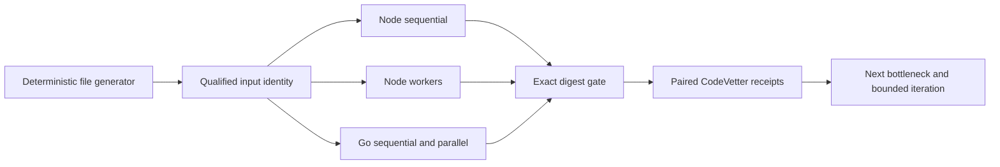

## Context

The existing artifact parses a generated JavaScript string on one thread and
times only aggregation. Its file entry point decodes the complete file before
parsing. See `proposal.md` for why that evidence cannot answer the current
language-versus-implementation question.

## Goals / Non-Goals

**Goals:**

- Process file-backed inputs with memory bounded by chunk and aggregate sizes.
- Measure sequential Node, parallel Node, and Go on one input and machine.
- Keep correctness outside the optimization argument by requiring one digest.
- Produce CodeVetter evidence an agent can use to choose the next iteration.

**Non-Goals:**

- Claim eligibility for the closed official Java leaderboard.
- Guarantee a particular finish time before measurement.
- Add native Node extensions, external benchmark dependencies, or cloud runs.
- Generate the approximately 12 GB fixture during normal tests or CI.

## Decisions

### Generate once, time consumers separately

A deterministic generator writes a file in bounded chunks and records row
count, byte count, and SHA-256 identity. Generation is outside the consumer
timing boundary, matching the challenge's distinction between fixture creation
and program execution. All variants consume the same retained fixture within a
campaign; the campaign removes it afterward by default.

Alternative considered: generate rows in each timed process. This measures the
generator and makes runtime comparisons consume different inputs or work.

### Parse bytes incrementally

The Node sequential lane reads buffers from a file descriptor, carries only an
incomplete trailing row across reads, performs integer-tenths parsing, and
decodes a station name only when needed for aggregate identity. The Go lane uses
the same row and output contract with bounded buffered reads.

Alternative considered: preserve the whole JavaScript string parser and only
add workers. It would remain incapable of a safe full-file run and continue to
mix UTF-8 decoding and parser costs.

### Split parallel work at newline-aligned byte ranges

The coordinator derives a bounded worker count and byte ranges, advances range
ends to a newline, and gives each worker an independent range and aggregate.
Workers never share a mutable hash table; the coordinator merges the small set
of station aggregates after parsing.

Alternative considered: shared atomic aggregates. It adds synchronization to
the hottest loop and cannot efficiently represent arbitrary UTF-8 station keys.

### Use a paired benchmark ladder

The default ladder remains small enough for a laptop and includes at least two
file sizes large enough to amortize process startup. An explicitly authorized
extended lane may progress to 100 million and one billion rows after checking
available disk. Each variant gets one untimed warm-up where practical and five
timed runs; the fastest and slowest are discarded and the remaining three are
averaged. Receipts record cold/warm policy rather than claiming the macOS page
cache was reset.

### Treat external results as context, not a local denominator

The report shows local paired speedups first. It may cite the official result,
but cannot call the quotient a measured performance gap because hardware,
runtime, input scale, and timing conditions differ.

## Data Flow

## Risks / Trade-offs

- **[Small files exaggerate startup and worker overhead]** → Include a scale
  ladder and make conclusions only at sizes where parsing dominates.
- **[OS page cache makes repeated file runs warmer]** → Use the same ordered or
  rotated policy for every variant and record it; do not attempt destructive
  cache flushing.
- **[Station decoding or hash collisions compromise correctness]** → Preserve
  byte equality checks and the shared exact output digest.
- **[Parallel reads saturate memory bandwidth]** → Sweep bounded worker counts
  rather than assuming logical CPU count is optimal.
- **[Large fixtures consume local disk]** → Calculate first, require opt-in,
  generate in a temporary directory, and remove by default.
- **[Go appears faster because implementations differ]** → Report the paired
  implementation result, profile both, and avoid claiming a universal language
  ceiling.

## Migration Plan

The new lanes are additive. The existing bounded in-memory test remains as a
fast parser regression until the file-backed lane proves equivalent. Rollback
removes the new artifact files and scripts; no data migration or production
configuration is involved.
