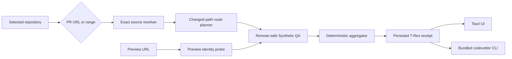

## Context

The current T-Rex page exposes four separate expert workflows: warm
verification, differential verification, scenario compilation, and a persistent
PR watcher. Synthetic QA can test remote URLs, but its UI requires manual
workflow, route, goal, auth, loop, and runner choices. The owner instead wants
one direct action for an existing repository:

```text
selected repository + PR/range + preview URL -> test the change
```

The preview URL removes dependency installation and application startup from
the first slice. The repository delta supplies targeting context; the preview
supplies the executable candidate.



## Goals / Non-Goals

**Goals:**

- Make one direct T-Rex run the primary path above the existing expert panels.
- Require only a PR URL or commit range and one candidate preview URL after the
  repository is selected.
- Preserve exact base/head identities and bounded changed paths.
- Exercise the root and statically derivable changed routes against the preview.
- Preserve screenshots, console failures, navigation failures, and limitations.
- Be explicit when the preview-to-head relationship is verified, merely
  claimed, or mismatched.
- Keep execution deterministic and model-free in this first slice.
- Make the same run available from a terminal without starting or scripting the
  desktop UI.

**Non-Goals:**

- Clone an unknown repository or install dependencies.
- Launch the candidate application locally.
- Accept an application URL without repository change context.
- Compare two deployed environments.
- Explore authenticated or irreversible workflows.
- Infer arbitrary business intent with a model.
- Replace the existing T-Rex watcher, warm verifier, differential verifier, or
  scenario compiler.
- Add MCP entry points, hosted coordination, Sentry, or observability.

## Decisions

### 1. T-Rex is the primary product surface

The direct-run card appears immediately after the Testing header. The selected
repository remains authoritative. The operator chooses `Pull request` or
`Commit range`, enters the source value and preview URL, and starts one run.
Advanced workflows remain below it.

The orchestration contract lives behind typed Tauri IPC so a later CLI/MCP
adapter can reuse the receipt without dictating this first release.

### 2. Resolve source without mutating the checkout

PR mode accepts only canonical `https://github.com/<owner>/<repo>/pull/<n>`
URLs. It verifies that the URL matches the selected repository's origin, then
uses authenticated `gh api` reads for PR base/head identities and changed
files. It does not check out the branch.

Range mode accepts one bounded `base..head` or `base...head` expression. It
uses shell-free Git argument arrays to resolve both endpoints, list commits in
order, and collect changed paths. Revisions containing option-like or control
characters are rejected.

Both modes cap changed files and command output. Truncation returns
`no_confidence`; it never silently verifies a partial delta.

### 3. Preview identity is a separate proof dimension

The preview resolver accepts only HTTP(S) URLs without embedded credentials.
It follows a bounded redirect chain and inspects explicit revision headers:

- `x-commit-sha`
- `x-git-commit`
- `x-git-sha`
- `x-vercel-git-commit-sha`
- `x-codevetter-revision`

An exact head match is `verified`; a conflicting revision is `mismatch`; no
explicit revision is `claimed`. URL shape, page copy, or an agent opinion never
proves deployment identity.

### 4. Changed paths select bounded preview routes

The first planner always selects `/`. It additionally maps conventional
TypeScript/Node web routes:

- `pages/**` and `src/pages/**`;
- `app/**/page.*` and `src/app/**/page.*`; and
- `routes/**` and `src/routes/**`.

Layout groups and file extensions are removed. Dynamic segments and ambiguous
paths are recorded as limitations rather than guessed. The plan is deduplicated
and capped at six routes.

This is targeting evidence, not proof of route ownership.

### 5. Reuse Synthetic QA execution, not its setup form

Each selected route invokes the existing built-in `generic-page-smoke`
contract with remote targets explicitly enabled, no auth, and bounded
artifacts. Development builds may use the existing Playwright adapter. Release
UI and CLI builds use the already-shipped native Chrome driver so the installed
command does not depend on a repository-local CodeVetter checkout or bundled
Node modules. Both adapters check navigation, visible body content, and
unexpected console errors and emit the same journey contract. T-Rex aggregates
those deterministic results; no model synthesizes the verdict.

Remote execution is read-only. The first slice does not click controls, submit
forms, upload files, send messages, purchase, delete, or mutate durable state.

### 6. Use an honest three-way verdict

- `failed`: at least one required preview journey produced executable failure
  evidence.
- `no_confidence`: source resolution, preview identity, execution, cleanup, or
  bounded coverage was invalid or incomplete, including preview mismatch.
- `passed_with_limits`: all selected journeys passed, while the receipt still
  states that this is bounded candidate-preview evidence. A `claimed` preview
  cannot satisfy staged change verification.

The receipt preserves source, preview, plan, journeys, artifacts, timings, and
limitations. The human UI leads with verdict and preview identity.

### 7. Persist direct runs separately

An additive `trex_preview_runs` table stores summary columns plus canonical
receipt JSON. Existing `trex_pr_runs` remains the watcher history and is not
overloaded with range or preview semantics.

### 8. Keep CLI as a transport adapter

The `codevetter trex` binary parses one source selector (`--pr` or `--range`),
one preview URL, and an optional `--repo` whose default is the current
directory. It calls the same Rust orchestration service as Tauri and persists
to the same local app database. `--json` prints the canonical receipt;
otherwise the CLI prints a compact verdict, source, preview identity, route,
and limitation summary.

Exit code `0` means `passed_with_limits`, `1` means executable failure, and `2`
means no confidence or an operational/input error. The CLI does not introduce
another verdict model or silently downgrade errors.

### 9. Register the bundled CLI without privileged installation

Tauri bundles `codevetter` beside `codevetter-mcp`. On launch from an installed
macOS `.app`, CodeVetter atomically creates or refreshes
`~/.local/bin/codevetter` as a symlink to that bundled executable. It creates
the user-owned directory when needed but never edits a shell profile, requests
administrator access, or overwrites an unrelated file or symlink.

DMG drag-install has no safe post-install script, so registration occurs on
the first installed-app launch and is rechecked after app updates. Development
launches and unpackaged binaries never register themselves.

## Risks / Trade-offs

- **Preview may be stale** -> keep preview identity explicit and refuse staged
  proof for `claimed` or `mismatch`.
- **Path-to-route mapping is incomplete** -> cap supported conventions and list
  unknown or dynamic paths as limitations.
- **Candidate-only execution cannot attribute every failure to the change** ->
  report executable preview failure without claiming paired regression proof.
- **Remote previews can have side effects** -> first runner navigates only and
  performs no interactive mutations.
- **PR files may exceed API bounds** -> fail closed on truncation.
- **Existing Synthetic QA ignores some broad network errors** -> preserve its
  current qualified contract and treat richer network grading as follow-up.
- **`~/.local/bin` may not be on a user's shell PATH** -> document the one-line
  PATH addition and keep profile mutation explicit rather than editing shell
  startup files automatically.
- **A pre-existing `codevetter` command may be unrelated** -> fail closed on
  collisions and leave the existing entry untouched.

## Migration Plan

1. Add contracts, source resolution, route planning, preview identity, and unit
   tests.
2. Add the Tauri orchestration command, receipt persistence, and recent-run
   query.
3. Add the preserve-lane direct-run panel and focused Playwright coverage.
4. Dogfood against a known PR/range and preview fixture, then validate docs and
   OpenSpec.
5. Add the CLI adapter, native release runner, sidecar preparation, installed
   launcher registration, packaging assertions, and focused CLI tests.

Rollback removes the panel, commands, and additive table reads. Existing T-Rex
workflows remain unchanged.
