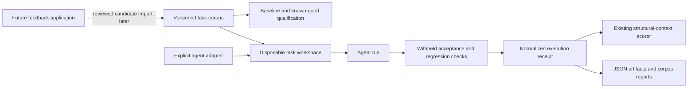

## Context

CodeVetter currently has three adjacent but disconnected assets:

- the warm verifier selects scenarios from changed paths and emits deterministic
  browser evidence;
- the scenario compiler turns a bounded acceptance criterion into a reviewed
  candidate; and
- the structural-context evaluator scores already-produced paired agent
  receipts using hidden checks and regressions as outcome authority.

The missing system is the evidence producer between a realistic coding task and
those receipts. The new runner must execute arbitrary explicitly configured
agent CLIs without making CodeVetter responsible for provider authentication,
must keep evaluation material out of the task workspace during the run, and
must remain useful before the owner's separate feedback application is linked.

This is not the first implementation step. The owner-facing
`automate-change-verification` change must first remove routine manual test
selection, execution, interpretation, and rerun work. This corpus then measures
that product loop and guards its claims.

## Goals / Non-Goals

**Goals:**

- Create a credible 30–50 task TypeScript/Node corpus centered on observable
  browser and API outcomes.
- Produce real, provider-neutral agent-run receipts under explicit local
  operator control.
- Prove each task's baseline and known-good solution before using it in
  experiments.
- Reuse the existing structural-context evaluator instead of creating another
  scoring authority.
- Keep commands hermetic where possible, fail closed where not, and expose all
  limitations in machine-readable output.

**Non-Goals:**

- Replace or delay the owner-facing automatic change-verification loop.
- Ingest Sentry, logs, traces, metrics, tickets, sessions, or production
  telemetry.
- Connect the owner's future feedback application in this change.
- Generate scenarios automatically from production feedback.
- Add a desktop UI, hosted runner, CI merge gate, multi-tenant service, or new
  model/provider dependency.
- Claim adversarial secrecy for public checks. "Withheld" means the runner does
  not copy or disclose evaluation artifacts to the task workspace or agent
  invocation; it is not an operating-system security boundary against a
  malicious process that searches the host.
- Replace the warm verifier or use model predictions as acceptance evidence.

## Decisions

### 1. Store tasks as immutable packages, not one mutable fixture repository

Each task directory contains a manifest, public task packet, baseline fixture
archive or owned source tree, withheld check bundle, known-good patch, and
expected qualification metadata. All semantic inputs receive SHA-256
identities, and the corpus index commits the ordered task set.

This makes individual tasks cacheable, reviewable, and portable, and prevents a
shared fixture change from silently altering many experiments.

Alternative considered: one large seed repository with many branches. It is
closer to a real monorepo but makes task isolation, licensing, identity,
parallel qualification, and later public contribution much harder.

### 2. Separate structural validation, qualification, and agent execution

The CLI has three distinct authority levels:

1. `validate` reads manifests and hashes only.
2. `qualify` runs baseline and known-good setup/checks but never launches an
   agent.
3. `run` launches one explicit adapter, then runs checks and writes a receipt.

The strict readiness command aggregates only qualified task receipts. Dry runs
stop after resolving identities, commands, approvals, budgets, and workspace
plans.

Alternative considered: one convenient command that validates, qualifies, and
runs. It hides expensive work and makes it too easy to confuse fixture plumbing
with measured agent outcomes.

### 3. Use an explicit argument-array adapter rather than built-in providers

An adapter document declares the executable argument array, bounded placeholder
substitutions, agent/model/configuration identities, timeout, whether the
configuration may spend money, allowed environment variable names, and optional
diagnostic receipt path. The runner uses `spawn` with `shell: false`, sets the
task workspace as `cwd`, and records names and hashes rather than secret values.

The initial adapters are examples and fixtures, not default Codex or Claude
integrations. Real model execution requires `--allow-model-calls`; paid adapters
also require `--allow-paid` on every invocation.

Alternative considered: directly integrate provider SDKs. That would add
production dependencies, duplicate installed CLI authentication, and make the
corpus runner less provider-neutral.

### 4. Withhold evaluation artifacts procedurally and stage them after exit

The runner copies only the baseline fixture and public task packet into an
owner-created temporary workspace. Hidden checks and the known-good patch stay
under the corpus root and are not named in the agent invocation. After the
agent process and owned descendants terminate, the runner stages the check
bundle or invokes a bounded external check driver against the workspace.

Receipts label this isolation as `withheld_workspace_v1`, not as a secure
sandbox. A later sandbox-capable adapter can declare a stronger policy without
changing task identities.

Alternative considered: encrypt checked-in tests. Encryption does not create a
meaningful security boundary when the local runner must also hold the key.

### 5. Make task checks emit a closed result protocol

Each task's check driver returns bounded JSON with a schema version, exact task
and acceptance identities, and one result for every declared check. Check
statuses are `pass`, `fail`, or `error`; the runner derives higher-level
outcomes and never accepts free-form prose as proof. Process exit status and
protocol contents must agree.

Baseline and known-good qualification use the same check driver as agent runs.
This prevents separate fixture tests from drifting away from measured tests.

Alternative considered: parse TAP, Jest, or Playwright output directly. Those
formats are useful artifacts but do not provide one stable cross-task
acceptance contract without tool-specific heuristics.

### 6. Emit a native run receipt and a lossless scorer projection

The native receipt records workspace policy, lifecycle events, command
identity, output truncation, checks, regressions, cleanup, and diagnostics. A
separate deterministic export projects one or more native receipts into the
existing structural-context experiment manifest.

The scorer remains read-only and continues to launch nothing. Export rejects
identity mismatches or contaminated context instead of repairing them.

Alternative considered: write structural-context manifests directly during
execution. That would couple the general task runner to one experiment and
encourage incomplete pairs to masquerade as finished studies.

### 7. Grow the corpus in reviewable lanes

The implementation seeds a small owned fixture framework and then expands to
30–50 qualified tasks across browser state, authorization, API contracts,
validation, asynchronous/state behavior, integrations, and regression
preservation. Strict readiness requires both browser and API lanes and at least
six categories.

Tasks may use existing workspace dependencies or Node built-ins, but setup and
checks must not download packages or access the network. Externally derived
tasks require immutable public provenance and license metadata.

Alternative considered: reuse the 27 static review snippets as tasks. They
measure finding classification, not whether an agent completed an executable
software task, so they remain a separate benchmark.

## Risks / Trade-offs

- **Corpus construction becomes the largest part of the change** → Land the
  schema, runner, and 6–10 seed tasks first, then expand through repetitive
  reviewed task additions; strict publishable readiness stays closed until 30.
- **A local agent can theoretically search outside its workspace** → State the
  procedural threat model, disclose it in receipts, avoid passing hidden paths,
  and allow future sandbox-qualified adapters without claiming current
  adversarial secrecy.
- **Agent CLIs expose different diagnostics** → Keep tokens, cost, tool calls,
  and inspected files optional; never treat missing diagnostics as zero.
- **Fixtures become toy examples** → Require externally observable outcomes,
  regression checks, browser/API breadth, known-good qualification, and a
  documented realism rationale per task.
- **Repeated agent trials can spend money** → Require one-shot launch and paid
  approvals, print the resolved run count before execution, and provide a
  no-model dry run.
- **Agent processes can leak descendants** → Own a process group, apply
  timeouts, terminate descendants, verify cleanup, and preserve a failed cleanup
  status in the receipt.
- **The corpus can overfit CodeVetter's graph** → Keep task outcomes independent
  of structural context and preserve control, treatment, order alternation, and
  A/A requirements in the existing scorer.

## Migration Plan

1. Add schemas, validators, sample adapters, hermetic runner fixtures, and
   non-strict validation commands.
2. Add baseline/known-good qualification and prove the seed task framework.
3. Add explicit agent execution and native receipt output behind required
   one-shot approvals.
4. Add scorer projection and prove it against the existing synthetic evaluator.
5. Expand the qualified corpus to the strict 30–50 task gate and publish corpus
   methodology and limitations.
6. Keep existing public catch-rate and structural-context commands unchanged.

Rollback is removal of the new root scripts, package commands, and
`benchmarks/agent-tasks/`; there is no database, protocol, deployment, or
production migration.

## Open Questions

- Which exact real agent configurations and trial counts will be preregistered
  for the first measured study?
- Should the first public corpus release publish all withheld checks
  immediately, or publish them only after the initial frozen evaluation window?
- Which future versioned import contract will the owner's feedback application
  use to propose regression-task candidates?
