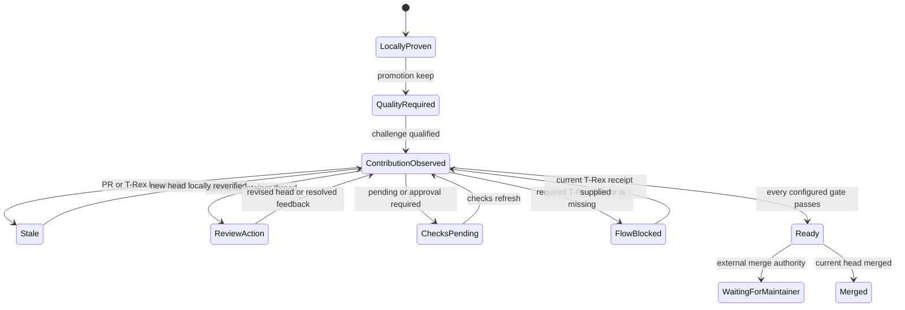

## Context

The local runtime campaign already keeps immutable manifests, append-only
experiment records, exact correctness results, paired performance evidence,
repository identities, and deterministic promotion decisions. It deliberately
does not own source edits or GitHub publication. T-Rex independently emits a
canonical change-plus-preview receipt with an exact source head and
deterministic browser-flow verdict.

The missing boundary is between a campaign `keep` and an honest external
contribution closeout. See `proposal.md` and the optimization-contribution-
closeout specification.

## Goals / Non-Goals

**Goals:**

- Make patch quality a required, evidence-backed gate after promotion.
- Bind local optimization and optional T-Rex evidence to one candidate SHA.
- Normalize enough GitHub state to distinguish code failure, review work,
  approval, and upstream ownership.
- Keep the full loop available through deterministic CLI/MCP JSON without a
  desktop dependency.

**Non-Goals:**

- Generating or editing patches, reviewing arbitrary style, or scoring code
  quality with a model.
- Running T-Rex, deploying a preview, or load-testing hosted systems.
- Posting or resolving GitHub feedback, approving workflows, or merging PRs.
- Adding a second persistence system or modifying existing T-Rex receipts.

## Decisions

### 1. Add a companion closeout artifact instead of changing campaign v1 records

The campaign ledger remains immutable and backward compatible. A new bounded
challenge artifact references one or two existing `keep` records by sequence,
record digest, repository revision, and diff digest. The contribution receipt
references the challenge and the selected record.

Changing the closed v1 campaign record was rejected because old campaign
artifacts would become unreadable or require a migration that adds no runtime
evidence. Treating line count as part of the existing performance decision was
rejected because complexity must not compensate for correctness or speed.

### 2. Use deterministic risk signals as prompts for evidence

The challenge computes files and line movement from recorded campaign data and
scans the selected Git diff for bounded language-neutral risk tokens such as
new cache/state identifiers, `finally`/`defer` cleanup, and fallback branches.
Signals are observations, not a quality score. A flagged candidate needs either
a qualified simpler comparison or a bounded invariant justification.

The comparison retains the largest scale or latency value as the target and
smaller scale points, bytes/op, and allocations/op as controls when the
promotion evidence contains them. A simpler candidate must stay inside the
same tolerance on every recorded value. This avoids accepting a fast target
that quietly regresses the no-op, small-input, or allocation surface.

An AST dependency was rejected for the first slice because it would increase
packaging and language scope. An LLM quality verdict was rejected because it
would make the publication gate nondeterministic.

### 3. Keep contribution inspection in a separate pure service

`contribution-contracts.mjs` owns strict schemas and deterministic verdict
derivation. `contribution.mjs` loads campaign/challenge/T-Rex artifacts,
invokes a narrow injected GitHub inspector, normalizes observations, and writes
one atomic receipt under the campaign directory. Tests inject fixtures; the
default adapter calls local `gh` with argument arrays and a fixed GraphQL query.

The service accepts one canonical PR URL and verifies that its repository and
head match the locally selected evidence. It does not use a general GitHub SDK
or add a production dependency.

### 4. Compose T-Rex by receipt, not by execution

The contribution input declares `optional`, `required`, or `not_applicable` and
may identify one contained T-Rex JSON receipt. The adapter reads only the fields
needed for source identity, verdict, preview identity, limitations, and receipt
identity. Unknown schema or malformed evidence becomes no-confidence.

This keeps T-Rex beside performance while preserving authority: performance
cannot turn a failed browser flow into a pass, and T-Rex cannot claim a speedup.
Launching T-Rex from the runtime MCP was rejected because it would expand a
closed local performance server into a browser/network execution authority.

### 5. Derive readiness lexicographically

The receipt keeps all gates even when an earlier gate controls the overall
status. A weighted score was rejected because a large speedup must never offset
wrong behavior, stale identity, or actionable review.

### 6. Make refresh explicit for the local MVP

CLI and MCP expose challenge, inspect, and refresh operations. No daemon or
hosted webhook is added. Each refresh reads the current PR once and emits a new
current receipt while retaining earlier receipts as bounded history.

Background polling was rejected because it creates hidden resource and API
cost, conflicts with the local-first product boundary, and is unnecessary to
prove the contract.

### 7. Optimize contributor preparation, not maintainer ceremony

Candidate challenge runs before publication whenever possible. GitHub refresh
only consumes evidence that already exists, and a maintainer-owned terminal
state ends in quiet waiting. The adapter contains no mutation command and the
MCP annotations remain read-only for inspection and refresh.

Installing a GitHub App, creating a required status check, posting a large
benchmark report, automatically requesting re-review, or reminding maintainers
was rejected. Those actions externalize the contributor's verification cost
onto open-source projects. A future explicit author action may copy a concise
summary, but it is not part of this service.

### 8. Derive learning and publication from receipt transitions

When a reviewed candidate is superseded, the service reads the prior immutable
challenge and carries the actionable thread into a bounded learning record. It
records exact before/after revisions and complexity, prior risk signals, the
revised campaign hypothesis, repeated gate status, and current upstream
disposition. It does not infer a universal style rule or ask a maintainer to
classify the feedback.

`publication.json` is a replaceable projection, not evidence authority. A
current receipt regenerates it. Head drift only marks the existing projection
stale while preserving its source digest; no stale receipt can silently become
the new publication. The append-only receipt ledger and immutable challenges
remain authoritative.

## Risks / Trade-offs

- **Diff-token signals can over-report complexity** → treat them as evidence
  requests, never automatic rejection; allow explicit invariant justification.
- **GitHub status models vary across check runs and status contexts** → preserve
  raw bounded observed kinds and normalize only the small readiness taxonomy.
- **T-Rex is not applicable to every Node or Go project** → require an explicit
  policy and keep `not_applicable` distinct from missing evidence.
- **A PR can change immediately after inspection** → bind the receipt to the
  observed head and require refresh before terminal closeout.
- **Repeated refreshes can consume GitHub API quota** → remain operator-
  triggered, make normalization idempotent, and perform no background polling.
- **Issue #111 is broad** → ship one hermetic Marked-shaped fixture and closed
  operations first; UI and hosted monitoring remain out of scope.

## Migration Plan

The change is additive. Existing campaign and T-Rex artifacts remain readable
and unchanged. New challenge and contribution files live under the existing
contained campaign directory. Rollback removes the new CLI/MCP operations and
artifacts without touching campaign history, T-Rex storage, desktop data, or
external pull requests.
