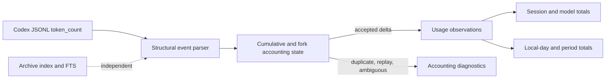

## Context

See [proposal.md](./proposal.md). CodeVetter currently stores canonical token totals on `cc_sessions`, stores message-count day buckets in `cc_session_days`, and derives period usage by prorating each session total across those message buckets. Codex parsing sums every `last_token_usage` row and uses a first-second heuristic to suppress copied fork prefixes.

Reference implementations provide stronger invariants. CodexBar records timestamped usage rows, tracks cumulative baselines and monotonic watermarks, suppresses exact cumulative re-emissions, resolves fork inheritance, and prioritizes recent bounded scans. Codex itself documents that rate-limit-only updates can repeat both an unchanged `total_token_usage` and the prior nonzero `last_token_usage`. ccusage and CodexBar aggregate local usage by the usage event's day rather than by session-message proration.

The implementation must remain local-only, incremental over very large JSONL files, compatible with existing SQLite data, and must not retain prompt or tool content for accounting.

## Goals / Non-Goals

**Goals:**

- Make a one-shot scan, an arbitrary sequence of incremental scans, and an idempotent repair produce identical Codex totals.
- Make daily/weekly/monthly totals directly reproducible from accepted timestamped deltas.
- Correctly suppress repeated snapshots, inherited fork prefixes, and interleaved cumulative gaps.
- Keep live usage fresh while archive indexing and FTS maintenance run.
- Provide content-free diagnostics for every excluded or pending category.

**Non-Goals:**

- Reproduce ChatGPT subscription quota percentages from local token counts.
- Change Claude, Grok, Cursor, or Devin accounting in this change.
- Add a new dashboard route or store raw prompts/tool payloads.
- Guarantee repair of sessions whose source transcripts have been deleted or rotated away.

## Decisions

### Persist normalized Codex usage observations

Add a compact Codex usage-observation table keyed by stable session identity plus source event position. Each accepted row stores timestamp/local day, model, input, cached input, output, reasoning output, cumulative snapshot components, and disposition. Canonical daily totals are sums over accepted observations; session totals are reconciled from the same rows.

Storing only updated session totals was rejected because it cannot reproduce calendar attribution, explain exclusions, or preserve incremental deduplication state across restarts.

### Use cumulative containment as the accounting guard

For each token event, compare `total_token_usage` with persisted state:

1. Exact previously seen total: accept zero.
2. Monotonic progression: prefer a valid contained cumulative delta, capped by `last_token_usage` when appropriate.
3. Component decrease: latch interleaved mode, retain a component-wise monotonic watermark, and accept only growth contained above already counted totals.
4. Missing cumulative total: accept nonnegative `last_token_usage` with a source-position idempotency key.

This follows the core CodexBar invariant while allowing a smaller implementation tailored to CodeVetter's schema. Blindly summing `last_token_usage` was rejected because Codex re-emits it. Using only the latest cumulative total was rejected because it loses per-day/model attribution and fails on interleaved lineages.

### Resolve fork ownership from child-local counter evidence

Use fork lineage as structural evidence, then derive an ordinary child's inherited baseline from its first internally consistent `total - last` snapshot. This avoids subtracting the parent snapshot twice: current Codex child counters already carry the inherited prefix locally. For copied-history subagents, suppress the monotonic replayed prefix until a counter drop establishes the child-local boundary. Until either ownership shape is established, ambiguous events are diagnostic-only.

Cross-file parent subtraction was rejected after frozen-corpus qualification because it zeroed legitimate child requests. Blindly summing each child cumulative total, as a standalone reference scan does, was also rejected because it recounts inherited parent context.

The current “two token rows in the first second” heuristic was rejected because timestamp coincidence is not ownership evidence and does not handle lineage interleaving.

### Separate usage progress from archive progress

Use an independently serialized, bounded usage-ingestion path and cursor/state transaction. Archive messages and FTS synchronization may follow asynchronously. The usage path prioritizes recently modified Codex files and records pending bytes when its time or byte budget expires.

Reusing the global full-index lock was rejected because a long FTS reconciliation makes fresh usage invisible even though the transcript is readable.

### Rebuild Codex-derived data by revision

Introduce a new accounting revision. On repair, stream each readable Codex transcript, replace its normalized observations and derived session/model/day totals transactionally, and leave unreadable sessions untouched with an unrepaired diagnostic. Revision completion is recorded only after all readable candidates have committed.

## Data Flow

## Risks / Trade-offs

- [Fork metadata varies across Codex versions] → Keep structural parsing tolerant, treat unresolved ownership conservatively, and add fixtures from ordinary, spawned, forked, and interleaved logs.
- [Observation rows increase database size] → Store only numeric/accounting fields, use one row per token event, index the period query keys, and retain no transcript content.
- [A new repair can materially change historical totals] → Run deterministic before/after reconciliation on a database copy, report changed sessions and exclusions, and gate the migration by revision.
- [Concurrent usage and archive writers can contend in SQLite] → Use short transactions, busy timeouts, bounded batches, and independent cursors; never hold a write transaction while reading transcript files.
- [Reference behavior evolves] → Encode source-shape fixtures and invariants rather than copying implementation details, and retain diagnostics for unsupported shapes.

## Migration Plan

1. Add the observation/state/diagnostic schema without changing existing reads.
2. Implement and test the accounting state machine against synthetic adversarial fixtures and sanitized current-format fixtures.
3. Switch Codex incremental ingestion to dual-write observations and existing totals; assert reconciliation in tests.
4. Switch period queries to accepted observations for Codex while retaining existing provider paths.
5. Run the revisioned repair on a database copy and compare CodeVetter totals with independent reference calculations.
6. Enable the repair for the live database only after validation; unreadable historical sessions retain prior totals.

Rollback disables observation-backed reads and returns to existing session totals. The additive schema remains harmless; the repair must preserve enough pre-repair summary information to report changed rows, but source transcripts remain the canonical recoverable evidence.
