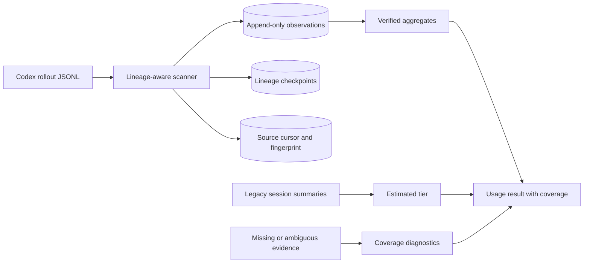

## Context

The current database contains 1,354 Codex session rows, but only 91 were repaired from retained sources; 1,260 point to missing transcripts. The retained observation ledger reports roughly 2.83B input tokens while the installed CodexBar 0.16-era scanner reports about 947M input tokens over the same retained time window. A simpler cumulative-difference product reports about 3.43B, demonstrating that market products also diverge sharply when fork history is copied into child rollouts.

CodexBar commit `4f0ac0680cd2f3cce36ed02b8a1e1fbc20bfee76` is the selected reference because its MIT-licensed scanner resolves parent snapshots at fork timestamps, latches interleaved cumulative streams, caps post-latch deltas, persists checkpoints, and has extensive fork/subagent integration fixtures. It remains an oracle, not a production runtime dependency.

## Goals / Non-Goals

**Goals:**

- Make verified usage durable independently of transcript retention.
- Match the selected lineage-accounting oracle exactly on token classes and days.
- Make missing evidence and pricing uncertainty impossible to mistake for zero usage or exact spend.
- Keep indexing bounded, incremental, private, and local.

**Non-Goals:**

- Reconstruct exact tokens from deleted transcripts or summary rows.
- Claim API-equivalent dollars equal a ChatGPT subscription bill.
- Infer priority/service tier when Codex did not record it.
- Add a cloud account or upload transcript content.

## Decisions

### 1. Use a durable evidence ledger as the canonical source

The canonical aggregate is the sum of immutable accepted observations, not mutable session summary columns. One transaction appends observations, lineage/checkpoint state, and the completed source cursor. Session summaries become rebuildable projections.

Alternative rejected: keeping only final per-session totals. It cannot support day attribution, replay audits, repricing, or post-pruning verification.

### 2. Port the oracle's lineage invariants, not its Swift implementation

The Rust scanner will implement the same state machine: parent snapshot resolution at fork time, monotonic component watermarks, bounded seen-total suppression, permanent interleaving latch after any component drop, and post-latch `min(last, contained-growth)` accounting. Parent sources are indexed before children through an explicit dependency graph; unresolved ancestry is ambiguous rather than guessed.

Alternative rejected: shelling out to CodexBar. It would create a runtime dependency, platform coupling, and an opaque availability boundary.

### 3. Pin an executable oracle and upstream-derived corpus

A development-only parity harness runs the installed or explicitly provided CodexBar CLI against a content-sanitized corpus and compares exact token classes and local-day buckets. Repository tests include adapted lineage fixtures with MIT attribution and the upstream commit. Release qualification additionally supports the operator's retained corpus without copying transcript content into the repo.

Alternative rejected: fixtures authored only from our own interpretation; that reproduced the previous false confidence.

### 4. Represent coverage as a reconciled state machine

Each source snapshot is exactly one of `verified`, `legacy_estimated`, `ambiguous`, `missing_unestimated`, or `stale`. Aggregate results carry tier totals, counts, pending bytes, last observation time, scanner revision, pricing revision, and oracle qualification revision. “Complete” is derived, never stored as an unchecked boolean.

### 5. Separate token certainty from price certainty

Token evidence can be exact while API-equivalent price is not. Cost rows retain model, recorded service tier when available, rate revision, and one of `priced_exact`, `priced_range`, or `unpriced`. Unknown GPT-5.6 service tier produces a labeled range based on supported list-price tiers rather than a point estimate.

### 6. Historical backfill has recovery and preservation phases

Recovery scans the primary Codex home, archived sessions, configured additional homes, JetBrains Codex homes, and explicit imported directories. Stable session identity plus source fingerprint prevents duplicates. Unrecovered legacy rows remain immutable estimates and cannot enter verified daily charts. A user may later attach a recovered archive and promote matching rows to verified.

## Risks / Trade-offs

- [CodexBar behavior changes upstream] → Pin the revision and update only through an explicit oracle-revision change with corpus diffs.
- [Real corpus contains private content] → The parity runner exchanges aggregate JSON only; fixtures are synthetic or sanitized and never copy prompts.
- [Parent transcript was pruned before the child is first seen] → Mark child lineage ambiguous; preserve its legacy estimate separately.
- [Append-only observations grow] → Store content-free fixed-width fields, checkpoint lineage state periodically, and retain observations because they are the accounting evidence.
- [Unknown service tier makes dollar ranges wide] → Lead with tokens and cache classes; keep cost visibly secondary and qualified.
- [Legacy 91B-token rows may be inflated] → Never call them verified; expose their provenance and allow later recovery to supersede them.

## Migration Plan

1. Add ledger/checkpoint/coverage schema without altering existing totals.
2. Re-scan every retained source using the new lineage engine and write a new scanner revision alongside the old ledger.
3. Run exact CodexBar parity and internal reconciliation before switching reads.
4. Classify unrecovered rows into the legacy estimated tier and expose coverage diagnostics.
5. Atomically switch usage queries to the new revision; retain the prior tables for rollback.
6. Roll back by restoring the previous read revision. Never delete the new ledger or legacy rows during rollback.
