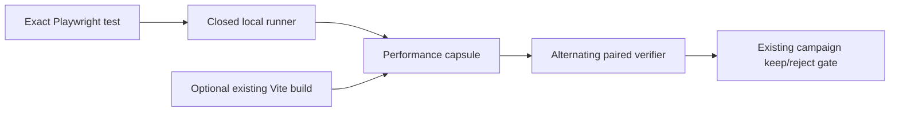

## Context

See [proposal.md](proposal.md). Current `main` retains a closed Playwright
runner but excludes Playwright from profiling, paired verification, and
campaign scopes. The retired branch proved deeper browser attribution at the
cost of roughly 60,000 runtime lines; this design must recover the high-value
measurement seam without recovering that architecture.

## Goals / Non-Goals

**Goals:**

- Make one existing Playwright test a first-class performance and campaign scope.
- Use test-reporter evidence that excludes server startup from the primary flow metric.
- Preserve alternating paired verification and current campaign authority.
- Surface initial Vite JavaScript bytes without executing a build or trusting freshness.
- Stay below 1,000 net new production lines and add no dependency.

**Non-Goals:**

- Chrome trace ingestion, Core Web Vitals, React commit attribution, retained
  heap, request waterfalls, automatic patching, or production profiling.
- Static evaluation of Playwright/Vite configuration or execution of package scripts.
- Automatic claims that a discovered browser test is representative.

## Decisions

### 1. Reuse the closed Playwright runner and parse its JSON reporter

The existing runner already resolves a contained test, invokes the repository's
installed Playwright CLI without a shell, pins the exact test name, bounds
output, and uses the repository's declared managed server. The performance
capsule will parse the single matching test result and store its reported
duration separately from process wall time. Playwright scopes skip V8/Go
profiling passes.

This is preferable to reviving the owned-Vite/trace runtime. It measures less,
but the evidence boundary is understandable and small.

### 2. Make paired test duration primary and process wall time protective

The paired verifier will alternate incumbent and candidate executions. Exact
test duration is the primary metric because Playwright reports it after server
setup; process wall time remains a secondary guard against moving work outside
the test interval. Ten campaign promotion samples use the existing campaign
policy. Direct comparisons require at least three samples.

The materiality floor is both 10% and 10 ms. A process-wall regression above
20% rejects a candidate. Failed, retried, missing, ambiguous, or truncated
results return no confidence.

### 3. Read, but never trust, an existing Vite artifact

A small inert reader accepts an explicit contained build directory and HTML
entry. It follows literal relative module-script and static-import edges with
fixed file/byte/depth bounds, computes raw and deterministic gzip bytes, and
marks the whole observation unverified. It never imports configuration, runs a
build, follows source maps, or turns bundle movement into a keep verdict.

An attested artifact comparator is deferred until current `main` has a compact
source-snapshot contract that includes untracked files.

### 4. Extend existing contracts instead of adding another loop

Playwright joins the profile-adapter set, performance capsule observation, CLI,
MCP, paired verifier, and campaign manifest already used by Node/Vitest/Go.
There is no browser-specific campaign ledger or service.

## Risks / Trade-offs

- **Playwright duration includes assertions as well as user actions** → Name the
  exact tested flow and preserve this limitation; compare only identical test bytes.
- **Reporter shape drifts** → Parse a closed subset and fail closed on missing
  or ambiguous results.
- **Existing build artifacts may be stale** → Label them unverified and prevent
  them from authorizing a keep.
- **Wall time can be noisy** → Use it only as a broad regression guard and keep
  test-reported duration primary.
- **This does not locate source hotspots** → Treat the result as measurement
  authority; source hypotheses still require review/static evidence or agent inspection.

## Migration Plan

The capability is additive. Qualify it first against hermetic reporter and Vite
artifact fixtures, then run it on Chess Coach without source changes. Rollback
removes Playwright from the profile adapter set and ignores the additive capsule
fields; existing Node, Vitest, and Go receipts remain valid.
