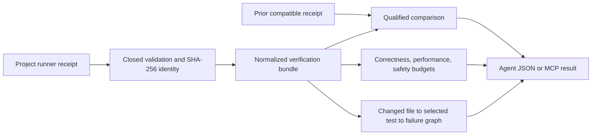

## Context

See [proposal.md](./proposal.md) for motivation and
[spec.md](./specs/verification-receipt-comparison/spec.md) for observable
behavior. CodeVetter already has several specialized receipts, deterministic
agent-task evaluators, a runtime performance capsule, and a Rust T-Rex CLI. A
project runner must remain the authority for executing its own suite; this
change consumes evidence after execution and must not create another runner.

The first integration is repository-owned and dependency-free. The desktop
database and viewer are intentionally outside the critical path so identical
receipt bytes produce identical analysis on any supported transport.

## Goals / Non-Goals

**Goals:**

- Normalize one narrow project-verification receipt without weakening its raw
  evidence or mutating it.
- Compare correctness, resource use, safety, and inventory independently.
- Explain test selection and failures with a small evidence graph.
- Reuse one pure implementation from JSON CLI and read-only MCP transports.
- Connect deep runtime performance capsules as optional referenced evidence
  while keeping their verdict separate.

**Non-Goals:**

- Executing tests, discovering arbitrary commands, replacing Playwright or Go
  benchmarks, continuous monitoring, desktop visualization, production
  ingestion, automatic patching, or inferring dependencies absent from the
  producer receipt.

## Decisions

### 1. Use one canonical producer contract and one derived bundle

`codevetter.project-verification-receipt/v1` is a closed producer contract.
`codevetter.verification-bundle/v1` is a derived CodeVetter artifact containing
the source hash, normalized outcomes, budgets, taxonomy, graph, limitations,
and optional comparison. The raw receipt is never rewritten or embedded.

Alternative considered: accept arbitrary Playwright, Vitest, and Go JSON.
Rejected because heuristic adapters would silently erase inventory and process
accounting differences. Project-specific runners should perform a small,
explicit projection into the canonical contract.

### 2. Keep analysis a pure function of receipt bytes and repository scope

The core accepts already parsed JSON plus a verified relative source path and
returns canonical JSON data. It does not read Git, inspect the ambient machine,
or add an analysis timestamp. SHA-256 identities use stable key ordering, so
re-ingestion and offline rescoring are reproducible.

Alternative considered: persist directly into the desktop SQLite database.
Rejected for the first slice because storage migrations and app lifecycle would
couple the machine contract to the viewer and make hermetic adoption harder.

### 3. Qualify comparisons with an explicit compatibility matrix

Repository, schema major, runner profile, environment, and inventory contract
must match. Exact revision equality yields `same_commit`; a revision difference
with all other identities equal yields `cross_commit`; any other mismatch is
`incompatible`. Cross-commit comparisons retain observations but cannot emit a
controlled speedup claim.

Budgets are evaluated per receipt before comparisons. Comparison classifications
describe change; they never replace either receipt's correctness, performance,
or safety verdict.

### 4. Model test selection as an evidence graph, not a guessed call graph

Nodes are only changed files, test identities, and failure signatures supplied
by the producer. Edges carry `selected_by` or `failed_with`; missing selection
relationships become limitations. This avoids converting repository proximity
or a static graph guess into runtime proof.

### 5. Keep the MCP surface read-only and repository-scoped

A small stdio process receives one canonical repository at startup and exposes
`ingest_verification_receipt` and `compare_verification_receipts`. Tool inputs
contain only repository-relative receipt paths. It calls the same pure module
as the CLI, writes nothing, accepts no command, and cannot change scope.

Alternative considered: add tools to the existing history MCP. Rejected
because that Rust sidecar is database- and opaque-repository-id scoped, while
receipt ingestion is a filesystem evidence operation. Keeping the experimental
process separate preserves the current history MCP contract.

### 6. Make producer omissions explicit

The canonical receipt records coverage for CPU, RSS, process count, inventory,
network, fixed waits, retries, and selection explanations. A required budget
against missing coverage yields `no_confidence`. Optional referenced runtime
performance capsules are identified by relative path and SHA-256 only; their
source hotspots remain a drill-down artifact rather than being copied into the
project-level verdict.

## Risks / Trade-offs

- **Producer adoption requires a projection step** → provide fixtures, a JSON
  schema-shaped example, precise validation errors, and a reusable package
  script instead of accepting ambiguous native formats.
- **Project runners can misreport process-tree resources** → require coverage
  declarations and preserve limitations; never upgrade partial RSS to total RSS.
- **Strict inventory identity can make comparison unavailable** → retain both
  standalone bundles and report exact incompatibilities rather than comparing
  unlike runs.
- **A filesystem MCP can expose local data** → canonicalize the startup scope,
  reject absolute/traversal/symlink escapes, cap bytes, reject secret-shaped
  values, and never return raw receipt text.
- **One graph omits undeclared dependencies** → this is deliberate; missing
  explanations are visible and later integrations may add separately labeled
  static graph evidence.

## Migration Plan

1. Add the contract, pure ingestion/comparison modules, and hermetic fixtures.
2. Add JSON CLI operations and qualify deterministic output and exit codes.
3. Add the separate read-only MCP transport over the same functions.
4. Ingest existing project-runner evidence as a real receipt fixture and record
   its measurement limitations.
5. Keep the feature repository-owned and experimental. Rollback removes the
   additive scripts and package entries; no database or target-project migration
   is required.
