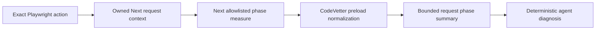

## Context

See [proposal.md](proposal.md) for motivation. The owned Next runtime already
injects one dependency-free preload for capture-scoped HTTP, CPU, and async
evidence. Next 16's internal tracer optionally mirrors three allowlisted spans to
Node performance measures when a prefix is present before the module loads.
Those measures are local process events and require neither an exporter nor an
OpenTelemetry SDK registration.

## Goals / Non-Goals

**Goals:**

- Reuse framework-emitted timing rather than infer business phases from stacks.
- Keep phase identity closed and tied to one captured request.
- Make a long unaccounted server interval more interpretable to an agent.
- Preserve all existing correctness, paired-verification, and cleanup gates.

**Non-Goals:**

- User-defined spans, arbitrary OpenTelemetry ingestion, or production traces.
- Exclusive-time accounting, critical-path reconstruction, or source causation.
- Next-version-independent phase completeness.
- Instrumenting repository source or loading repository configuration.

## Decisions

### Reuse the owned preload and Next's closed performance bridge

The owned runtime supplies one fixed private prefix before Next loads. The
preload wraps `performance.measure`, calls the original operation first, and
admits only exact known names emitted by Next's fixed log allowlist. It captures
the returned measure's monotonic start and duration synchronously while the
request `AsyncLocalStorage` context is active.

Registering an OpenTelemetry exporter was rejected for this local slice because
it would add SDK/provider lifecycle, dependency, attribute-redaction, and span
context complexity. Inferring phases from CPU or async stacks was rejected
because those mechanisms do not name the framework operation.

### Preserve only three semantic categories

Exact private measure names normalize to `route_resolution`,
`component_tree`, or `client_component_loading`. The raw name, prefix, marks,
detail, attributes, route, and error data do not enter the event stream. Unknown
names are ignored. Capture requires `currentAsyncParentId()`, which excludes
generated `/_next/` request contexts under the existing policy, and rejects an
event after the response is complete.

### Keep phase accounting separate

Each event uses the same process clock as its parent request. Public projection
exposes start offset and duration, retains at most eight representative phases,
and computes one interval union against the request bounds. It does not add
nested durations, change database/HTTP child accounting, or subtract phase time
from residual duration.

### Add a no-edit detector

A phase must cross 5 ms and 20% of its request to become a finding. The longest
qualifying phase wins deterministically. The finding has no source and is always
ineligible for an experiment; it tells the agent which framework step deserves
deeper evidence. A paired exact-flow improvement and project correctness remain
required after any external edit.

## Risks / Trade-offs

- **Next changes or removes the performance bridge** → Phase coverage becomes
  explicitly unavailable while all independent evidence lanes continue.
- **A framework phase includes application work** → The finding names only the
  enclosing phase and carries no source or exclusive-time claim.
- **Measure wrapping perturbs the request** → Collection is limited to the
  existing diagnostic execution and cannot become authoritative latency.
- **Nested phases overstate work if summed** → The public report exposes interval
  union and explicitly keeps phase accounting non-additive.
- **An application emits a colliding measure name** → The private prefix is set
  only in the owned runtime, but collision cannot prove origin; evidence remains
  framework-category diagnostic and never edit-eligible.

## Migration Plan

This is an additive local evidence-schema revision. Rollback removes the fixed
prefix and measure wrapper; older captures remain readable through their
existing schema versions. No data migration, production rollout, or dependency
installation is required.
