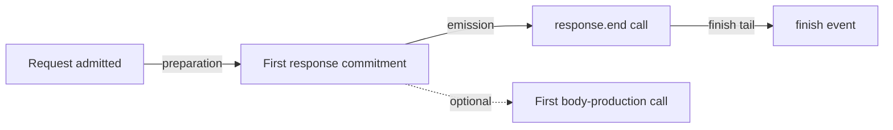

## Context

The closed Next performance-measure bridge exposes only the three phases
CodeVetter already captures. On unchanged High Signal those total less than one
millisecond while a warm correlated request takes over one second. Node's
`ServerResponse` lifecycle is the next stable boundary available without an
OTel SDK or framework patch. See [proposal.md](proposal.md).

## Goals / Non-Goals

**Goals:**

- Partition server-side response production using ordinary Node API calls.
- Preserve exact workload behavior and private-data boundaries.
- Give agents one coarse next measurement rather than a fabricated source.

**Non-Goals:**

- Browser/network TTFB, kernel send completion, socket backpressure causation,
  chunk sizes, response contents, or exclusive CPU.
- Framework-specific render spans, production instrumentation, or source edits.

## Decisions

### Wrap four response methods inside the admitted request

The preload wraps `writeHead`, `flushHeaders`, `write`, and the already-wrapped
`end` on the per-request response object. The earliest call establishes
commitment. `write` or an `end` call with a non-callback argument establishes
first body production. Wrappers observe only call time and delegate with the
original receiver and arguments; they never examine argument content.

### Normalize offsets on the existing server event

The completed `http_server` event gains a closed `response_timing` object. Its
public projection contains commitment, optional body-production, end, and
finish offsets plus preparation, emission, and finish-tail intervals. Finish is
the existing authoritative request-duration boundary, so the three derived
intervals partition rather than overlap the request. This is descriptive and
stays outside child-operation accounting.

### Fail closed on incomplete or inconsistent order

The preload can observe requests that fail, destroy their socket, or bypass the
ordinary `end` path. It retains null boundary fields and `complete: false` in
those cases. Normalization rejects negative, out-of-order, beyond-duration, or
unknown data. A detector runs only on a complete partition.

### Use one closed dominant-interval detector

The detector picks the longest interval, breaking ties as preparation,
emission, then finalization. It requires 5 ms and 50% of the request. A finding
is source-null, low confidence, and edit-ineligible; its next action is a
correctness-passing paired experiment or a narrower supported child/source
observation.

## Risks / Trade-offs

- **Method calls do not equal bytes on the wire** → Name evidence response API
  boundaries and explicitly reject network-TTFB claims.
- **Frameworks can write through unusual paths** → Preserve an incomplete state
  instead of synthesizing boundaries.
- **Wrapping can perturb identity-sensitive code** → Scope wrappers to the
  per-request response instance and prove receiver, return, arguments,
  exceptions, and event behavior in fixtures.
- **Emission includes waits between writes** → Describe it as the interval from
  commitment through end, not exclusive streaming work.

## Migration Plan

Keep the private same-run Node event additive, and rev the persisted
browser-server flow and Playwright diagnosis schemas together. Stored evidence
keeps its old version and is never rewritten. No database, dependency,
deployment, or external migration is needed.
