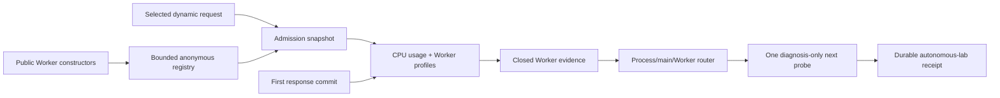

## Context

The completed pre-commit router compares process CPU with a main-thread V8 slice. High Signal retained only 45.74% of observed process CPU as non-idle main-thread sampled time, so the closed next probe is Worker or background CPU. Node 24.8+ exposes parent-side `Worker.startCpuProfile()` and Node 24.6+ exposes `Worker.cpuUsage()`, but Node provides no public enumeration of all existing Workers. Raw Worker profiles are serialized V8 profile documents in the current runtime and can be large.

## Goals / Non-Goals

**Goals:**

- Observe Worker instances created through both public CommonJS and ESM exports before application entry runs.
- Capture anonymous per-Worker CPU usage and sampled scope across the selected request's pre-commit interval.
- Make observation gaps and compatibility visible enough for deterministic routing.
- Preserve application behavior, bounded evidence, redaction, and zero edit authority.

**Non-Goals:**

- Enumerating native threads, libuv pool work, child processes, cluster workers, or Workers hidden behind native bindings.
- Calling the difference between process and sampled CPU an exact decomposition.
- Reading Worker filenames, constructor options, worker data, messages, environment data, or source bodies.
- Supporting Worker profiling on Node versions without the public parent-side APIs.
- Automatically optimizing Worker code in this change.

## Decisions

### Patch the public constructor with a transparent proxy

The preload replaces the writable CommonJS `worker_threads.Worker` export with a construct proxy and calls `syncBuiltinESMExports()` before application entry. The proxy delegates with `Reflect.construct`, returns the original instance, retains `instanceof` and static behavior, and only registers an anonymous ordinal plus online/exit lifecycle.

Subclassing was rejected because it changes constructor identity and can alter subclass/new-target behavior. Async hooks were rejected because their Worker resource exposes lifecycle but not the `Worker` instance required by the public profiling APIs. The registry is bounded and removes exited instances.

### Start admitted online Workers before handler dispatch

When the existing single active dynamic request profile is admitted, CodeVetter snapshots a bounded online Worker registry and starts `cpuUsage()` plus `startCpuProfile()` before dispatch alongside the main-thread profiler. Workers that are offline, beyond the bound, created after admission, exited, or unable to start make the inventory incomplete. The response commitment starts asynchronous stop/usage collection; persistence never blocks the response method.

This gives the tightest supported interval and records start/stop offsets. It still has observer overhead and small boundary skew, so routing requires fixed compatibility tolerances. Continuously profiling every Worker was rejected because it creates uncontrolled overhead and cannot isolate one request.

### Keep raw Worker evidence private and normalize through a dedicated adapter

One bounded raw document contains the selected request identity, overlap count, requested commit boundary, anonymous Worker ordinals, interval offsets, CPU deltas, and private profiles. A dedicated normalizer validates size and consistency, reuses the existing V8 frame classification rules, and emits a closed aggregate plus bounded per-Worker summaries. Public output never contains thread IDs, constructor arguments, raw profiles, worker input, messages, or absolute paths.

The raw schema accepts the current serialized profile representation and a parsed profile representation to remain compatible with Node API evolution, but public normalization produces one stable schema.

### Route by observed share without subtracting an exclusive residual

For a compatible off-main-thread gap, the router compares summed Worker CPU with process CPU. A fixed 5 ms floor and 20% process-CPU share make Worker CPU material. If material and sampled non-idle Worker time has a dominant closed scope, the route names that scope for inspection. If CPU is material but sampling is insufficient, it requests a narrower Worker source profile. If a complete inventory is below threshold, it routes to child-process/native/background/sampling-gap capture.

Worker CPU and main-thread samples are not subtracted from process CPU because sampling, interval skew, profiler overhead, and process-wide accounting are not exclusive. Every route remains source-null and edit-ineligible.

### Preserve the failed-flow laboratory boundary

Worker evidence enters the existing full and compact diagnosis and durable result integrity check. A failed exact assertion can carry the next probe but remains `failure_diagnosed`; it never becomes a candidate or accepted optimization.

## Risks / Trade-offs

- [Public-module interception misses native or preloaded Worker creation] → Mark the scope and inventory provenance explicitly; never call unobserved CPU zero.
- [Profiling perturbs the request and Workers] → Bound Workers and samples, activate only for selected diagnostic requests, record observer effect, and require paired correctness-passing verification later.
- [Worker startup or exit races with admission] → Retain per-Worker states and make the inventory incomplete when the interval cannot be closed.
- [Multiple Worker profiles exceed storage bounds] → Cap admitted Workers, cap profiler samples, bound raw bytes, and fail excess evidence closed.
- [Process and Worker intervals are slightly different] → Retain offsets and require compatibility tolerances before routing.
- [A runtime returns a different profile representation] → Accept only the two explicitly validated representations and treat all others as unsupported evidence.

## Migration Plan

The new evidence fields and raw documents use new schema versions. Existing captures remain readable only under their existing schema contracts; new capture discovery ignores incompatible historical receipts. Rollback removes the Worker registry and routing field while leaving application repositories unchanged. No database or production migration is required.
