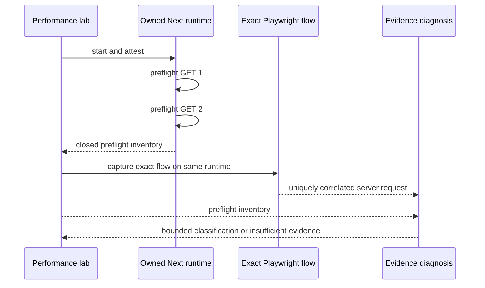

## Context

The owned Next runtime currently performs one bounded GET and retains only a
`warmup` enum. The subsequent Playwright capture already correlates one browser
request with Node server timing, but that result cannot recover how expensive
the initial route request was. See [proposal.md](proposal.md) and the
`node-browser-preflight-evidence` spec.

## Goals / Non-Goals

**Goals:**

- Preserve two coarse same-runtime preflight timings without expanding private
  application evidence.
- Compare them with exactly one compatible browser-correlated server request.
- Let the agent eliminate or prioritize initial-route effects before searching
  source code.

**Non-Goals:**

- Replaying arbitrary Playwright tests, resetting application state, or
  measuring a statistical distribution.
- Identifying Next compilation, module ownership, exclusive CPU, production
  latency, or a source edit from timing shape alone.
- Adding OpenTelemetry providers, repository configuration, remote traffic, or
  dependencies.

## Decisions

### Use two HTTP preflights, not automatic test replay

The exact static GET already qualifies the safe route and has no browser-side
mutation. Two sequential requests expose initial-versus-repeat shape within the
same maximum ten-second preflight budget. Replaying a full test could mutate a
database or in-memory server state and would require a repository-owned reset
contract, so it remains out of scope.

### Keep the legacy warmup state and add a closed nested inventory

The runtime contract moves to v3 but retains the current `warmup` value for
existing consumers. A new `preflight` object contains at most two observations.
This avoids silently changing the meaning of old fields and allows downstream
code to fail closed on the new schema.

### Compare only compatible route and status identity

The browser-server projection receives the runtime preflight evidence plus the
statically qualified route identity. It compares only a unique correlated GET
request whose normalized route and status class match both preflights. No clock
alignment is attempted: only durations are compared, with a 100 ms materiality
floor and a 2x ratio. The closed classifications are ordered so a browser
outlier takes precedence over an initial-preflight outlier, followed by repeated
high latency and no material outlier.

### Diagnose timing shape without edit authority

The tool-led detector can surface the three material classifications. Findings
have no source, low confidence, and zero experiment eligibility. They direct the
next measurement: repeat the exact correctness-passing flow or inspect a
supported child/CPU source. They never name compilation or an application file.

## Risks / Trade-offs

- **Preflight wall time and server request time use different observers** → Use
  only coarse fixed thresholds and state this limitation in evidence.
- **A GET route can still have side effects** → Use only the already-qualified
  browser GET route, run exactly twice, and never expand to request-fixture
  methods or dynamic values.
- **Two requests are not a distribution** → Emit shape classification, not a
  stable benchmark or regression verdict.
- **Preflight consumes startup budget** → Share the existing ten-second warmup
  deadline across both requests rather than doubling it.

## Migration Plan

Rev the owned runtime, browser-server flow, and top Playwright diagnosis schemas
in the same change. Existing stored artifacts retain their old schema and are
never upgraded in place. Rollback removes the nested preflight projection and
restores the v2/v5/v12 schema constants; no database or external migration is
required.
