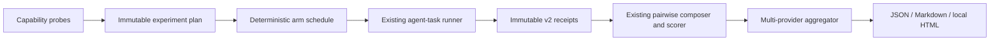

## Context

CodeVetter already has the pieces needed for a single-provider paired test:

- a 30-task, eight-category qualified corpus;
- deterministic planning and a one-attempt provider-neutral runner;
- immutable v2 run receipts with optional diagnostics;
- a receipt composer that rejects identity drift and contaminated controls;
- the structural-context A/B and A/A scorer with JSON, Markdown, and HTML
  projections.

The current evaluation bundle models one `control`/`treatment` pair and names
the treatment context as a graph. The planned experiment must compare several
agent-readable context systems without weakening that proven pairwise contract,
misclassifying infrastructure as a finished provider, or installing any
provider into the production application. See `proposal.md` for motivation and
`specs/context-provider-comparison/spec.md` for observable requirements.

## Goals / Non-Goals

**Goals:**

- Compare a plain baseline, CodeVetter context, and eligible external context
  providers under identical executable tasks and agent configurations.
- Preserve the current hidden-check scorer as the outcome authority.
- Make provider eligibility, indexing freshness, tool access, order, cost, and
  contamination inspectable before interpreting results.
- Stage the work so a cheap local feasibility probe can stop an unsound or
  impractical experiment before full-corpus execution.

**Non-Goals:**

- Building another graph, wiki, search engine, or enterprise context service.
- Comparing human-facing documentation quality or visual graph quality.
- Treating pgGraph, HydraDB, or another storage primitive as an end-to-end
  context provider.
- Adding provider SDKs or CLIs as CodeVetter production dependencies.
- Running paid trials, publishing a leaderboard, or making provider claims in
  this planning change.

## Decisions

### 1. Add a comparison layer over existing pairwise scores

The multi-provider experiment will introduce closed `context-provider-plan`,
`context-provider-probe`, and `context-provider-comparison` artifacts. Each
eligible provider is still evaluated as baseline-versus-provider evidence
through the existing receipt composer and structural-context scorer. The new
aggregator validates those pairwise score artifacts against one common plan
and produces the cross-provider scorecard.

This avoids changing the established A/B evaluator or creating a second task-
success definition. The legacy `context.graph` projection can carry the exact
provider engine/index identity internally for pairwise compatibility; the new
artifacts use the accurate public term `context_provider` and record whether
the source is graph, search, wiki/RAG, hybrid, or another declared kind.

Alternative considered: replace the pairwise evaluation bundle with a new
multi-arm schema. Rejected because it would duplicate pairing, check
projection, qualification, and invalid-evidence behavior that already passes.

### 2. Separate eligibility from outcome execution

A capability probe runs before experiment planning and emits a bounded record:

- provider/version/configuration and interface kind;
- local, hosted, or enterprise operating mode;
- index command and exact revision/freshness evidence;
- available tool names and whether calls are observable;
- setup time, bounded storage, data egress, authentication posture, and known
  limitations;
- eligible cohort or an explicit exclusion reason.

The first candidate inventory is:

| Candidate | Initial classification |
|---|---|
| Plain repository tools | Required baseline |
| CodeVetter structural context | Required local treatment |
| CodeGraph | Local agent-readable candidate |
| Graphify | Local agent-readable candidate |
| Repowise | Local/self-hostable agent-readable candidate |
| DeepWiki | Separate candidate only if its MCP/CLI path is reproducible |
| Sourcegraph | Separate hosted/enterprise cohort requiring explicit approval |
| pgGraph / HydraDB | Excluded infrastructure, not end-to-end providers |

Eligibility is determined from a live probe at implementation time; this table
is not a compatibility or quality claim.

### 3. Use a staged, deterministic crossover design

Stage 0 performs capability probes and produces plans only. Stage 1 is a
free/local feasibility run over a preregistered four-task slice: two API and
two browser tasks spanning at least four failure categories. It uses two
repetitions per arm and admits at most the baseline plus three treatment arms.

Stage 2 may run all 30 tasks with at least three repetitions per admitted arm
only after Stage 1 passes setup, freshness, contamination, cleanup, and
observability gates. The planner calculates exact attempts and conservative
cost bounds before requesting approval. Hosted or paid providers are a
separate cohort so local/privacy differences are not hidden in one ranking.

The implemented Stage 1 crossover schedule contains A/B arms only. It can test
adapter feasibility and report descriptive outcomes, but it cannot qualify a
provider because the existing pairwise policy requires independent A/A noise
evidence. Before any Stage 2 approval, its plan must therefore add a
preregistered A/A schedule with fresh workspaces and sessions; repeating or
relabeling Stage 1 A/B evidence is not sufficient.

Arm order is derived deterministically from the experiment identity using a
balanced Latin-square schedule where possible and a declared balanced rotation
otherwise. Fresh workspaces and new agent sessions prevent conversation or
generated-instruction carryover.

Each treatment binds a separate content snapshot to every task fixture. A
single provider-wide snapshot is invalid because the compact corpus tasks have
different source trees even when they share one provenance revision. A
content-addressed per-task snapshot may be reused read-only across repetitions;
provider configuration, agent session, and mutable workspace still remain
fresh for every arm.

Alternative considered: run providers sequentially in a convenient fixed
order. Rejected because model/provider drift, cache warmth, and learning or
rate-limit effects could become provider effects.

### 4. Keep task outcome primary and preregister diagnostics

Every arm uses the immutable task packet and hidden acceptance inventory.
Success requires all required checks and no regression. Operational failure,
setup failure, missing checks, check errors, timeouts, cancellation, and
cleanup failure retain their existing distinct states.

The plan preregisters secondary diagnostics:

- setup/index success and latency;
- tool calls and context-tool calls;
- files inspected and modified;
- relevant-file recall only for tasks with a predeclared relevant-file set;
- input/output tokens, elapsed time, and cost when actually captured;
- invalid, stale, missing, and contaminated arm counts.

Known-good changed files are not automatically used as retrieval ground truth:
a valid solution may touch a different boundary. Relevant-file sets require a
separate pre-run annotation and are diagnostic only.

### 5. Qualify each provider against baseline, then adjust the family

Each provider must pass the existing pairwise identity, sample, regression,
and A/A noise gates. The comparison plan additionally declares a family-wise
multiple-comparison method before runs begin. The initial design uses Holm's
step-down correction over provider-versus-baseline success hypotheses because
it controls family-wise error without assuming independent arms.

Raw outcome counts and unadjusted descriptive intervals remain visible, but a
provider is not ranked as qualified unless both its pairwise gates and adjusted
family decision pass. The report preserves negative, null, unavailable, and
excluded results.

Alternative considered: rank raw success rates. Rejected because repeated
provider comparisons make favorable noise increasingly likely.

### 6. Keep execution and scoring separated

Planning never launches agents. The runner never interprets success. The
pairwise scorer and new aggregator consume local immutable evidence and make no
network requests. This preserves deterministic rescoring and permits a ground-
truth correction without repeating expensive runs.

## Risks / Trade-offs

- **Provider interfaces change during the experiment** → Pin exact versions,
  configuration hashes, tool inventories, and snapshot identities; invalidate
  drift instead of silently combining it.
- **Global MCP configuration contaminates the baseline or another arm** → Use
  isolated per-run agent configuration roots and reject undeclared context-tool
  calls or injected instruction files.
- **Hosted and local products are not operationally comparable** → Separate
  cohorts and expose privacy, setup, and data-egress differences beside outcome
  results.
- **The 30 compact tasks favor localized fixes** → Limit claims to this corpus
  and add broader tasks only through the existing qualification contract.
- **Repeated multi-arm runs become expensive** → Stop after Stage 1 unless
  exact attempt, time, and cost bounds justify Stage 2 and receive approval.
- **Tool-call diagnostics may be incomplete** → Mark missing measurements
  unavailable; do not infer them from model prose or stdout.
- **External license or terms restrict automation/publication** → Record the
  restriction in the probe and exclude or keep the provider's result private.

## Migration Plan

1. Add new closed probe, plan, and aggregate-score contracts without changing
   existing run receipts or pairwise evaluation bundles.
2. Add hermetic synthetic fixtures proving eligibility, scheduling,
   contamination, missing-arm, aggregation, adjustment, and deterministic
   output behavior.
3. Add baseline and CodeVetter experiment adapters, then probe external
   candidates one at a time outside the production dependency graph.
4. Run Stage 0 and publish only the eligibility/feasibility plan locally.
5. Request explicit approval before Stage 1 execution and again before any
   Stage 2, paid, hosted, or public result.

Rollback is removal of the additive comparison contracts and scripts. Existing
corpus, runner, receipts, structural-context score, CLI, MCP, and desktop paths
remain unchanged.

## Open Questions

- Which exact four qualified tasks best represent the Stage 1 slice will be
  selected from the current corpus by a deterministic coverage report during
  implementation.
- External candidates admitted after the capability probe may require a
  private-only result if their licenses or terms prohibit public comparison.
