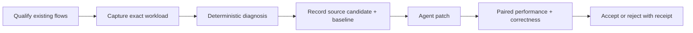

## Context

The useful product boundary is one evidence loop, not a collection of profiler
wrappers. Qualification, runtime capture, diagnosis, and verification already
exist but accumulated duplicate inventories,
validators, and low-level operations.

## Design

### One public laboratory operation

MCP exposes qualification/reporting plus one bounded laboratory operation.
Low-level capture and verification functions remain internal or CLI-only where
needed for reproducibility. The lab advances only through product-generated
next actions and stops before source mutation.

The consolidation removes the duplicate experiment ledger, correctness
projection, and profile-experiment verifier. The peak MCP surface fell from 32
to 14 tools; relative to `HEAD`, MCP gains only
`run_autonomous_performance_lab`. The reproducibility CLI gains only the lab
runner; existing profile and paired-verification operations remain authoritative.
The whole shared worktree is now 17,918 added lines, down from 25,915. Of that,
2,048 lines are unrelated work preserved in the checkout. This feature is
15,870 lines: 10,648 runtime implementation, 3,787 tests, and 1,435 lines of spec,
documentation, and evidence.

### Ship the laboratory with CodeVetter

The repository-local Node CLI remains the canonical implementation, but a
source-checkout package script is not a distributed product. Tauri therefore
bundles the dependency-free runtime module directory as an application resource,
and the existing `codevetter` sidecar gains a `performance-lab` command that
invokes that exact entrypoint for one explicit repository. The Rust bridge owns
only closed argument validation, resource discovery, process exit propagation,
and compact human output; it does not duplicate profiling or verdict logic.

The existing `codevetter-mcp` sidecar remains a read-only graph/history surface.
Performance execution is deliberately not inserted into its short query timeout
or read-only audit contract. Agents can use the shipped execution CLI directly;
the standalone runtime MCP remains available from a source checkout until a
separate long-running-job MCP contract is justified.

The packaged bridge invokes `node` from the developer's existing PATH. Missing
Node or missing packaged resources stop with an explicit no-execution error.
This adds no embedded runtime or production dependency and is appropriate for
the initial Node/React and Go developer audience, while preserving an honest
portability limitation.

### Reuse one flow identity

Qualification owns the only flow inventory; static route declarations do not
create a second denominator. An exact identity requires repository revision,
package, target, adapter, and test name agreement. A small per-adapter floor prevents high-volume unit tests from
starving browser or Go workloads inside the bounded result.

### Evidence before source

The lab measures first, emits observed hotspots and limitations, then returns
one repository-contained file/line candidate plus its durable baseline. If no
direct sampled source is eligible, it stops
instead of promoting a cumulative caller or generic advice.

Vitest's JSON reporter suppresses user console output when it runs alone, while
its verbose reporter does not provide the structured assertion durations used
for startup-share classification. Unprofiled Vitest executions therefore use
both reporters in one process. The parser extracts only a line-delimited object
matching the Vitest result schema and separately retains bounded `[benchmark]`
metrics after normal redaction. This avoids an extra workload execution and
keeps exact selection, durations, and per-input metrics on the same run.

Anime List has no existing catalog-scale timing declaration even though its
checked-in 14,841-title catalog and pure taste-recommendation function form a
real local user computation. A test-only contract will use that exact catalog,
derive a deterministic local watchlist, and record supported catalog sizes.
The fixture is repository data rather than generated load; it exercises no D1,
Worker, Jikan, or production endpoint. Import/startup time remains separately
visible so the lab can reject the contract if application share is still too
small.

The first catalog run revealed a runner-topology error before supporting any
product memory conclusion. CPU and heap passes already forced one Vitest fork,
but timing and RSS passes inherited the host-sized default pool; a 16 MB JSON
fixture was therefore replicated across worker processes and the sampled tree
reached 5.77 GB. Every exact Vitest pass will use the same one-fork,
no-file-parallelism topology. This is an evaluator isolation rule, not an Anime
optimization, and all pre-fix RSS evidence is invalidated as observer overhead.

The bounded topology replay showed that worker count was not the dominant
cause: Vite's static JSON transform expanded the 16 MB fixture in both its
parent and worker, measured at roughly 1.86 and 3.63 GB RSS. The test contract
will instead read and parse the same checked-in file inside the worker. This
preserves the real dataset and keeps file I/O outside each timed operation while
avoiding a transformed giant object module. The original 5.77 GB capsule remains
harness evidence only.

With the harness bounded, allocation and CPU profiles independently select
`scoreAnime`. The positive-limit path currently creates full recommendation
objects, genre/theme arrays, and reason arrays for every catalog entry before
the bounded top-12 insertion decides whether to retain the candidate. The
experiment will compute only rank scalars during the scan, retain at most the
bounded candidates, and materialize the existing public result shape for the
winners. The `limit <= 0` path stays unchanged. A 12-case hash across three real
catalog sizes and limits 1, 12, 0, and -1 must match exactly before performance
evidence is considered.

Qualification will also prevent this failure mode from recurring. It may stat,
but never read, at most the bounded relative `.json` imports declared by a test
source. A contained file above 1 MiB adds a
`large_static_json_fixture_signal`, leaving the flow inspectable but ineligible
for autonomous execution. Missing, escaping, bare-package, dynamic, secret-like,
and non-JSON imports are ignored by this check; existing source and snapshot
safety rules continue to govern them.

The same incident exposed a comparison-boundary gap: optimization verification
treated adapter kind and test scope as sufficient even when the recorded runner
arguments changed. Exact-scope compatibility will therefore include the
executable identity, ordered redacted public arguments, and repository-relative
working directory. These fields are already captured without absolute paths or
secret values. Missing or different command identity fails closed; argument
order remains significant because it can change runner behavior. This prevents
worker-pool, reporter, loader, benchmark-count, and package-root changes from
appearing as product improvements.

App Health exposed the analogous source-selection problem for Go. Its
middleware profile contains concrete direct leaves, but larger cumulative
callers consumed the five-candidate diagnosis window and left the agent with a
line that performs no allocation itself. Ordinary Go diagnosis will now run
two bounded profiles, attach each profile run's exact benchmark iterations,
and normalize direct `alloc_objects` values per operation. Only a file/function
repeated in both complete measurements can outrank cumulative paths. The
existing direct-share and source-pattern materiality floors remain unchanged;
repeatability improves attribution but does not make a one-allocation change
material by fiat.

The first implementation replay produced an impossible 1.79 UUID objects/op.
Time-based Go benchmarks execute hidden calibration rounds which pprof includes,
while benchmark output reports only the final `b.N`. Profile runs will instead
derive a bounded iteration count from the unprofiled median `ns/op` and execute
that count with Go's fixed `Nx` benchtime. The count is capped so profiler
overhead cannot create an unbounded run. Only that fixed reported denominator
may support a per-operation source claim; the original App Health value is
invalid evaluator evidence.

The fixed profile count is also part of Go capture compatibility. Baselines
without it, or candidates captured at a different count, fail closed before
source or aggregate movement is evaluated. Paired verification derives both
sides and uses the smaller count for both, preserving one bounded workload.

### Verification is part of acceptance

The agent tests one bounded candidate. Acceptance requires repeated identical-
scope measurements plus project-owned correctness. T-Rex remains a
supplemental clean-commit browser check and never becomes performance evidence.

Node and Go latency and peak process-tree RSS use separate executions, so
memory sampling cannot perturb the timing series. Go uses benchmark `B/op`,
`allocs/op`, pprof allocation paths, and three sampled RSS passes. CodeVetter
compiles one owned benchmark binary per side before those memory passes, then
samples the binary directly so compiler and `go test` orchestration memory are
excluded. RSS can reject a material regression but cannot identify an
allocation source or confirm a source-level improvement by itself. A 10% and
16 MiB median increase rejects an otherwise faster candidate.

Campaign screening compares separately captured incumbent and candidate
capsules, so its RSS movement is diagnostic only; it may promote a promising
candidate but cannot reject one on that memory evidence. Alternating paired
promotion owns the authoritative RSS regression gate. This avoids discarding a
candidate when two non-interleaved three-pass medians move in opposite
directions across repeated local captures.

Promotion trusts the paired verifier's `shipping_recommended` decision, which
already enforces sample floors and blocking limitations. Standard claim-boundary
limitations remain visible in the receipt but do not prevent `keep`.

Paired Go verification also alternates two dedicated pprof runs per side. A
baseline source activates the allocation-source gate only when the same direct
`alloc_objects` row repeats across both complete profiles. Raw profile totals
are divided by the benchmark iteration count from that same execution before
comparison; otherwise differing `b.N` values would create false movement. The
exact baseline file and function is then measured in both current
profiles. A missing row in a complete profile is zero, while a missing profile
or iteration count remains no-confidence. A 20% and 0.5-object-per-operation
increase rejects the candidate. This gate verifies the diagnosed allocation
source but does not turn pprof totals into retained-heap or peak-memory claims.

Node, Vitest, and Jest also use two separate V8 inspector sampling-heap
executions at a fixed 8 KiB average interval. The owned preload includes
objects collected by minor and major GC so short-lived allocation churn remains
visible. It writes bounded periodic checkpoints because test workers may bypass
Node's normal `beforeExit`; those checkpoints run only in the dedicated heap
executions and cannot contaminate latency or RSS measurements. CodeVetter
traverses only bounded profile nodes, normalizes
repository-contained frames, deletes raw profiles, and promotes an allocation
source only when the same material application function leads both runs. The
profile does not provide exact retained bytes, forced-GC reachability, peak RSS,
or leak evidence. This optional lane cannot invalidate otherwise complete
timing/CPU evidence.

Paired verification reuses the baseline's qualified source identity rather
than requiring that source to remain the current leading allocator. It
alternates two dedicated allocation runs per side, retains bounded per-run
application hotspots, and compares the median sampled bytes for the exact
baseline file and function. Absence in a complete current profile counts as
zero; absence of the profile itself remains no-confidence. The gate uses both
a 20% relative threshold and a 64 KiB absolute threshold. A material increase
rejects the candidate, while a material decrease can confirm it only when the
exact workload still passes and latency and compatible peak process-tree RSS do
not materially regress. The RSS guard applies even when an explicit console
benchmark, rather than process wall time, is the primary metric.

The owned Playwright run samples peak RSS across its runner and Chromium process
tree. This is useful total-memory evidence but is not renderer-heap attribution;
the same bounded Chromium trace also retains `UpdateCounters` observations for
one renderer when available. Heap, DOM-node, document, and listener deltas are
observations only: no forced-GC or leak claim is made until the same interaction
can be repeated safely and compared.

For request-fixtured declarations only, a separate Playwright pass may wrap the
existing page fixture in the worker and collect CDP heap/DOM counters before and
after the unchanged test. Three `repeat-each` executions use fresh contexts and
never contaminate the timing/main-thread pass. They establish a comparable
post-GC distribution, not same-page retention; leak inference remains closed.

The worker may also execute that unchanged project callback three times in one
ephemeral page and context. It samples after forced GC around each complete
callback and keeps this ordered sequence distinct from the fresh-context
distribution. Because a callback can recreate routes, authentication, and
other harness state, this first protocol reports retention observations only;
it cannot attribute retained objects or confirm a leak. A failed repeat makes
only this evidence lane unavailable and never invalidates the original flow.

The attribution layer starts V8 sampling immediately before those callbacks
with the default alive-object semantics, then reads one cumulative sampling
profile after each forced GC. It never takes or stores a heap snapshot. The
worker normalizes only repository-contained loopback or file frames, strips URL
queries, classifies tests and fixtures as harness, bounds traversal and output,
and persists no object values. Anonymous allocation nodes inherit their nearest
named repository ancestor when available. A source is material only when it is
present in at least two profiles, its sampled-live bytes are monotonically
non-decreasing, and they rise by both 20% and 64 KiB from cycle one to cycle
three. This repeated-presence rule rejects a threshold-edge sample that appeared
only in Anime List's third cycle and disappeared on an immediate second capture.
Harness growth cannot qualify. Even a
qualifying application source is a retention candidate only: sampling is
approximate, intentional caches can grow, three cycles do not prove unbounded
behavior, and no dominator or reachability path is captured.

### Paired React acceptance

The existing paired-verification operation accepts Playwright as a separate
closed path; ordinary Node/Go performance capsules remain unchanged. It resolves
the same exact qualified declaration in two clean runnable repository roots,
requires byte-identical test source, and alternates baseline/current capture
order. When revisions differ, a fixed Git comparison requires every changed
file to remain inside the bounded sealed-source set supplied by the lab or
campaign; an escape stops before runtime startup. Each measurement owns and attests its
loopback runtime, captures the exact flow, and cleans up before the other side
begins.

The primary comparable metric is the normalized root workload interval from the
Chromium trace, not Playwright process startup. Outer-main-frame LCP and renderer
JavaScript, style, layout, and paint time are secondary exact-flow metrics. Median process-tree RSS
and final post-GC same-page heap are regression guards. A sampled-live retention
source affects the verdict only when the same application file and function
qualify in at least two independent captures on one side. A current-only
repeated candidate rejects the change; a one-capture candidate remains noise.
Confirmation requires all exact flow assertions to pass, at least three
measurement captures per side, a material workload, renderer-JavaScript, or LCP
improvement, and no material regression in any guard. This is local paired
evidence and does not establish production or representative-device impact.

### Static browser project profiles

Qualification parses only bounded static `projects` entries; it never imports
or evaluates repository Playwright configuration. A project qualifies when it
has a literal name and either an allowlisted installed Playwright `devices[...]`
spread or a literal bounded viewport. Each exact declaration becomes a separate
project-qualified flow, and its identity includes the project name. Dynamic
projects remain explicit non-execution evidence.

Owned capture resolves a named device only from the repository-contained
installed `@playwright/test` package that already supplies the runner. The
generated CodeVetter configuration applies the resolved device fields, then
overrides browser, loopback origin, tracing, proxy, worker, and retry policy.
Receipts retain project name, device name, viewport, scale, mobile, touch, and
provenance but never store the user agent. Generic capture is still available
only when the repository exposes no static project profile; it is labeled as
CodeVetter generic desktop rather than representative-device evidence.

Paired verification requires the same project selector and resolved profile on
both sides. Campaign manifests carry a nullable project field, and the
campaign forwards it unchanged through qualification, screening, and promotion.

Named project arrays remain static data rather than executable configuration.
Qualification may follow one local `const projects[: Type] = [...]` declaration
only when the exported configuration contains the `projects` shorthand. Literal
or statically named regular-expression `testIgnore` filters are applied to the
discovered test path before a project-qualified flow is emitted. Projects with
`testMatch` remain outside this bounded parser until their base URL and project
selection can be proven together. A device spread may include literal viewport,
scale, mobile, or touch overrides; owned capture applies those values after the
installed device descriptor, matching Playwright's object-spread order.
The bounded browser floor selects one project variant from as many distinct
test declarations as possible before adding a second variant of any declaration,
so a large device matrix cannot erase journey coverage.

### Owned config-disabled Next runtime

For a clean statically qualified Next flow, the lab may resolve the contained
installed `next` package and start its programmatic development server directly.
It passes a closed custom configuration with an isolated ignored dist directory,
so `next.config.*`, package scripts, and deployment adapters are not evaluated.
Before startup it checks only the names of files in the package root and stops
if Next could load `.env`, `.env.local`, `.env.development`, or
`.env.development.local`; `.env.example` is inert and does not block capture.
The child receives only the existing minimal tool environment plus fixed Next
development and telemetry-disable values.

The launcher owns the loopback HTTP server and uses a fixed family marker.
Readiness, repository-CWD/family attestation, output bounds, process-group
termination, and cleanup use the same lifecycle as Vite. Its summary records
`config_disabled_development` so a reused repository-configured listener cannot
be confused with the owned runtime. The isolated Next cache is retained under
`.codevetter/`; cleanup never deletes repository or dependency data.

When the exact declaration contains one literal query-free `page.goto`,
`page.request.get`, or request-fixture `get` path, qualification retains that
path as a bounded warmup signal. After process attestation and before measured
capture, CodeVetter issues one loopback-only GET with manual redirect handling
and a short deadline, then discards the body. This separates first-route
compilation from the trace without following a redirect or inventing a
workload. Missing, dynamic, query-bearing, non-GET, or failed warmups remain
explicit limitations rather than guessed requests.

This mode executes application modules for the selected flow but does not claim
repository-configured or production-build equivalence. Redirects, rewrites,
headers, plugins, aliases, or compiler behavior defined only in repository
configuration may differ. A resulting assertion failure remains flow evidence
and cannot seed an experiment. An occupied unattested port, missing contained
Next package, loadable environment file, startup failure, or failed attestation
stops before browser capture.

### Stable agent-change snapshots

An agent normally invokes the lab after editing source, so cleanliness is not a
valid proxy for identity. Qualification now binds the base Git revision to a
SHA-256 snapshot over the bounded changed-file inventory. Each entry contributes
its repository-relative path, file kind, executable mode, size, and contents;
deletions contribute an explicit tombstone and symlinks contribute only their
link text. `.codevetter/` evidence remains excluded. Secret-like paths,
environment files, escaping paths, special files, more than 256 changes, any
file above 8 MiB, or more than 64 MiB total fail before execution.

Qualification fingerprints immediately before and after bounded discovery and
accepts the result only when both identities match. The lab carries that
identity through its subject, supervised receipts, performance capsules, and
browser receipts. Existing evidence counts only when both revision and snapshot
identity match. After every child/capture and before every next action, the
current fingerprint must still equal the initial one; otherwise the result is
invalidated and the laboratory stops as `snapshot_changed`.

This authorizes measurement of existing changes, not mutation. The lab still
does not edit, stage, reset, commit, stash, or clean source. Paired promotion
continues to require independently fixed roots and sealed changed files. A dirty
snapshot is local candidate evidence and does not imply a releasable commit.

### Concrete direct-allocation selection

Line-level Go profiles can produce many rows from one function and can place a
high-share generic allocator ahead of a smaller leaf that exposes a bounded
mechanical source pattern. Source-context collection therefore deduplicates by
repository file and function before applying its three-context bound and ranks
direct `alloc_objects` functions before cumulative callers.

The first supported mechanical pattern is one-line `fmt.Sprintf` string
construction whose format uses only literal text, `%%`, and `%s` verbs. The
detector records only the pattern kind and source lines, never the format
literal or argument values. A directly sampled function with this pattern may
seed the single experiment candidate at a 5% object-share floor; direct sources
without a concrete pattern retain the existing 10% floor. Pattern-backed
sources outrank generic direct allocators, but CodeVetter still returns only one
candidate and labels argument compatibility, concatenation, or another rewrite
as an unverified hypothesis requiring identical-scope correctness, allocation,
latency, and RSS verification.

Supplemental profile truncation remains visible but cannot override complete
ten-sample benchmark metrics. Missing or cumulative-only allocation evidence,
unsupported formatting verbs, or source ambiguity does not receive this
preference.

### Advance after a rejected candidate

One diagnosis may retain up to three direct allocation findings corresponding
to its bounded function contexts, while the lab still returns only the
highest-ranked eligible finding. A later invocation may provide up to eight
canonical 24-hex finding IDs that the agent has already rejected with the
separate verifier. The sorted exclusion list is recorded in the lab policy and
affects only candidate selection; it cannot introduce a source path, command,
URL, environment value, or execution scope.

When the leading finding is excluded, selection advances deterministically to
the next eligible finding from the same immutable diagnosis. When every
eligible finding is excluded, the lab completes with an explicit
`candidate_exclusions_exhausted` boundary rather than re-proposing a finding or
inventing another optimization. CodeVetter does not infer that an exclusion is
a verified rejection; the verification receipt remains the authority for that
claim.

### Advance across exhausted flows

Coverage applies the lab's bounded finding exclusions while projecting each
durable supervised result. A flow with findings before exclusion and none after
exclusion becomes `candidate_exhausted` for that policy. It remains visibly
measured and retains its run ID, but no longer outranks safe unmeasured flows.
The sequential lab can therefore measure the next declared flow without
deleting evidence, changing the repository, or widening execution authority.

If another safe automatic action exists, exhaustion is an intermediate flow
state. If no safe action remains, coverage emits
`candidate_exclusions_exhausted` and the lab completes with that explicit
boundary. Exclusions never alter the stored diagnosis or count a flow as
verified-rejected; they affect only the current coverage projection.

### Deduplicate a candidate across flows

Finding IDs remain evidence-specific: metrics, flow evidence, and confidence
can change the ID even when two flows select the same source and inference
mechanism. Eligible source-bounded profile findings therefore also receive an
opaque 24-hex candidate key derived from the source snapshot, detector, finding
kind, source anchor, inference mechanism, and operation kind. Values, URLs,
commands, and source contents are not part of the public key.

A caller may exclude at most eight canonical candidate keys. Selection first
applies finding-ID and candidate-key exclusions, records both sorted lists in
the lab policy, and otherwise preserves ranking. Because the snapshot digest is
part of the key, a source edit produces a different candidate key and an old
skip cannot suppress the changed implementation. The skip means only that the
caller does not want the same candidate proposed again; it is not a verified
rejection and does not suppress another inference mechanism at the same source.

### Conservative V8 sampled-allocation verdicts

Two V8 sampling heap profiles establish source repeatability but do not produce
exact allocation counts. Median-only comparison can claim a regression when
the paired sample ranges overlap or when the smallest current run is not
materially above the largest baseline run. Node source-allocation verdicts
therefore retain the median diagnostic delta but use a conservative range delta
for status: improvement compares the largest current run with the smallest
baseline run, while regression compares the smallest current run with the
largest baseline run.

The existing absolute and relative materiality thresholds apply to that
conservative delta. Overlapping or threshold-adjacent ranges remain stable
diagnostic evidence and cannot reject a separate mechanically confirmed
improvement. Clearly separated repeated ranges continue to confirm or reject.

### Bind candidate identity to selected source context

Whole-snapshot candidate keys are safe but unnecessarily volatile: accepting a
change in another function changes the repository snapshot and resurrects an
untouched candidate. Source-context collection already bounds the selected
function body before redaction. It now records only a SHA-256 of that bounded
raw body, and new profile candidate keys use that digest instead of the whole
repository snapshot.

The key retains repository-relative file, function name, detector, finding
kind, inference mechanism, and operation kind. It omits line number when a
function identity exists, so unrelated lines inserted above the function do
not invalidate the skip. An edit inside the selected function changes the body
digest and therefore the key. Legacy findings without a context digest retain
their snapshot-bound validation path so durable receipts remain readable.

### Explain browser no-finding outcomes

Owned Playwright capture already normalizes renderer JavaScript, style, layout,
paint, long tasks, and bounded repository CPU samples in the durable result.
The compact capture and autonomous-lab receipts currently retain only LCP,
memory, and finding counts. An agent therefore sees `no_findings` without being
able to tell whether the flow was cheap, dominated by unattributed application
work, or blocked by a material browser phase below source thresholds.

The compact diagnosis will add one closed main-thread summary containing the
four normalized phase totals, long-task count and total duration, repository CPU
sample count and self time, and an explicit source-attribution state. It is
derived entirely from already normalized bounded evidence; it does not retain
new source text, trace events, URLs, or raw profiles. Missing or incomplete
main-thread evidence is represented as `null`, not zero.

### Measure exact benchmarks in a truncated inventory

The bounded repository inventory may reach its 128-flow limit before the lab
runs, even when qualification has already identified exact explicit Go, Node,
Vitest, or Jest benchmark declarations. The lab currently allows a ranked safe
screen or browser capture through that boundary but rejects the stronger direct
measurement action. CodeVetter therefore cannot profile its own explicit
benchmarks in a crowded repository.

`measure_unmeasured_flow` will join the existing truncated-inventory allowlist.
The action still comes from the closed qualification and coverage report, must
have no safety flags, and runs the exact adapter/target/name scope. The receipt
keeps `discovery_truncated: true`; completing or exhausting that candidate never
becomes a repository-coverage claim. No arbitrary command, workload invention,
or priority inference is added.

### Reject synthetic performance-test intent

Performance-themed test files can validate CodeVetter's own diagnosis schema
without being performance workloads themselves. Metric labels such as
`allocs/op` are evidence vocabulary, not proof that the declaration measures
runtime cost. Treating those literals as timing sources caused a synthetic unit
test to cross the autonomous readiness threshold during self-profiling.

Direct Node measurement intent will therefore require a supported executable
timing call inside the exact test declaration. File names and workload names
remain ranking hints, while metric strings, fixture fields, expected output,
and assertions do not establish a measurement. The existing declaration slice
keeps this evidence local when a file contains multiple tests.

### Keep Node setup allocations out of the measured candidate

V8 sampling profiles cover the complete process lifetime, while explicit
`ms/op` metrics often exclude fixture construction and other setup. The largest
repeatable heap source can therefore be real but irrelevant to the measured
operation. A separate CPU profile already identifies the leading repeatable
repository function for the exact workload.

When a material heap source repeats in both heap runs and matches that CPU file
and function, it will become the allocation experiment candidate even if a
larger setup allocator exists. The original heap hotspots remain visible, so
the tool separates selection from suppression. If no repeatable CPU candidate
exists, the existing heap-only rule remains available for memory-focused
workloads. The selected source still must satisfy the same sampled-byte and
share thresholds independently in each heap run.

After a successful change, the original CPU candidate may disappear or fall
below the profile materiality floor. That is expected diagnostic movement, not
missing correctness evidence. When explicit workload metrics, the activated
allocation-source comparison, RSS, correctness, and sample floors are all
complete, the current CPU-materiality limitation remains visible but does not
veto `shipping_recommended`.

### Advance across repeated Node allocation sources

The normalized V8 evidence already retains several bounded application
hotspots from each independent heap profile, but the agent-facing diagnosis
currently promotes only one. Excluding a necessary or rejected leading source
therefore cannot expose a smaller source that independently repeats in both
profiles. Manual profile inspection is then required, which defeats the
laboratory's purpose.

The profiler will intersect application hotspots by repository file and
function across both heap runs, apply the existing byte and share materiality
rules to every run independently, and retain a bounded internal candidate window. When a
repeatable CPU candidate exists, secondary experiments stay in that repository
file; larger allocations in fixture or setup files remain observed but cannot
replace measured-path work. The CPU-aligned candidate remains first when
qualified; otherwise the existing leading-source candidate remains first.
Remaining candidates are ordered by combined sampled bytes. Each becomes a
separate finding and candidate key, so the existing bounded exclusion
mechanism can advance without suppressing observed evidence or changing the
primary optimization verifier.

Verification accepts an optional exact repository file and function from the
selected alternate finding. A sampled source can disappear because allocation
was re-attributed to its caller or another helper, so source movement alone is
not enough to confirm an optimization. The selected source must clear its
existing conservative range threshold and the total repository-application
sampled bytes must also show a separated improvement. A material aggregate
regression rejects the change; an unconfirmed source-only movement remains
stable diagnostic evidence.

The first implementation retained three internal Node candidates. A real
self-profile then rejected the third while a fourth material repeated source
remained visible in both normalized heap runs but could not be selected. The
internal window will therefore match the existing maximum-eight candidate-key
exclusion budget. This does not widen the autonomous response: selection still
returns one source candidate, and the receipt still carries at most eight
canonical exclusions. It only prevents the internal projection bound from
silently defeating the already smaller public bound.

The diagnostic heap pass uses one fixed 8 KiB sampling interval. The denser
interval makes sub-megabyte source movements less dependent on a handful of
samples while the existing sample-count and profile-byte ceilings remain the
hard safety bounds. The interval is recorded in every capture and becomes part
of paired scope identity; profiles captured at different densities are not
comparable and fail with no confidence.

When CodeVetter profiles itself, the owned heap-profiler preload is contained
by the subject repository and would otherwise look like application code.
Checkpoint and final-profile serialization are observer overhead, not work in
the measured operation. Those frames remain in the bounded hotspot evidence as
`test_or_harness`, but they are excluded from application sampled-byte totals,
repeatability, and experiment selection.

Node's test runner may be declared inside a nested TypeScript package whose
tests depend on that package's `tsconfig` paths. For a TypeScript `node:test`
target, qualification requires the nearest package to declare `tsx`; execution
resolves its contained loader without running package scripts, changes the
working directory to that package root, and passes the package-relative exact
target. The public command records only `<local:tsx>`, never its absolute path.
Missing, escaping, or undeclared loaders make the flow ineligible or fail
closed before test execution.

Post-run source fingerprints detect repository mutation but cannot undo or
prevent the first write. Standalone scripts therefore need a stricter admission
boundary than exact test declarations. Generator, build, publish, release,
deploy, migration, seed, and update-style filenames are not workloads even when
they contain the word `benchmark`. A standalone source with direct filesystem
write, append, stream, rename, removal, or directory-creation calls is also
ineligible. This is intentionally conservative; safe exact tests and read-only
standalone benchmarks remain the preferred autonomous lanes.

Normalized heap output is intentionally compact: it retains the highest-ranked
application and harness hotspots after fully visiting the bounded profile.
Omitting lower-ranked rows from that presentation is not collection
truncation. The `truncated` gate remains reserved for malformed input or an
actual file, byte, sample, or node traversal limit. This lets a repeated top
source remain actionable in dependency-heavy Vitest processes without claiming
that the compact output contains every parsed frame.

The same rule applies after independent runs are merged. The union can contain
more source identities than the combined display window even though every run
was fully parsed. Only an input run's real truncation propagates to the combined
gate; slicing the aggregate projection remains presentation-only.

### Resume a source experiment as one durable laboratory episode

The autonomous laboratory currently stops correctly before source mutation,
but the agent must manually reconstruct the post-edit measurement and compare it
with the originating run. A later laboratory run may therefore name one prior
run that stopped at `source_edit_required`. CodeVetter reads and validates the
prior receipt, binds the continuation to its exact digest, candidate, baseline
run, and source snapshot, then remeasures only the same qualified flow on the
current snapshot. Reusing a laboratory ID remains forbidden; continuation is an
append-only link between two independently durable runs.

The resulting comparison is a sequential screen, not release authority. It can
reject a regression or show that a candidate is not material, but even a
material improvement stops at `paired_verification_required`. Project-owned
correctness and independently runnable paired measurements remain necessary for
shipping. A missing predecessor, unchanged snapshot, unsupported browser-only
baseline, changed or unsafe flow, incompatible scope, or incomplete capsule
fails closed with an explicit state. CodeVetter still never edits or reverts
source.

A source snapshot alone is not enough to reuse Node evidence. The coverage
ledger compares the recorded capsule's Node version with the runtime executing
the laboratory. Incompatible evidence remains durable but becomes
`runtime_incompatible`, forcing a fresh measurement instead of resurfacing a
stale candidate that the verifier must later reject.

### Finish acceptance without leaving the laboratory

A material continuation screen currently tells the agent to invoke paired
verification and correctness separately. The laboratory may instead accept an
explicit incumbent repository plus one exact correctness declaration. It first
requires the incumbent revision and source snapshot to match the predecessor
receipt, then runs the declared correctness test in both checkouts. Only two
distinct contained repositories, a closed test adapter, a contained target,
and an exact literal test name are accepted. CodeVetter never creates,
installs, edits, resets, or removes the incumbent checkout.

If both correctness executions pass exactly one selected test, the laboratory
runs the existing interleaved paired verifier over the predecessor performance
scope and selected source. The full paired report is written beside the lab
receipt with a digest reference; the receipt retains a compact observed summary
and final accepted, rejected, or no-confidence decision. Acceptance requires
the existing shipping sample floor, materiality, runtime/command identity,
memory gate, and limitation policy. A correctness failure rejects the change;
an unavailable or mismatched incumbent, indeterminate correctness execution,
or incomplete paired report cannot accept it. Source snapshots are checked
again after execution so evaluator mutation invalidates the result.

The restored Significant Hobbies evidence selects the allocation-heavy
decorate/sort/undecorate shuffle as the next experiment. A parallel typed key
array plus stable index sort can remove the per-candidate wrapper objects while
preserving the exact number and order of RNG calls, numeric key ordering, and
stable tie behavior. Acceptance additionally requires an unchanged hash across
nine fixed input/seed output cases before the usual correctness, latency,
allocation, and RSS gates.

### Let the flow own its correctness gate

Requiring an agent to repeat correctness adapter, target, and name flags is
still procedural knowledge outside the product. A repository may instead
keep one fixed `codevetter.performance.json` document. The document is data,
not executable configuration: it has one schema version and a bounded list of
unique exact performance identities, each mapped to one closed correctness
scope. Both sides use the existing adapter, contained-target, and literal-name
contracts. CodeVetter reads only this fixed regular root file, caps it at 64
KiB, rejects symlinks and unknown fields, and records its digest.

Qualification joins bindings to discovered flows by exact adapter, target, and
name equality. It never selects a nearby test, follows an import graph, or
falls back from a stale entry. Coverage reports how many flows are bound and
how many manifest entries are stale. A material continuation supplied with an
incumbent but no correctness flags uses the exact binding on the predecessor
performance flow. Missing, duplicated, malformed, or stale bindings cannot
authorize acceptance. Explicit correctness flags remain available for
unconfigured repositories, but when a binding exists they must match it.

The manifest, whether committed or part of the bounded agent change, is covered
by the repository source snapshot, so changing the
performance-to-correctness relationship after measurement forces new evidence.
The receipt records whether correctness came from the repository manifest or
the explicit CLI surface plus the manifest digest when present. CodeVetter
still runs exactly one selected test in each checkout and does not claim that
this replaces the broader project suite.

### Let accepted evidence constrain code review

The laboratory currently finishes with stronger evidence than the review
pipeline can use. Review will request one compact projection from the same
packaged runtime before starting model work. The runtime scans only the bounded
local laboratory directory and admits a run only when it is completed with
`candidate_accepted`, exact correctness passed on both checkouts, the paired
verifier recommended shipping, and the full paired artifact still matches the
receipt's byte count and SHA-256. It also recomputes the current bounded source
snapshot and, for repository-owned correctness, revalidates the manifest
digest.

The projection contains observed flow, source, correctness, metric, receipt,
and artifact identities plus fixed local-scope limitations. It does not copy a
raw profile, infer production impact, or turn a performance improvement into a
general correctness claim. The Rust review pipeline makes one final relevance
check: the accepted candidate source must be in the exact review target's
changed-file set. Only then does it render the projection into specialist and
coordinator prompts. Missing Node, no receipt, stale source, malformed or
tampered evidence, a changed binding, and unrelated accepted evidence remain
diagnostic metadata and never influence model review. Review itself remains
available when this optional evidence is absent.

When the only mismatch is a newer bounded source snapshot, the historical
receipt remains useful as test-selection authority but not as performance
evidence. The runtime may return a compact reverification plan only when the
receipt and full paired artifact still validate, the accepted correctness came
from the unchanged repository manifest, and both the old and current Git
revision are the same. The plan contains the accepted candidate source, exact
correctness scope, current snapshot identity, and receipt/artifact digests; it
contains no historical metric values.

The Rust review boundary first checks that candidate source against the exact
review target. Only a relevant plan is sent back to the closed runtime, which
checks the expected current snapshot, executes exactly one named
Node/Vitest/Jest/Go test, and checks the snapshot again. A passing, failing, or
indeterminate result becomes fresh observed review evidence. Mutation,
selection ambiguity, timeout, missing runtime, unrelated source, explicit-CLI
correctness, or changed manifest cannot revive the stale performance claim and
cannot block review itself. This is deliberately one test: it captures the
high-value accepted-flow regression gate without turning every review into an
unbounded suite run.

### Let review characterize the current owned flow

Fresh correctness alone tells review that one behavior still passes, but it
does not expose where the changed flow currently spends time or allocations.
For a source-owned manifest entry, a passing exact correctness result therefore
authorizes one bounded current performance characterization. The runtime
revalidates the same source, performance scope, correctness scope, manifest
digest, revision, and source snapshot as one binding before execution. It uses
two unprofiled samples, no warmup, a five-second child deadline, and the
existing separate CPU, allocation, and RSS mechanisms. Snapshot identity is
checked again after every characterization.

The compact result retains exact local wall time, domain metrics, process-tree
RSS, application hotspots, deterministic diagnosis, and at most one actionable
candidate. A lower-level source candidate is withheld when the top-level
diagnosis says the workload is startup-dominated or otherwise asks for better
evidence. The reviewer receives `current_characterization_only`, never an
improvement or regression verdict: those still require a compatible baseline,
paired measurement, and project correctness. Failed correctness skips the
performance run; timeout, binding drift, mutation, or incomplete evidence keeps
the correctness result and marks performance no-confidence or not measured.

### Retain review characterization as bounded screening history

A useful current characterization should not disappear when review ends. After
the source snapshot remains stable, review stores the validated redacted
performance capsule under the repository's ignored `.codevetter/` evidence
root. Each immutable record is bound to the manifest digest, source owner,
exact performance and correctness scopes, both target-file digests, runtime
command identity, and source snapshot. Storage is bounded and refuses unsafe,
escaping, symlinked, oversized, or conflicting records instead of pruning or
overwriting evidence.

On a later distinct snapshot with the same exact binding and target contents,
review compares the new capsule with the latest compatible record. This is a
sequential historical screen: it can expose metric movement and request the
existing independently runnable paired verifier, but it cannot establish an
improvement, regression, causation, or shipping recommendation. The current
capsule is retained even when no compatible predecessor exists, comparison is
incompatible, or history storage is unavailable, and all of those states stay
explicit in the compact review projection.

### Materialize a clean incumbent for paired review

Review can close the last orchestration gap without treating historical source
as the acceptance baseline. A compatible same-revision history record decides
only whether paired execution is worth the cost. The authoritative incumbent is
always the clean current Git revision. Automatic pairing remains eligible only
when every current changed file belongs to the selected manifest binding's
bounded source set and the manifest plus exact performance and correctness
targets are unchanged tracked files. CodeVetter does not persist source patches,
stash changes, or guess a baseline.

For an eligible material screen, CodeVetter inspects the bounded Git tree, rejects
secret-like paths, symlinks, gitlinks, oversized trees, and unsupported entries,
then streams `git archive` into a product-owned temporary directory. It does not
create a worktree or modify Git metadata. Node runners may resolve their already
installed executable from the current repository while their working directory,
application source, configuration, and test files remain inside the materialized
baseline. Since only manifest-owned sources may differ, package, lock, runner,
and configuration files are byte-identical to the clean predecessor.

For Node package resolution, the owned temporary tree may add symlinks only at
the corresponding root and package-local `node_modules` locations. Each graft
must resolve to the current repository's existing dependency tree, is excluded
from the Git-source fingerprint, and is revalidated separately before and after
execution. A direct dependency link that resolves to mutable workspace source
outside `node_modules` makes automatic pairing unavailable rather than allowing
current application source to leak into the clean baseline.

CodeVetter fingerprints the materialized tree, runs the exact correctness scope
in baseline and current roots, then executes the existing ten-sample interleaved
paired verifier. Current snapshot and temporary-tree fingerprints must remain
stable throughout. The full paired report is stored once under ignored bounded
evidence with a digest; later reviews of the same two snapshots reuse that
artifact instead of rerunning the expensive pair. Only a paired report whose
existing decision recommends shipping becomes `paired_local_accepted`.
Correctness failure rejects, while materialization, identity, execution,
mutation, or evidence uncertainty remains no-confidence. All results retain
their exact-local and non-production boundary.

### Explain automatic-pair eligibility failures

A fail-closed decision is useful only if the agent can distinguish an
uncommitted evaluator from an unrelated product change. The automatic-pair
boundary will therefore classify the already-bounded changed-file inventory
against four closed sets: manifest, performance target, correctness target, and
binding-owned source files. The result may expose only repository-relative paths
already admitted by source snapshotting, capped at the snapshot inventory bound.

Evaluator changes and unrelated changes remain blockers; the product does not
stage, commit, reset, or recommend deleting either category. A clean baseline
authority gap returns the next action `establish_evaluator_baseline`, explaining
that manifest and evaluator targets must first become tracked baseline content.
An unrelated-change gap returns `isolate_owned_source_change`. No action tells
the agent to mutate Git automatically, and no blocker projection weakens the
requirement that a later automatic pair contain only binding-owned source edits.

### Reuse project-owned static analyzers for React redundancy

Runtime evidence is necessary for performance claims, but it cannot see code that
never enters an exercised flow. For JavaScript and TypeScript repositories,
CodeVetter will therefore expose one bounded static redundancy lane backed by an
already-installed project-owned Knip binary and the repository's own configuration.
The product invokes the binary directly with a fixed read-only argument vector,
without a shell, package installation, cache, watch mode, or any fix flag. Missing
Knip authority is an explicit unavailable result rather than a reason to download a
tool or invent an analyzer.

The adapter normalizes only unused files, exports, types, dependencies, and duplicate
export groups into a closed report. It records the analyzer version, configuration
authority, repository snapshot, elapsed time, and bounded source locations. Output,
stderr, candidate count, path shape, and execution time are capped; malformed output,
repository mutation, timeout, or path escape becomes no-confidence.

Every normalized item remains a `static_candidate`. Knip establishes graph
reachability under its configuration, not semantic equivalence, runtime cost, or safe
deletion. CodeVetter therefore supplies a verification requirement and never mutates
source. A later agent change can be accepted only through the existing exact
correctness and paired performance loop. This makes external-tool evidence part of
the product while preserving the distinction between discovery and verification.

### Add bounded duplicate-implementation evidence

Knip reports graph reachability and duplicate export paths, but it does not detect
copied function bodies. The same canonical redundancy operation will therefore
run an already-installed, directly declared project-owned jscpd binary as an
independent analyzer. Missing jscpd authority remains explicit and does not make
valid Knip evidence unavailable.

CodeVetter invokes jscpd directly through Node with a fixed JavaScript/TypeScript
policy, no shell, package installation, Git blame, source mutation, or repository
output directory. JSON is written only to an owned temporary directory, bounded
before parsing, and removed after capture. Repository identity is checked around
the complete run. Output paths, clone groups, line ranges, runtime, and process
output are capped; malformed or escaping evidence fails closed.

The normalized report retains only format, token and line counts, and the two
repository-relative source ranges. It deliberately drops jscpd's source fragment
field. Each group is a `duplicate_implementation_fragment` static candidate with
`safe_to_remove: false`. Repeated syntax may be intentional or semantically
different, so consolidation still requires source review, exact project-owned
correctness, and paired performance evidence before CodeVetter can accept an
optimization. Clone percentage is analyzer coverage evidence, not an application
performance claim.

### Prioritize redundancy introduced by the active change

A repository-wide clone inventory can be accurate and still be too noisy for an
agent reviewing one change. After both analyzers finish and the repository
snapshot is revalidated, CodeVetter will intersect each candidate's bounded
source range with the already-captured zero-context Git diff. Exact changed-line
intersection ranks first, followed by same-changed-file evidence and unchanged
repository debt. Untracked files receive file-level relevance because Git has no
tracked hunk for them.

The annotation retains only bounded changed line numbers already admitted by the
source snapshot. It does not call a clone newly introduced merely because one
side changed: history or a clean predecessor is required for that claim. Stable
candidate IDs remain analyzer-derived, while the snapshot-bound review order and
diff-relevant count help an agent spend its source-review budget on the current
work.

### Observe React commits through exact Playwright flows

Chromium phases show renderer work but cannot distinguish one expensive React
commit from repeated component work. For an exact Playwright declaration whose
nearest package declares React, CodeVetter will run one separate diagnostic pass
after the unchanged authoritative capture. An owned Node loader wraps only the
selected test module's `@playwright/test` import and installs an automatic
fixture. The fixture adds a bounded React DevTools-compatible hook before the
test page navigates, then collects only final live-document telemetry after the
original callback and assertions finish. Project source and Playwright
configuration remain untouched.

The hook records renderer versions, commit count, root-reported actual duration,
and bounded named component activity only when React exposes non-zero profiling
duration. It never retains props, state, DOM content, URLs, component source,
object values, or raw Fiber graphs. Per-document commits, traversed Fibers,
component names, serialized bytes, execution time, and output files are capped.
Hook collision, unsupported React builds, navigation-discarded documents,
malformed output, failed assertions, timeout, or source mutation remains an
explicit unavailable or not-detected lane.

Because hook traversal perturbs rendering and React's `actualDuration` is
inclusive framework-reported instrumentation, this pass is never the primary
wall-time authority. A single capture may expose observed commit/component
evidence and a hypothesis that repeated activity deserves comparison, but not a
rerender bug or source optimization. Paired exact-flow verification may compare
compatible repeated React evidence as a secondary metric and regression guard;
correctness, authoritative browser timing, memory, and source-bounded evidence
remain required for acceptance.

### Preserve React evidence across document lifecycle

Final-page evaluation is insufficient for framework runtimes that replace a
document, close a page during fixture teardown, or make the telemetry global
unavailable before the worker reads it. Before adding the hook, the owned
fixture will expose one fixed private Playwright binding. The hook reports only
its already-bounded closed telemetry after renderer injection and commits. The
worker sanitizes every binding payload before retaining it, keys documents by a
non-semantic ephemeral token, and persists at most the latest bounded report
for each of eight documents. An application call to the exposed binding cannot
smuggle props, state, DOM text, URLs, or arbitrary fields into evidence.

Final live-page evaluation remains a fallback. A separate closed lifecycle
record distinguishes fixture/binding setup, delivered document count, fallback
page count, collision, truncation, and collection completion. The record
contains no page URL, application value, PID, absolute path, or source. Missing
delivery remains unavailable rather than `not_detected`; a delivered installed
hook with no commits may become `not_detected`. Binding calls add observer work,
so the complete pass remains diagnostic and never supplies authoritative flow
time.

### Explain exact-flow loading cost

The Playwright trace already contains bounded HAR resource snapshots with
transfer, encoded-body, decoded-content, type, MIME, and phase timing when the
browser provides them. CodeVetter will normalize only non-negative safe integer
sizes, closed resource/MIME categories, query-free route labels, and existing
network scope. It will retain observed totals, category totals, and at most
eight largest resources. A Vite-style loopback route becomes repository-owned
only when its decoded path maps exactly to one contained regular source file;
`node_modules`, generated Next chunks, ambiguous routes, and missing files stay
external or unresolved.

The trace parser will retain a bounded mix of earliest, slowest, and largest
resources. Total transfer is comparable only when the complete inventory was
retained and every counted resource exposed a valid transfer size. Otherwise
the summary is explicitly partial and cannot establish a total. HAR snapshots
do not expose a trustworthy JavaScript initiator graph, so CodeVetter will not
invent a dependency or critical chain from overlapping intervals.

CodeVetter also separates completed HTTP responses from failed or aborted
requests. A completed-response total is complete only when the full resource
inventory was retained and every completed response exposed a valid transfer
size. It excludes failed/aborted requests and request bytes. Their count and a
digest of their request identities remain separate evidence, preventing a
smaller result caused by newly broken requests from masquerading as an
optimization. Credential-shaped opaque path segments are redacted before route
labels enter evidence.

Paired exact-flow verification may compare compatible complete
completed-response totals using a 10% and 64 KiB materiality floor, but only
when the failed/aborted count and identity digest remain unchanged across all
captures. A reduction can confirm only a local loading improvement when
correctness passes and timing, memory, and React guards do not regress; an
increase is a regression guard. Development-server module transforms, HMR
clients, uncompressed local payloads, and warm-cache behavior are not
production bundle, CDN, cache, or user-network evidence.

### Break the exact journey into Playwright action windows

The trace parser will retain a bounded mix of the earliest and slowest
completed Playwright API actions. Only closed framework object/method identities
such as `page.goto`, `locator.click`, `locator.fill`, or `page.waitForResponse`
enter evidence. Selectors, parameters, values, test titles, attachments,
absolute paths, and error messages do not. Combined modern `action` events and
paired legacy `before`/`after` events normalize to the same contract.

The normalized action summary retains total and observed action counts,
sampling state, the first sixteen actions, and the eight longest actions. Each
entry records action category, duration, completion state, resources initiated
during its window, completed-response bytes only when the global response
inventory is complete, and bounded long-task overlap. Resource starts and
renderer-task overlap are temporal associations; they do not establish that an
action or application function initiated or exclusively owned that work.

An action that starts but never yields a bounded completion remains counted but
is not assigned a fabricated duration. Excess actions cause explicit sampling.
Unsupported/dynamic trace records remain unavailable. Action duration is
Playwright wall time including waiting and framework overhead, not exclusive
application CPU. This lane is diagnostic and does not add a standalone paired
shipping metric; existing authoritative timing, loading, React, memory, and
correctness gates remain unchanged.

### Correlate exact browser flows with owned local server work

When CodeVetter owns an eligible config-disabled Next development runtime, the
primary Playwright pass will send one fixed `x-codevetter-capture` value derived
from the already-validated capture ID. A Node preload attached only to that
owned runtime will admit server requests carrying exactly that value and stream
bounded completed request, loopback fetch, and built-in SQLite observations to
an owned temporary directory. Separate React and memory diagnostic passes omit
the header, so they cannot enter the primary server evidence.

Browser and server clocks are not assumed comparable. CodeVetter joins a
browser resource to a server request only when the capture scope, HTTP method,
and normalized query-free route agree and that method/route occurs exactly once
on both sides. Repeated or concurrent identities remain ambiguous and unjoined.
An action ordinal may be attached only from the already-observed browser
resource start inside one retained action window; this is a bounded temporal
association, not proof that the action initiated the request. Server child
operations retain their AsyncLocalStorage parent relationship and source only
when the existing diagnostic call-site contract resolves a contained file.

The compact result will expose at most sixteen server requests and eight child
operations per request, prioritizing dynamic/API work over static assets. It
will report observed request duration, child-operation duration, and bounded
unaccounted wall time without adding overlapping child durations or claiming
exclusive handler CPU. The preload writes append-only diagnostic NDJSON during
the capture because the owned server remains alive while the result is built;
normal workload profiling retains its existing exit-time artifact behavior.

Existing attested listeners are unowned and cannot be retrofitted safely. Vite
serves frontend development assets rather than the application's backend;
Next repositories with loadable development environment files remain blocked;
and Go cannot be preloaded without repository integration authority. Those
lanes return a closed availability reason. This feature does not read env files,
install instrumentation, modify application source, or establish production
database, network, build, concurrency, or user-impact behavior.

### Resolve static Next route ownership

For an observed owned-Next request, CodeVetter will scan only bounded contained
`app`/`src/app` and `pages`/`src/pages` route conventions under the exact package
scope. Static segments, `[parameter]`, `[...catchAll]`, and `[[...optional]]`
normalize to a closed route pattern. App Router `page.*` may own GET/HEAD page
routes; `route.*` may own only statically declared exported HTTP methods; Pages
Router files may own their corresponding page or `pages/api` route. Private
groups, parallel route slots, and file extensions are not exposed as URL
segments.

Ownership is retained only when one regular contained source file uniquely
matches method and route. Ambiguity, unsupported syntax, generated output,
excess files, and missing method authority remain unresolved. The result labels
this `static_unique_next_route` and includes the declaration line when one
closed exported method can be located. It is a review starting point, not proof
that the file executed, that one function owned the request duration, or that a
  source edit is eligible. Runtime child call sites remain stronger evidence.

### Sample CPU inside isolated owned Node requests

For an eligible CodeVetter-owned Next runtime, the diagnostic preload may open
one local Node Inspector session and enable V8 sampling before the application
starts. It profiles at most eight capture-scoped dynamic requests, beginning
before handler dispatch and stopping after the response completes. Starting the
profiler defers that diagnostic request briefly, so the result records observer
overhead and cannot be used as an authoritative latency comparison. Static Next
assets and extension-shaped resource routes do not start a profile.

Only one request may own the process-wide V8 profiler at a time. If another
captured dynamic request overlaps, the active profile is marked contaminated
and yields no source candidate. Raw profiles remain solely in the owned
temporary flow directory and are removed with the runtime. The normalizer reads
bounded files, nodes, samples, and time deltas; accepts only exact contained
source files or closed Next server `webpack-internal` source URLs that resolve
to such files; and discards dependency, generated, absolute, malformed,
oversized, or secret-shaped evidence. Function names pass through the existing
redaction contract.

The public request summary contains only bounded sample totals, repository
self-time, and at most eight repository source candidates above fixed sample
and share floors. A material isolated candidate can narrow a hypothesis, but a
single development capture remains ineligible for an optimization claim. Any
edit still requires a paired measurement and project-owned correctness proof.

### Observe bounded request-context async callback delay

The same owned preload may install one Node `async_hooks` observer before the
application starts. It considers only timers, immediates, filesystem requests,
DNS requests, connection requests, and selected worker-pool operations created
while the capture-scoped request AsyncLocalStorage context is active. Generic
promises, ticks, sockets, handles, and resource values are excluded. For at
most 256 pending resources, the preload records initialization, the first
callback start, and the end of that callback. A resource must begin its first
callback before the parent response completes and wait at least one millisecond
to enter the stream.

Each event contains only a closed resource category, delay until first callback,
callback-active duration, the request parent, and an optional contained
diagnostic call site captured at resource creation. It contains no timer value,
filename argument, hostname, address, query, callback data, resource object, or
raw async identifier. Pending work is discarded when the response completes;
background callbacks cannot be presented as request completion work.

The browser-server summary retains at most eight events per request, prioritizing
response-completion descendants and then longer delays, and unions the complete
observed delay intervals to report temporal overlap. It does not subtract
that overlap from residual request time. AsyncLocalStorage propagation proves
that the resource was created in the request context, not that the response
awaited it, that it lay on the critical path, or that its complete delay belongs
to application code. A material source-backed event may narrow an investigation
but remains ineligible for an edit until a paired experiment and project-owned
correctness establish end-to-end improvement.

### Trace async dependencies to response finalization

Request context alone is too broad: background work can inherit
AsyncLocalStorage even when the response does not wait for it. The owned preload
will therefore retain a private bounded active scheduling graph while a
captured request is active. Each node contains only its request parent, trigger
edge, promise category, and a compact set of supported callback ancestors.
Trigger initialization forwards that set; promise resolution forwards a
resolver's set through already-created descendants. Destroyed resources are
released after their ancestry has been forwarded. The active graph is capped
at 4,096 nodes per request and 16,384 across the process. It is discarded at
response completion and never enters an artifact.

Async lineage is collected only for non-`/_next/` captured routes. Browser HAR
loading evidence already covers generated Next assets, while tracing their
compiler and file-serving promise graphs can crowd out the application request
the agent is trying to diagnose. Their server request records remain visible,
but their async inventory is empty rather than sampled.

The wrapped `response.end` call snapshots the supported ancestor set from its
execution context and records the time. At the response `finish` event, a
retained callback in that set is labeled `response_completion_descendant`;
another retained callback is `context_only` only when the private graph was
complete. If an active-graph bound was crossed or no `response.end` call was
observed, a negative relationship is `unknown`. The public event retains only
this closed relationship and the elapsed time from callback completion to
`response.end`; it contains no graph, raw async identity, promise identity,
resource value, or response data.

This is stronger dynamic evidence than temporal overlap: response finalization
ran in an async scheduling lineage descended from the callback. It still does
not prove JavaScript `await` syntax, exclusive blocking, the full critical path,
or that the callback delay is reducible application time. Parallel promises,
framework scheduling, and observer overhead remain possible. Diagnosis ranks a
response-completion descendant ahead of context-only work, but a source edit
still requires a contained source, passing exact correctness, and compatible
paired end-to-end improvement.

A complete `context_only` relationship is negative response-bottleneck
evidence, not merely a weaker positive. The async-delay detector therefore
dismisses it. A response-completion descendant uses the fixed absolute delay
floor because a bounded scheduling link is already present; an `unknown`
relationship retains the larger request-share screen and explicit uncertainty.

### Preserve application callsites across promise-based Node creators

The async hook normally captures a contained stack frame when a supported
resource is initialized directly by application code. Some public promise-based
Node APIs create that resource after the public caller has disappeared from the
initialization stack. In the owned diagnostic preload only, CodeVetter will use
its existing global-timer wrappers and wrap a closed set of built-in
`node:timers/promises` and `node:fs` promise methods. A wrapper captures one
contained direct callsite synchronously, forwards all arguments and return
values unchanged, and makes that source available only while the original
built-in creates its async resource.

This direct handoff uses separate `node_async_creator_callsite` provenance so
agents can distinguish a public API caller from a generic diagnostic stack. It
does not retain API arguments, delay values, paths, handles, callback data, or
errors. It runs only when request async capture is enabled and one matching
request context is active. Named ESM built-in exports are synchronized after the
owned wrapper is installed; no application module or repository source is
modified.

CodeVetter does not skip over a dependency frame to inherit a request route,
response source, or arbitrary application ancestor onto an otherwise
unattributed resource. Therefore a framework-created response-linked timer
remains source-null. A direct source
can narrow investigation and increase confidence in the observed creation
site, but the existing paired end-to-end and correctness requirements still
prevent one diagnostic capture from authorizing an edit.

### Safety and claim boundary

Only repository-declared commands and loopback browser origins are eligible.
The lab is sequential and budgeted, denies remote browser traffic, avoids env
and secret files, and labels every result local/fixture-scoped. External DB or
network time may be observed but cannot support an application-speedup claim.

### Resolve bounded environment-backed Playwright ports

Many ordinary Playwright configurations declare a numeric development port as
`process.env.PORT ?? '3000'`, construct a loopback `baseURL` template from that
constant, and reuse it in `use.baseURL`. Treating this closed fallback as fully
dynamic prevents CodeVetter from seeing otherwise exact desktop and mobile
flows.

Qualification may statically resolve only this narrow form: one `const` reads
an uppercase environment key with `??` or `||` and a quoted decimal fallback;
the fallback is a valid TCP port; one `const` template contains an HTTP
loopback origin and exactly one interpolation of that port constant; and
`baseURL` references the template constant. The qualifier uses the declared
fallback, never reads the environment, and still requires one matching
repository-declared server family. Ambiguous declarations, non-loopback hosts,
extra interpolation, expressions, unquoted fallbacks, or invalid ports remain
ineligible.

This is static qualification, not configuration execution. A caller-supplied
runtime port cannot silently change the selected origin, and the capture still
fails closed when the declared fallback listener is occupied or cannot be
owned and attested.

For a config-disabled owned Vite or Next runtime only, an unrelated listener on
the declared port need not terminate the attempt. CodeVetter may reserve one
ephemeral port on the same declared loopback host, release the reservation
immediately before spawning its owned launcher, and pass that effective origin
to its generated Playwright configuration. Protocol, host, path, query, and
fragment cannot change. The original listener is never stopped; a lease race,
startup failure, failed repository/family attestation, or failed cleanup yields
no evidence. Reused repository-declared servers never receive this override.

## Trade-offs

- Static discovery misses generated tests and unusual wrappers; those are
  explicit gaps rather than guessed flows.
- Existing tests may not represent production load; they can prove local code
  changes but not production impact.
- A compact surface may expose fewer debugging primitives, but it is easier for
  agents to use correctly and easier to validate across products.
