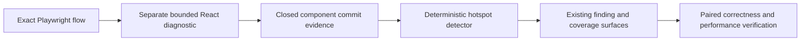

## Context

See [proposal.md](./proposal.md) for motivation. The owned Playwright lane
already performs a separate React diagnostic rerun and retains a closed
`browser_react` projection: commit counts, profiled commit counts, root actual
duration, per-component commit presence and inclusive actual duration, and
bounded static repository ownership when available. The deterministic tool-led
diagnosis currently ignores that projection.

The React pass has observer overhead and current component durations are
inclusive. In the recorded Anime List flow, `QueryProvider`, `RootLayout`, and
other ancestors each retain most of the 17.2 ms root duration because they
contain descendant work. Both chosen-product reports also use one `truncated`
flag for presentation and capture/source bounds. Inclusive ranking plus an
ambiguous completeness flag is not sufficient edit authority.

## Goals / Non-Goals

**Goals:**

- Add bounded derived self-render evidence and explicit source-scan completeness.
- Convert compatible React evidence into one power-law source candidate.
- Fail closed on partial, unprofiled, truncated, ambiguous, or immaterial data.
- Reuse existing finding, diagnosis, performance-lab, CLI, and MCP paths.
- Keep policy deterministic, bounded, machine-readable, and testable.

**Non-Goals:**

- Capture props, state, DOM values, hook values, or raw Fiber graphs.
- Claim why React committed, whether a commit was necessary, or what hook caused it.
- Treat diagnostic duration as authoritative latency or production evidence.
- Automatically edit components or add a twentieth public operation.

## Decisions

### Extend the React evidence contract before deriving a finding

The document hook will retain each named component's derived self duration as
its non-negative inclusive `actualDuration` minus the sum of its direct child
fibers' positive `actualDuration` values for that commit. It will aggregate
total and maximum derived self duration alongside the existing inclusive
values. The evidence labels this explicitly as
`inclusive_minus_direct_child_actual_duration`; it is a bounded diagnostic
derivation, not exact JavaScript self CPU.

The React aggregate contract advances while its normalizer continues to accept
legacy evidence as self-duration-unavailable. Old durable captures remain
inspectable but cannot authorize the new experiment.

The source attribution pass will report whether its admitted directory queue
completed before its 512-file and 4 MiB limits. A partial scan cannot label one
match globally unique. Presentation truncation remains separate: an observed
retained component may still qualify when its own measurement and source scan
are complete, but the finding says a stronger omitted component may exist.

The tool-led browser diagnosis then adds
`browser_react_component_commit_hotspot` over `capsule.browser_react`.

Alternative considered: add a dedicated React MCP tool. Rejected because the
same flow identity, snapshot, finding contract, and verifier already exist; a
new operation would split authority and increase the agent's tool-selection
burden.

### Use fixed conservative materiality floors

The policy adds four public values:

- at least three profiled commits for the exact diagnostic pass;
- component presence in at least three commits;
- at least five milliseconds of derived component self duration; and
- at least 10% of the pass's total root actual duration.

The detector also requires `state: succeeded`, component activity attribution,
positive total duration, derived-duration provenance, complete source
attribution, and one `ownership: repository` source. These floors match
CodeVetter's existing preference for repeated and material evidence while
avoiding a candidate from ordinary one-off mounting or ancestor-only inclusive
time.

Alternative considered: flag every component present in two commits. Rejected
because development behavior, strict checks, boundaries, and ordinary state
transitions make low-count repetition common and unactionable.

### Select only the highest-impact eligible component

Eligible components are ordered by derived self duration, then commit
presence, then repository-relative file, line, and name. Only the first becomes
a finding. This keeps the laboratory's next action power-law focused and avoids
turning one flow into dozens of speculative edits. Other observed components
remain in the existing bounded React summary.

### Make the finding experiment-eligible but inference-limited

The finding uses a new `react_component_commit_hotspot` kind, its unique source
declaration, and the existing source-context candidate identity. It records
`repeated_profiled_react_component_self_work` as the inference mechanism and is
eligible only to inspect or externally edit that bounded source. Its unverified
and limitation fields explicitly withhold redundancy, causality, exclusive CPU,
production frequency, and user-impact claims.

Acceptance still requires the existing exact correctness binding and paired
browser verifier. React improvement alone cannot compensate for a correctness,
latency, loading, or memory regression.

### Preserve detector coverage for every negative state

The detector reports `unavailable` when the React evidence family is absent or
instrumentation failed, `insufficient_evidence` when profiling, completeness,
or unique ownership is missing, and `ran` when complete evidence is below the
fixed floor or yields a finding. The detector is added to the existing coverage
matrix and policy inventory; no silent omission is allowed.

## Risks / Trade-offs

- **A necessary repeated render can cross every floor** → label the result as
  activity, not redundancy, and require correctness plus paired verification.
- **Derived self duration is not exact exclusive CPU** → retain the derivation
  provenance, clamp subtraction at zero, and use it only for candidate
  materiality and ranking.
- **Development or diagnostic overhead can perturb commits** → retain the
  separate clean browser measurement as authoritative and expose provenance.
- **Component names can collide or be minified** → require one bounded static
  declaration; ambiguous or external components remain observations only.
- **One-candidate selection can hide a secondary opportunity** → retain all
  bounded component observations and allow another run after the first
  candidate is excluded or resolved.

## Migration Plan

Advance the React document/aggregate contract with legacy normalization, add
source-scan completeness, then add the finding kind and detector. Update focused
contract, derivation, positive, threshold-edge, and fail-closed tests. Run the
serialized runtime suite and replay one chosen React product flow. The change
adds no dependency and retains no application values or raw Fiber graph.
Rollback removes the detector and new capture fields while the legacy
normalizer keeps prior evidence readable.
