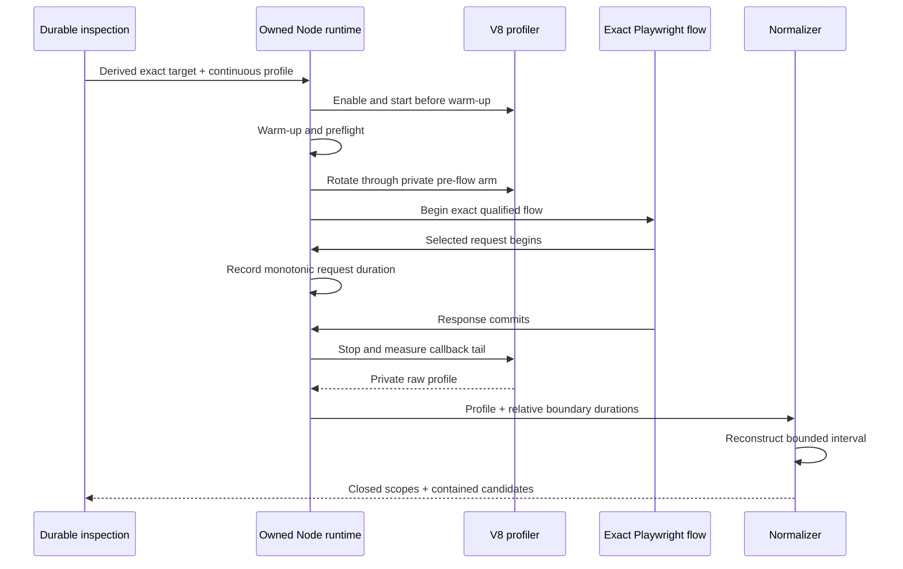

## Context

See `proposal.md` for motivation and
`specs/continuous-main-thread-source-probing/spec.md` for behavior. The existing
exact-request CPU profile starts V8 sampling immediately before handler
dispatch. The RolePatch proof showed that this start operation can dominate the
request. The independent profiler-disabled follow-up then measured material
main-thread CPU but found no GC, compilation, or libuv mechanism above 5 ms.

A temporary `node --cpu-prof` clock experiment also showed that its absolute
profile timestamps and the request's monotonic clock have different origins.
Absolute timestamp alignment is therefore not a safe source boundary.

## Goals / Non-Goals

**Goals:**

- Move profiler startup before framework warm-up and outside the selected
  request.
- Rotate the startup-enabled profiler after owned warm-up and immediately
  before the exact browser flow so cold-build samples cannot inflate stop cost.
- Stop on the exact response-commit boundary while accounting for the
  asynchronous stop tail.
- Retain only bounded, contained, source-mapped repository candidates and
  closed aggregate scopes.
- Integrate the probe into existing inspection, recapture, assessment, and
  three-run stability operations.

**Non-Goals:**

- Whole-process flamegraphs or arbitrary interactive profiling.
- Exact CPU accounting, call-tree causality, automatic edits, or optimization
  claims.
- Production profiling, OS profilers, new dependencies, or caller-controlled
  commands and profiler settings.
- Explaining work below the fixed materiality floors.

## Decisions

### Add a private continuous-source diagnostic profile

The owned runtime gains one closed diagnostic profile selected only by the
derived probe. Its preload enables the main-thread V8 profiler with a fixed
1,000 µs sampling interval and starts it before importing the application.
After owned warm-up and preflight, CodeVetter sends one private loopback arm
request. The preload intercepts that request before application dispatch,
discards the cold-start profile, and immediately restarts sampling before the
exact Playwright flow. This preserves the startup attestation and pre-request
sampling boundary while keeping cold compile samples out of the retained
profile.

The target method, normalized route, and correlation ordinal come from the
integrity-checked upstream receipt. They are passed through private owned
runtime environment values after validation and cannot be supplied by the
CLI/MCP caller.

Alternative considered: `node --cpu-prof`. It has lower integration effort but
does not share an absolute clock origin with request markers and normally stops
only with the process. Slicing it at a request boundary would require an
unsupported clock assumption.

### Stop at commit and reconstruct only relative profile positions

The preload records the selected request's monotonic start and commit duration,
then invokes `Profiler.stop` at commit. It measures the monotonic duration from
commit invocation until the stop callback returns. Normalization computes:

1. cumulative positions from the profile's ordered `timeDeltas`;
2. an estimated commit position equal to profile duration minus measured stop
   tail;
3. an estimated request-start position equal to commit position minus the
   request's monotonic pre-commit duration.

Only samples ending inside that interval are admitted. Absolute profiler and
request timestamps are never compared. The receipt reports uncertainty as the
sampling interval plus measured stop tail; an excessive tail, insufficient
profile duration, malformed delta, or unmatched boundary fails closed.

Alternative considered: subtracting only the request duration from profile end.
That would attribute asynchronous `Profiler.stop` work to the request, repeating
the observer problem in a subtler form.

### Match exactly one request and fail closed on overlap

The preload assigns correlated request ordinals in arrival order, matching the
normalizer's deterministic ordering. Profiling stops only when ordinal, method,
and normalized route all match. Zero matches, multiple matches, a selector
mismatch, or another dynamic request starting before the selected response
commit makes the source evidence incomplete or contaminated.

Redirect targets beginning only after the selected response commits do not
invalidate its pre-commit slice, but whole-request source authority remains
absent. This mirrors the existing boundary-aware overlap policy.

### Normalize a distinct durable contract

A new module reads the bounded private raw profile and emits a closed summary
containing:

- startup and exact-target attestations;
- request duration, profiler stop tail, sampling interval, and boundary
  uncertainty;
- admitted sample count and sampled time;
- closed scope sample/time aggregates;
- at most eight contained repository source candidates;
- completeness, contamination, observer, confidence, and authority fields.

Candidate floors are 5 samples, 5 ms sampled self time, and 10 percent of
admitted non-idle sampled time. These deliberately combine count, duration,
and share so one unusually large delta cannot create a candidate. Source-map
containment reuses the existing repository-frame policy; arbitrary raw identity
never enters a receipt.

Alternative considered: reuse the current request CPU schema. Its provenance
explicitly says the profiler started before handler dispatch and its
whole-request semantics differ, so schema reuse would make incompatible
evidence look comparable.

### Route through existing public operations

`inspect_browser_probe`, `recapture_browser_probe`, the assessment operation,
and the bounded stability scheduler gain one closed probe enum. No twentieth
MCP operation is added. Inspection derives the probe only from the linked
lower-overhead result; recapture derives its owned runtime configuration; and
stability compares normalized file/line routes rather than trusting a caller
label.

Three compatible passing runs are required before reporting a stable source
observation. Even then the output grants no edit or optimization authority; a
separate before/after verification remains necessary.

### Seal and remove private profile evidence

The browser capture finishes all configured diagnostic passes before sealing
the CodeVetter-owned server. The raw profile is bounded to 8 MiB and 100,000
samples, parsed only from the contained private flow directory, normalized,
and removed during mandatory runtime cleanup. Unowned listeners cannot satisfy
the startup or stop-boundary attestations and are never stopped.

## Risks / Trade-offs

- **Continuous sampling adds observer overhead across startup and the flow** →
  Use a fixed 1 ms interval, rotate after warm-up, label evidence sampled and
  low-confidence, and compare only runs with identical instrumentation.
- **Profiler stop latency makes the commit boundary approximate** → Measure the
  tail independently, expose uncertainty, and fail closed above the fixed
  bound.
- **Request ordinal order could diverge from normalized event order** → Retain
  ordinal, method, route, and correlation identity and require all to agree.
- **Framework source maps may resolve to generated or excluded paths** → Keep
  those samples only in closed aggregates and emit no candidate.
- **A dominant leaf frame is not necessarily the causal bottleneck** → Retain
  no causal/edit authority and require a separate verified intervention.
- **Cold profiles can exceed private bounds** → Stop with an explicit
  incomplete reason rather than truncate into a misleading candidate; the
  private pre-flow rotation keeps cold samples out of the retained profile.

## Migration Plan

Add readers and validators before emitting the new receipt version. Then add
owned-runtime capture, normalization, derived inspection, recapture, and
stability support. Reload immediate legacy receipts and run focused fixtures
before one unchanged RolePatch proof. Rollback may stop emitting the new
diagnostic profile while retaining readers for already-created evidence.
