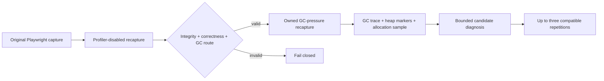

## Context

See `proposal.md` for motivation. Browser probes currently derive their first
follow-up from a durable Playwright receipt. Later routes can be normalized in
a browser-probe recapture receipt, but that receipt cannot become the next
operation's provenance source. The owned Node preload already bounds one
dynamic request, process/thread counters, native trace events, and V8 Inspector
sessions; repository-contained V8 heap-profile normalization also already
exists for whole-workload memory evidence.

## Goals / Non-Goals

**Goals:**

- Preserve a tamper-checked chain from the original Playwright capture through
  the profiler-disabled recapture into the GC-pressure follow-up.
- Capture one request-scoped sampling heap profile while keeping CPU sampling
  profilers disabled.
- Combine only compatible request markers, closed GC trace intervals, heap
  snapshots, allocation samples, and correctness.
- Produce bounded source candidates that an agent can inspect and repeat.

**Non-Goals:**

- Claiming allocation samples equal exact allocated or retained bytes.
- Claiming GC intervals consume equivalent CPU or that one source caused GC.
- Heap snapshots, object-retainer graphs, forced GC, production telemetry,
  browser-heap profiling, automatic patches, or arbitrary profiling flags.
- Executing a performance follow-up from a correctness-failing flow.

## Decisions

### Add an explicit upstream recapture identity

Existing operations keep `capture_id` as the linked Playwright capture and add
an optional `source_recapture_id`. When present, CodeVetter loads the upstream
browser-probe receipt, verifies its hash-linked Playwright receipt and result,
recomputes the normalized route, and requires the supplied capture to be that
receipt's `new_capture`. The new receipt stores both identities and hashes.

Alternative considered: trust the new Playwright capture's general diagnosis.
That diagnosis intentionally follows its own broad detector coverage and does
not preserve the mechanism-specific route normalized by the recapture, so it
cannot prove why GC profiling was selected.

### Use a closed owned-runtime profile

`inspect_gc_pressure` maps privately to `gc_pressure_runtime`. The environment
keeps flow, async, native trace, response, and process/thread evidence; omits
main-thread and Worker CPU sampling; and enables only CodeVetter's bounded heap
sampling marker. Existing unowned listeners cannot satisfy the attestation.
The public caller cannot select the profile or environment.

Alternative considered: reuse the profiler-disabled capture's raw native
trace. That artifact is intentionally deleted with the owned runtime and its
summary contains no allocation callsites. Re-execution is necessary and keeps
the evidence chain explicit.

### Start and stop heap sampling at the exact response boundary

The preload starts V8 allocation sampling immediately before dispatching the
selected dynamic request and requests the final profile at the earliest
response commitment. A bounded private marker records request identity,
monotonic interval, response offset, overlap, heap observations, profile file,
and completion. The collector waits only a small fixed local grace period for
asynchronous profile finalization, then fails closed.

The sample includes objects collected by minor and major GC because allocation
churn is the question. It uses a fixed repository-owned interval and stack
depth. This observer is explicitly distinct from the prior no-sampling GC
corroboration and cannot establish the GC duration of the unobserved program.

Alternative considered: `--heap-prof` across process lifetime. It mixes
startup, warmup, static requests, and the selected flow, weakening attribution.

### Normalize a separate GC-pressure contract

The contract retains only allowlisted GC kinds (`minor`, `major`,
`incremental`, `weak_callbacks`, `other`), counts of trace intervals, union
duration, longest interval, bounded heap deltas, aggregate sampled bytes, and
contained source candidates. It discards trace names, arguments, process and
thread IDs, absolute timestamps, object values, and paths outside the repo.

GC materiality remains the existing fixed 5 ms union floor. A source candidate
must also satisfy the existing heap-sampling byte/share floors. This reuses
calibrated policy instead of inventing a relative winner. One run grants source
inspection only; no run grants edit authority.

### Treat stable diagnosis as a terminal result

For GC-pressure runs, three unanimous passing classifications and leading
source identities produce `diagnosis_stable`, not a fabricated next probe.
The scheduler stops. The candidate can then guide an agent's bounded source
inspection and candidate edit, which must still pass paired correctness and
performance verification.

Historical stability and schedule schemas remain readable. Fresh schemas add
the terminal diagnosis state and upstream source identity without rewriting
old receipts.

## Risks / Trade-offs

- **Heap sampling can perturb allocation and GC behavior** → retain the prior
  profiler-disabled run as selection evidence, label the new run observed, and
  require repetition before escalation.
- **Response commitment can precede later allocations** → describe the scope as
  response-preparation allocation sampling and do not claim full-request or
  retained-memory coverage.
- **Source maps may not resolve generated server bundles** → retain only safely
  contained frames and report unresolved pressure when no candidate qualifies.
- **Private artifact finalization is asynchronous** → use a short bounded retry,
  immutable size limits, and incomplete evidence rather than blocking the run.
- **Development GC differs from production** → make local-runtime provenance and
  the absence of production frequency/impact authority explicit.

## Migration Plan

Add legacy readers before emitting new browser-server, inspection, recapture,
stability, and schedule schemas. Land controlled normalization and preload
tests before enabling the MCP enum. Reload representative historical receipts,
then run one unchanged local qualified flow. Rollback may stop emitting the GC
profile while readers continue accepting already-created receipts.
