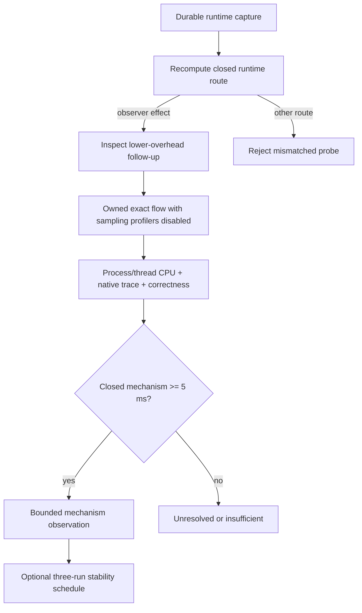

## Context

See `proposal.md` for motivation. The owned Next preload currently starts a V8
CPU profiler immediately before dispatching one selected dynamic request and
stops it at response commitment. It independently records process/thread CPU
counters, response boundaries, async lineage, closed framework phases, and
bounded Node trace events. The real High Signal runtime recapture demonstrated
that inspector sampling can dominate the mechanism summary even though the
independent trace retained GC and compilation intervals.

## Goals / Non-Goals

**Goals:**

- Make the observer-effect route genuinely different instrumentation.
- Prove the V8 and Worker sampling profilers are disabled by a closed owned
  runtime profile.
- Reuse independent bounded evidence already captured by the preload.
- Preserve exact-flow identity, correctness, privacy, durability, and bounded
  repetition.

**Non-Goals:**

- Replacing trace union activity with exact CPU attribution.
- Exposing trace names, IDs, arguments, timestamps, paths, or source values.
- Adding OS profilers, production telemetry, a new dependency, or arbitrary
  execution configuration.
- Implementing the mechanism-specific probes selected by corroboration.

## Decisions

### Select a closed owned-runtime diagnostic profile

The recapture maps `repeat_with_lower_overhead_cpu_measurement` to a private
`profiler_disabled_runtime` startup profile. The owned environment omits the
main-thread and Worker CPU-profiler flag while preserving stream events, async
lineage, native activity, response phases, and process/thread counters. The
caller cannot set or override this profile. An existing unowned listener cannot
satisfy this probe because CodeVetter cannot attest its profiler state.

Alternative considered: change the sampling interval from 100 µs to 1 ms. That
would reduce sampling frequency but would still use the same observer and could
repeat the anomalous first-delta problem. It is not sufficiently independent.

### Derive the follow-up from the durable runtime result

The existing Playwright diagnosis still emits the broad
`inspect_main_thread_runtime` probe. Inspection may accept the next-stage
lower-overhead probe only after loading the integrity-checked result and
recomputing its closed runtime route. This prevents callers from selecting an
arbitrary capture profile.

### Normalize a separate corroboration contract

The recapture receipt adds probe-specific evidence containing:

- profiler state (`main_thread` and `workers` disabled by policy),
- exact pre-commit process and main-thread CPU counters,
- closed GC, compilation, and libuv union activity,
- completeness/contamination state,
- a bounded route with null source and no causal/edit authority.

The contract never merges interval wall time into CPU counters. Routing uses
only complete isolated native union activity. Exact CPU is a materiality and
compatibility guard, not a denominator for trace activity.

### Keep a fixed 5 ms route floor

GC, compilation, or one libuv mechanism must retain at least 5 ms of union
activity. Ties use fixed mechanism order after duration and count. A
sub-threshold maximum remains unresolved. Complete pre-commit main-thread CPU
below 5 ms terminates as insufficient pressure.

### Reuse recapture and stability operations

The existing CLI/MCP recapture, assessment, and scheduler inputs expand their
closed probe enums. Fresh receipts evolve by one version while immediate legacy
versions remain readable. Stability loads the linked exact request and derives
the corroborated route, so comparing the unchanged outer probe cannot produce
false unanimity.

### Seal the owned server before collecting trace evidence

Node may buffer trace-event output until process termination. The browser
capture therefore finishes the primary assertion and all React/memory
diagnostic passes, then asks the owned runtime to stop its server process while
retaining the private flow directory. Only after that seal does it parse
server events and native trace evidence. Final cleanup removes the retained
directory and remains mandatory before a receipt is accepted.

Trace files can exceed the original 16 MiB whole-file memory bound during a
cold Next.js compile. Collection therefore scans a larger but fixed private
file bound incrementally, retains only closed trace categories whose timestamps
touch one of the at-most-eight request markers, and keeps the existing event
and per-event limits. Raw trace objects still never enter a receipt.

The seal callback exists only on an attested CodeVetter-owned runtime. A
repository-declared or otherwise unowned server never exposes that callback and
is never stopped. Failure to seal cannot produce complete native evidence.

## Risks / Trade-offs

- **Trace events remain observers and report elapsed intervals** → Output calls
  them union activity, never CPU, and keeps confidence low.
- **Trace coverage cannot explain every runtime mechanism** → Unexplained exact
  CPU stays unresolved rather than being assigned to application code.
- **Disabling Worker profiling removes Worker CPU detail** → The profiler state
  is explicit; this follow-up answers observer contamination, not Worker
  attribution.
- **An unowned local server may already be running** → The probe requires a
  separately owned alternate loopback runtime or fails closed.
- **Failed browser correctness can still retain mechanism evidence** → Evidence
  remains inspectable but correctness blocks scheduling and follow-up authority.
- **Trace output is buffered until process exit** → The owned server is
  sealed only after every browser pass, then artifacts are parsed before the
  private flow directory is removed.
- **Cold framework compilation produces a large trace file** → A bounded
  streaming scanner avoids loading the file wholesale and retains only events
  that can contribute to an admitted request interval.

## Migration Plan

Add legacy readers before emitting the new receipt form. Enable the derived
inspection route, then the owned profile, normalization, recapture, and
scheduler enum. Reload existing High Signal artifacts before one new unchanged
product run. Rollback may stop emitting the new profile, but readers retain
legacy and already-created receipt support.
