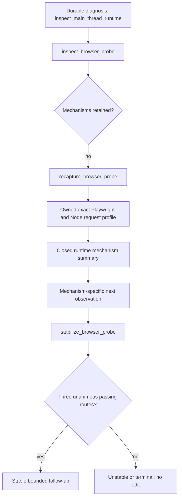

## Context

The owned Node preload already records one bounded V8 CPU profile around the
exact dynamic request and response-commit boundary. Normalization retains
repository candidates and broad repository/dependency/generated/runtime/idle
scope totals, but intentionally discards raw non-repository frame identity. The
new capability must extract useful runtime structure without relaxing that
privacy boundary or invalidating existing durable artifacts.

## Goals / Non-Goals

**Goals:**

- Reuse the existing request-scoped profiler rather than start a second
  overlapping profiler.
- Publish only fixed mechanism names and aggregate sampled timing.
- Make the already-emitted `inspect_main_thread_runtime` probe executable.
- Compare the narrowed mechanism route across bounded repetitions.
- Keep older captures and probe receipts usable.
- Distinguish overlap before response commitment from redirect or navigation
  work that begins only after the latency-relevant response boundary.

**Non-Goals:**

- Exposing Node/V8 raw frame names, URLs, call trees, engine versions, or source
  snippets.
- Treating samples as exact CPU, attributing runtime work to source, or
  recommending an edit.
- Implementing every mechanism-specific follow-up in this change.
- Production capture, record/replay, or cloud execution.

## Decisions

### Classify during private profile normalization

Runtime mechanisms are derived while the temporary raw profile is available.
Only a closed aggregate enters the public request CPU summary. Unknown frames
fall into `other_runtime`; no raw fallback string survives. Classification uses
fixed URL/function patterns with explicit precedence and never evaluates
application code.

Alternative considered: persist raw profiles for later agent queries. That
would increase sensitive data retention, receipt size, and tool complexity and
is unnecessary for the first power-law mechanism split.

### Keep whole-request and pre-commit views separate

The summary retains aggregate mechanisms for the whole sampled request and for
the exact pre-commit slice. Routing uses only the complete isolated pre-commit
view because post-commit cleanup cannot explain response latency. Sampled time
remains separate from exact current-thread and process CPU counters.

### Split whole-request and pre-commit overlap authority

The preload records both every dynamic request that overlaps the profiler and
the subset that begins before the profiled response commits. A profile with any
pre-commit overlap remains entirely contaminated. When overlap begins only
after commitment, normalization keeps the whole-request state contaminated,
emits no whole-request source candidates, and admits only the bounded
pre-commit mechanism view. The later request can therefore neither contribute
to the retained latency slice nor gain source or edit authority.

Legacy raw profiles expose only the whole-request count. They conservatively
treat every overlap as pre-commit overlap rather than inferring a missing
boundary. The normalized schema likewise accepts older durable summaries
without fabricating the new count.

### Use a fixed dominance floor

A mechanism must contribute at least 5 ms and 20% of pre-commit runtime sampled
time. `inspector` is eligible only for an observer-effect route. Ties use a
fixed mechanism order after sampled time and sample count. Sub-threshold
evidence stays unresolved.

### Evolve public contracts with legacy readers

Fresh request CPU summaries add a versioned runtime-mechanism object. Browser
server-flow and Playwright diagnosis versions advance for new output, while
validators admit their immediately preceding durable forms. Existing inventory
probe receipts remain valid. New recapture receipts add a probe-specific
runtime-mechanism inventory only when the source probe is
`inspect_main_thread_runtime`.

### Reuse existing operations rather than add parallel APIs

The CLI and MCP recapture schemas use an enum of executable probes. The
scheduler accepts the same enum and derives runtime routes from the new
mechanism summary, preventing trivially unanimous comparison of the unchanged
outer probe name.

When runtime mechanisms exist only in a newly executed recapture, the
profiler-disabled follow-up binds the upstream receipt hash, exact request
identity, selected route, and passing correctness. This mirrors the existing
profiler-disabled-to-GC chain and avoids requiring the older source capture to
contain evidence that did not exist when it was recorded.

## Risks / Trade-offs

- **Node/V8 frame labels change between versions** → Unknown identities fall
  into `other_runtime`; controlled fixtures cover every admitted pattern and
  real output remains low-confidence.
- **Profiler overhead appears as runtime work** → `inspector` has a dedicated
  non-application route and can never select a source edit.
- **Same raw profiler, richer normalization** → The probe is distinct in
  retained evidence, not profiler technology; the receipt states this
  limitation explicitly.
- **A redirect starts after headers but before response completion** → Only
  samples at or before the recorded commitment boundary are admitted; the
  whole-request profile remains contaminated and cannot produce candidates.
- **Contract evolution can strand older evidence** → Legacy schemas remain
  accepted and are exercised against the existing High Signal receipts.
- **A mechanism still may be framework work rather than application work** →
  Output authorizes only another observation, never causality or optimization.

## Migration Plan

Land normalization and legacy validation first, then enable the recapture and
scheduler enum. Verify legacy High Signal inspection/stability before producing
one fresh runtime-mechanism recapture. Rollback may stop emitting the new
schema, but readers should retain legacy acceptance so already-created local
receipts remain inspectable.
