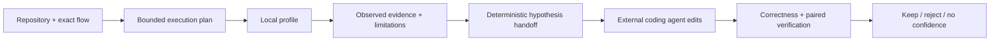

## Context

See [proposal.md](./proposal.md) for motivation. The desktop currently mounts Usage, Repo, Work/Board, Review, Testing, and Settings as persistent lazy routes. The performance laboratory is implemented as repository-owned Node CLI/MCP operations with closed schemas, local process governance, runtime-specific adapters, campaign ledgers, and portable receipts; no Tauri or React integration exists. Work and Board share a large `AgentPanel` route and local SQLite/backend lifecycle code.

## Goals / Non-Goals

**Goals:**

- Make the shell communicate five focused product responsibilities.
- Provide one operable vertical slice from repository selection through a bounded performance plan, profile, diagnosis, and receipt.
- Preserve identical performance semantics across desktop, CLI, and MCP.
- Remove Work/Board product presentation without destructive data migration or a giant backend deletion.

**Non-Goals:**

- Embed a general coding agent, task tracker, terminal, GitHub replacement, or source editor in Performance.
- Contact production, install dependencies, add cloud execution, or infer credentials.
- Delete historical work items, conversations, managed worktrees, or provider configuration in this change.
- Rebuild the performance engine in Rust or create a desktop-only verdict implementation.

## Decisions

### 1. Performance is outside Testing

Performance receives its own `/performance` destination because it is an iterative measurement and improvement workflow, not merely a pass/fail test stage. Review and Testing remain the correctness surfaces that Performance composes into candidate promotion.

Alternative: a Testing sub-tab. Rejected because it hides a core product pillar and makes campaign iteration look like another test receipt.

### 2. Work and Board routes redirect; data is retained

The shell, command palette, shortcuts, onboarding, documentation, and persistent route registry stop exposing Work/Board. `/agents` and `/board` redirect to Usage for stable legacy behavior. Existing backend commands, SQLite tables, and historical data remain intact until a dependency/orphan audit can remove code without losing user state.

Alternative: delete the entire AgentPanel/backend stack now. Rejected because it creates a high-risk, high-churn diff and could destroy access to historical local data before an export decision.

### 3. The desktop bridge wraps existing closed operations

A narrow Tauri command accepts structured operation and typed scope fields, resolves the packaged runtime entry point, spawns the user's required local runtime with separated arguments, streams sanitized bounded progress, and parses exactly one validated JSON result. The bridge never accepts a shell command or arbitrary argument list.

The first implementation supports planning, direct profiling/diagnosis, run inspection, and paired verification. Campaign ledger views compose the same service incrementally after the direct vertical slice is stable.

Alternative: port the Node engine into Rust. Rejected because it would duplicate contracts and create semantic drift. Alternative: make the React page invoke an MCP subprocess directly. Rejected because process ownership, resource resolution, cleanup, and redaction belong in the Tauri backend.

### 4. Performance UI is evidence-first, not chat-first

The page uses a stable sequence:

The UI separates observed measurements, inferred bottleneck candidates, and unverified hypotheses. It shows one next action and a chronological candidate ledger rather than a chat transcript.

### 5. Preserve-lane visual implementation

The shell keeps CodeVetter's existing ink canvas, amber primary action, semantic status colors, typography, density, navigation geometry, focus behavior, and persistent-route model. Performance uses existing panels, controls, evidence labels, and receipt patterns; no new visual language or decorative dashboard treatment is introduced.

### 6. Intent scope resolves before execution

Testing and Performance share three user-facing intake modes: a function or flow described in human language, a pull request/change, or the entire codebase. These are discovery inputs, not executable commands. A local resolver converts the input into one or more explicit adapters, targets, workloads, repository identities, and coverage limitations. The user sees and confirms that plan before CodeVetter starts a test or profile.

Whole-codebase intake is a bounded discovery pass, not a claim that every behavior was exercised. Pull-request intake is bound to an exact change identity. Human-language intake preserves the original phrase in the receipt while recording which concrete flow CodeVetter resolved.

### 7. Navigation does not advertise mnemonic chords

The fixed rail and command search show destination names without `G H`, `G F`, or similar key badges. The custom global `g` chord handler is removed. Familiar platform commands such as command search can remain functional without adding shortcut chrome to every row.

## Risks / Trade-offs

- **Packaged Node entry point may drift from the repo script graph** → Add a build-time resource manifest and a Tauri integration fixture that resolves and runs the packaged CLI contract.
- **Local runtimes are not installed** → Qualify tools before execution and render actionable missing-runtime diagnostics; never auto-install.
- **Long profiles could leave owned processes behind** → Reuse supervision receipts, cancellation, timeout, and owned-process cleanup; expose cleanup state in the UI.
- **Legacy Work/Board links lose context** → Use deterministic redirects, preserve stored data, and document the compatibility period.
- **A large Performance page could become another dashboard** → Ship one direct-profile vertical slice first, keep one next action, and defer secondary visualizations until they have real evidence.
- **Existing active OpenSpec changes touch the same navigation tests** → Reconcile `make-verification-obvious` before implementation and avoid claiming both changes complete while their route expectations conflict.

## Migration Plan

1. Reconcile active navigation expectations and capture a before-state receipt.
2. Add Performance route/bridge behind the existing browser/Tauri availability guards.
3. Remove Work/Board entries and add legacy redirects while leaving data and backend commands intact.
4. Qualify direct profile and no-runtime/unsafe-scope states in browser and Tauri.
5. Enable campaign state rendering only after direct receipts match CLI/MCP byte-for-byte where deterministic.
6. After a release proves no required callers remain, open a separate guarded cleanup for orphaned Work/Board UI and backend code.

Rollback restores navigation and route registration; retained data requires no reverse migration.
