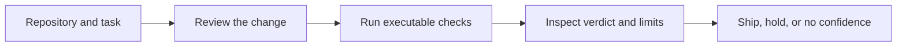

## Context

See [proposal.md](./proposal.md) for motivation. The desktop already has a
coherent ink-and-amber system, accessible route persistence, a Review surface
for changed-code findings and verification commands, and a Testing surface for
runtime receipts. The problem is their presentation as peer features rather
than parts of one workflow. The implementation must preserve all current
routes, local data, keyboard shortcuts, and long-running mounted state.

The existing `compare-code-context-providers` change is a synthetic and
provider-comparison experiment. The real shipping-decision pilot in this change
is separate: it dogfoods CodeVetter on current CodeVetter changes and cannot be
used to claim provider superiority or general product value.

## Goals / Non-Goals

**Goals:**

- Make checking an agent-authored change the most noticeable action in the
  existing broad workbench.
- Teach one truthful sequence across the shell, Home, onboarding, Review,
  Testing, and command palette.
- Put outcome, evidence gaps, and next action ahead of optional diagnostics.
- Produce three real dogfood cases whose verdicts control actual work.

**Non-Goals:**

- Removing, merging, or rerouting Usage, Repo Unpack, Work, Board, Review,
  Testing, or Settings.
- Creating a new verification route, receipt schema, database table, provider
  integration, hosted service, or public gallery.
- Claiming that Review alone verifies a change or that three dogfood cases
  validate CodeVetter as a product.
- Running, publishing, committing, releasing, or deploying the three cases
  without the separately required approvals.

## Decisions

### 1. Preserve breadth, introduce visual priority

Add a persistent `Check a change` action near the top of the existing
navigation and a matching verification spotlight before Usage telemetry on
Home. Keep the seven destinations and their shortcuts. This creates an obvious
entrance without a hard information-architecture reset.

Alternative considered: replace the navigation with Verify, Runs,
Experiments, and Settings. Rejected because the owner selected a broad
workbench and a polish pass rather than a product cut.

### 2. Present Review and Testing as stages, not synonyms

Review remains the first desktop stage because it already selects the
repository change, captures task intent, finds risks, suggests verification
commands, and links to evidence. Testing remains the runtime-evidence surface.
Copy and stage cues will explain their relationship, while keeping their routes
and implementations intact.

Alternative considered: merge both pages immediately. Rejected because it
would be a redesign, introduce substantial state ownership risk, and exceed the
selected polish scope.

### 3. Use existing components and one warm action voice

The spotlight, CTA, stage cues, and result summary will use existing Button,
Badge, panel, focus, spacing, and semantic-state patterns. Amber remains reserved
for the primary action or active verification context. No new visual metaphor,
animation system, or dependency is introduced.

Alternative considered: add a new dashboard visualization of the workflow.
Rejected because a static process graphic would add another surface instead of
improving task completion.

### 4. Dogfood three different failure boundaries

The pilot uses real agent-authored changes already on the roadmap. Each case
must pin a task statement, acceptance checks, exact Git base/head, environment,
CodeVetter version, evidence identities, limitations, and one decision owner.
Each outcome is `ship`, `hold`, or `no_confidence`; missing evidence cannot
silently become a pass.

| Case | Real change | Primary boundary | Decision controlled |
|---|---|---|---|
| A | Stage 0 context-provider contracts and planning | Node contracts, schemas, deterministic CLI output | Whether Stage 0 is ready for review/merge |
| B | Verification-discoverability UI polish | Desktop/browser workflow, accessibility, copy honesty | Whether the polish enters the next desktop release |
| C | First provider isolation and contamination adapter | Process, workspace, tool identity, cleanup | Whether any Stage 1 provider trial may start |

The cases deliberately cover contract, UI, and subprocess/isolation behavior.
They are private dogfood unless independently adjudicated and promoted under
the Agent PR X-Ray rules.

### 5. Record decisions beside immutable evidence

Each case will use the existing receipt/X-Ray formats where the workflow
supports them. A small private pilot ledger under the already ignored
`.codevetter/verify-artifacts/pilot/` root will link the task, Git identities,
check evidence, outcome, decision, and follow-up. The ledger summarizes;
receipts remain authoritative.

Alternative considered: add a new pilot database model. Rejected because three
cases do not justify a product data-model expansion.

## Risks / Trade-offs

- **The CTA overpromises because Review begins with model analysis** → Name the
  whole workflow, explicitly label findings as leads, and show runtime evidence
  as a separate required stage.
- **Additive polish increases rather than reduces Home density** → Keep the
  spotlight compact, place it before telemetry, and avoid new metrics or charts.
- **Old and new terminology drift across large pages** → Define one copy set in
  the spec, search all affected surfaces, and add focused UI assertions.
- **Three self-authored cases bias the evidence** → Label them dogfood, retain
  failures and missing proof, and use them only to govern their named shipping
  decisions.
- **A dirty worktree cannot provide immutable case identity** → Execute a case
  only after its exact reviewable Git range exists; planning never authorizes a
  commit or push.

## Migration Plan

1. Update the shell, Home, onboarding, Review, Testing, and command-palette copy
   without changing routes or persistence.
2. Run focused frontend checks, then desktop visual qualification at the
   representative states required by `desktop-visual-system`.
3. Roll back by removing the additive spotlight/stage cues and restoring copy;
   no stored data or backend migration is involved.
4. After exact Git ranges exist, execute cases A, B, and C independently. A
   failed or no-confidence case blocks only its named decision and records the
   next required action.
