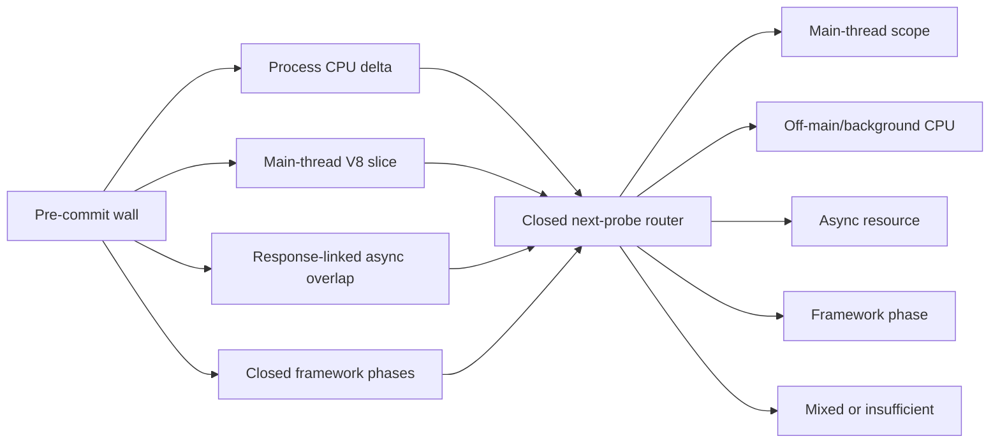

## Context

The owned request profiler already starts before handler dispatch and emits V8
`samples` plus `timeDeltas`; the response lifecycle now provides an exact
commit offset on the same request. The High Signal replay retained 524.729 ms
of process CPU during a 1,225.79 ms pre-commit interval, while its full request
profile was mostly idle and had no repository frames. Browser captures already
persist normalized results even when the selected assertion fails.

## Goals / Non-Goals

**Goals:**

- Reuse one capture to choose the next supported diagnostic probe.
- Keep timing domains explicit and fail closed on incomplete alignment.
- Preserve failed-flow diagnosis without converting failure into success.

**Non-Goals:**

- Worker CPU profiling in this slice, exclusive CPU accounting, causal wait
  attribution, source edits, passing correctness, or production equivalence.

## Decisions

### Slice V8 samples by cumulative `timeDeltas`

The normalizer walks samples in recorded order and includes a sample in the
pre-commit slice only while its cumulative profile time is at or before the
rounded response commitment. Raw timestamps, nodes, URLs, and sample IDs remain
private. The profile document gains the observed commitment offset so the
normalizer does not infer it from a second artifact.

Alternative: slice later while joining browser-server evidence. Rejected
because raw profiles are private and should remain confined to their existing
normalization boundary.

### Route from non-additive observations

The router compares, but never sums as exclusive work:

Fixed route precedence is: explain material process CPU with non-idle
main-thread activity; otherwise route material unexplained process CPU to an
off-main/background probe; with low process CPU, prefer complete material
response-linked async delay; then a complete material framework phase; else
mixed or insufficient. Every route is low-confidence and edit-ineligible.

### Separate diagnostic completion from test success

A capture is diagnostically complete when its receipt has a validated result,
unchanged subject identity, verified server attestation, and structured
diagnosis—even when `state` is `failed`. Coverage records this as
`failure_diagnosed`; only `succeeded` remains correctness-passing browser
evidence. The lab inspects the persisted result rather than launching another
runtime.

Alternative: count all failed receipts. Rejected because operational failures,
source mutation, and missing results contain no trustworthy diagnosis.

## Risks / Trade-offs

- **V8 sampled time is not exact CPU time** → Preserve sample provenance and
  compare only with broad fixed thresholds.
- **Process CPU includes other threads/background work** → Name the route
  off-main-thread-or-background, never worker causation.
- **Async intervals overlap CPU and one another** → Never add observations as
  exclusive decomposition.
- **Failed-flow diagnosis can be mistaken for performance authority** → Keep
  zero edit eligibility and make failed correctness explicit in every route.
- **Old evidence lacks the new fields** → Normalize to an explicit unavailable
  route and retain existing capture status.

## Migration Plan

Rev private CPU profile, request CPU, browser-server, Playwright diagnosis and
capture, performance coverage, and laboratory receipt schemas together. Stored
evidence is never rewritten. No database or external migration is required.
