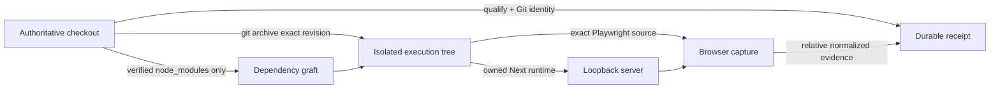

## Context

The current owned Next.js runtime deliberately blocks a checkout containing loadable `.env*` files. Existing clean-incumbent support can materialize and fingerprint an exact `git archive`, verify safe dependency grafts, and dispose its owned directory, but the browser path currently assumes one repository root for Git identity, evidence storage, source analysis, dependency lookup, and execution.

See `proposal.md` for motivation and `specs/clean-snapshot-browser-runtime/spec.md` for the behavior contract.

## Goals / Non-Goals

**Goals:**

- Preserve the original checkout as the authority for qualification, Git identity, and durable evidence.
- Execute server and Playwright test source only from an immutable archive of the exact committed revision.
- Reuse existing dependency payload without a package install or network access.
- Make snapshot provenance and cleanup observable without leaking absolute paths.
- Keep all existing browser profiling passes and diagnostic continuation available.

**Non-Goals:**

- Profiling dirty or staged source through this mode.
- Copying ignored files, repository configuration, caches, or build output.
- Creating a general sandbox, package manager, production runner, or new MCP operation.
- Claiming production equivalence from a local development runtime.

## Decisions

### Use a Git archive, not a detached worktree

The existing bounded archive materializer already rejects symlinks, gitlinks, oversized files, and inventory mismatch. Browser mode extends it with exact Git pathspec exclusions for paths already classified as sensitive: those blobs are never extracted or read, and the receipt retains only the exclusion count and a digest of sorted filenames. Reusing this path avoids adding mutable Git metadata and makes exclusion of ignored and sensitive files structural.

Alternative considered: a detached `git worktree`. It would make existing Git-aware functions work unchanged, but introduces repository metadata and worktree registration/cleanup state that are unnecessary for an execution snapshot.

### Separate authority, execution, dependency, and evidence roots

The orchestration layer carries a private clean-snapshot context:

Browser functions receive the authoritative qualification/subject through an internal context, use the isolated root for package/test resolution, process working directories, source maps, and profiles, and use the authoritative root only for source-drift checks and evidence persistence. Runtime executables resolve from the verified dependency root because their real paths intentionally live outside the archive.

Alternative considered: temporarily copying evidence out of a self-contained snapshot. That creates a second persistence protocol and risks losing terminal failure evidence during cleanup.

### Make the mode an automatic fail-closed fallback

The performance lab first attempts the normal owned runtime. It invokes clean-snapshot mode only for a statically qualified local Next.js flow that stopped specifically at `environment_blocked`, and only when the qualification says the authoritative source is clean. Other failure states keep their current meaning.

Alternative considered: a caller-controlled public flag. A private fallback provides the intended safety improvement without expanding the agent-facing API or allowing arbitrary roots.

Cold clean snapshots intentionally have no framework build cache. Next preflight therefore uses the caller's remaining runtime deadline up to 60 seconds, rather than the previous fixed 10-second ceiling; the default caller deadline still limits ordinary runs, and the two request observations share one deadline and retain no response body. Listener readiness remains separately capped at 30 seconds, while reported total startup may retain up to 90 seconds so cold compilation is not silently truncated. It follows at most three query-free same-origin redirects because exact browser navigation does the same, while refusing cross-origin, credentialed, cyclic, query-bearing, or excessive redirect chains.

### Attest the dependency graft without publishing paths

The materializer records each relative graft location plus stable filesystem identity for mutation checks. The public receipt exposes only the execution mode, graft count, sorted relative graft names, a SHA-256 attestation derived from bounded non-secret metadata, and the count/digest of excluded sensitive filenames. Absolute paths, sensitive filenames, file contents, and package contents are omitted.

### Cleanup participates in validity

The wrapper owns materialization, runtime stop, removal of the two exact framework-owned output roots (`.codevetter` and `.next`), immutable-tree verification, and disposal. Either output root must be a direct non-symlink child of the isolated tree; writes anywhere else remain source mutation. A measurement is not accepted until all stages complete. Cleanup failures replace the candidate measurement with a terminal operational failure; they are not appended as soft limitations.

## Risks / Trade-offs

- [Installed dependencies may have been built for a different source revision] → Limit the mode to the current clean revision and attest dependency identities; disclose that reused local dependencies are not a hermetic install.
- [Framework caches may write through dependency symlinks] → Reject workspace-source links, fingerprint source separately, verify graft identities, and do not treat dependency contents as immutable package proof.
- [Build output modifies the isolated source tree] → Remove only direct non-symlink `.codevetter` and `.next` output roots, verify the remaining materialized tree while excluding dependency grafts, and reject every other change.
- [Refactoring root semantics can weaken containment] → Add focused adversarial tests for every root boundary and keep the clean context private to the orchestrator.
- [Local Next development timing differs from production] → Preserve the existing limitation and make snapshot mode an additional provenance fact, not stronger impact evidence.

## Migration Plan

Add the fallback behind existing performance-lab orchestration with no schema-breaking public input. Existing receipts remain valid; new receipts may include optional clean-snapshot provenance. Rollback removes the fallback and optional provenance while leaving normal runtime behavior unchanged.
