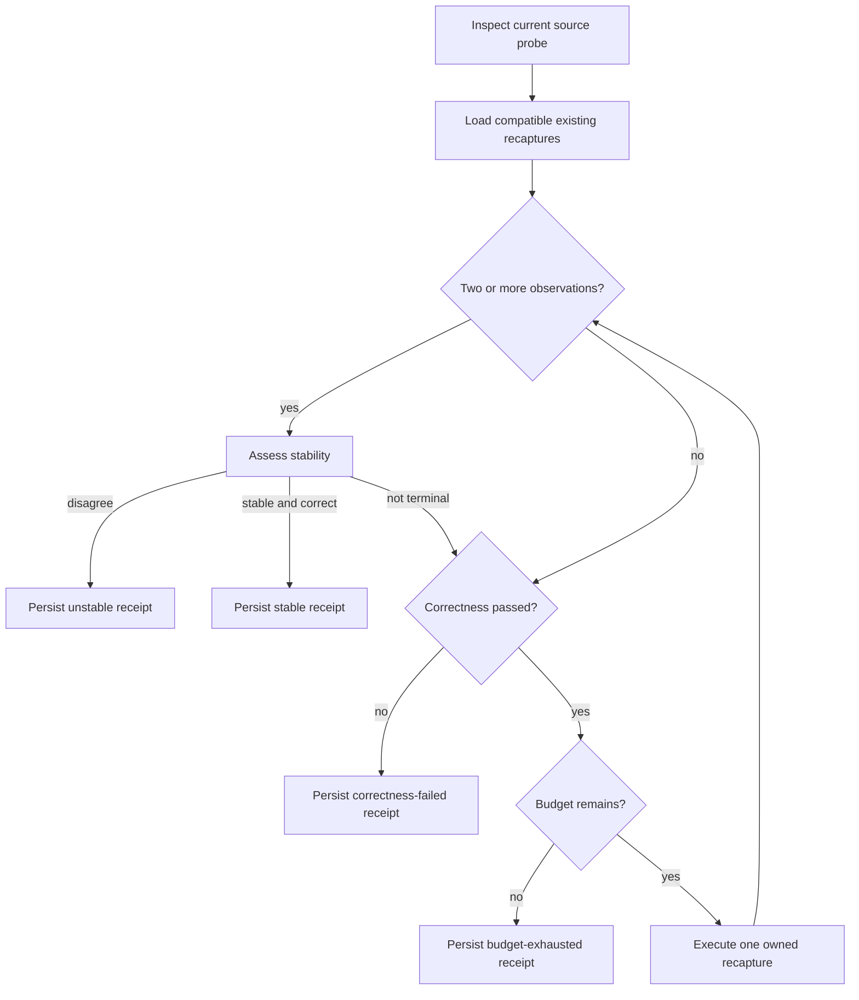

## Context

The existing recapture operation owns one exact local Playwright execution and
persists its evidence. The stability assessor is read-only, admits two to five
compatible recaptures, and requires three unanimous routes. The missing layer
is a budget owner between those two capabilities. See `proposal.md` and the
`browser-probe-stability-scheduling` specification.

## Goals / Non-Goals

**Goals:**

- Turn repeated probe acquisition into one bounded agent operation.
- Reuse integrity-checked evidence before spending local CPU, memory, or time.
- Make every stop reason and unit of consumed budget machine-readable.
- Preserve all recapture and stability authority boundaries.

**Non-Goals:**

- Parallel execution, adaptive statistical sampling, production capture, or
  cloud scheduling.
- Choosing or applying a source edit.
- Making unsupported probe families executable.
- Weakening the unanimous-three stability rule.

## Decisions

### One sequential schedule owns at most three total observations

The scheduler admits zero to three existing recapture IDs and zero to three new
runs, but the combined inventory never exceeds three. Three is sufficient for
the current stability contract; a fourth run cannot improve an already
unanimous result and must not erase a contradiction through majority voting.
Sequential execution makes cleanup and cost accounting unambiguous.

Alternative considered: allow the stability assessor's five-run maximum. That
is useful for read-only external comparisons but unnecessary and costly for an
autonomous scheduler whose decision is terminal at the first disagreement.

### Existing evidence is validated before any execution

Every existing probe receipt and linked Playwright receipt/result is loaded
through the existing integrity path. A current source-probe inspection binds
the requested source capture and snapshot. Any incompatible or unsafe seed
rejects the schedule before a recapture begins.

### Terminal checks run after each available observation

Route disagreement is evaluated before failed correctness when at least two
observations exist, because it is a stronger measurement-quality result and
still grants no follow-up. Otherwise failed correctness prevents additional
performance spending. Incomplete, stale, or operational outcomes terminate
immediately.

### New IDs are derived, not caller-controlled

The caller names a bounded schedule ID. New recaptures use
`<schedule-id>-r<ordinal>`, where ordinal counts the combined observation slot.
This prevents arbitrary output paths and makes retries collide safely instead
of overwriting evidence.

### The schedule receipt is terminal and atomically written

The fixed location is
`.codevetter/browser-probe-stability-schedules/<schedule-id>/receipt.json`.
The scheduler records compact recapture references and hashes rather than
duplicating full Playwright artifacts. The final normalized assessment may be
embedded because it is already bounded to three compact runs. Receipt files are
written through a contained temporary file and renamed after the source
snapshot is rechecked.

Alternative considered: return only an ephemeral orchestration result. That
would prevent later agents from auditing cost and stop reasons and would weaken
the product's evidence-first model.

## Risks / Trade-offs

- **A single failed correctness run can stop before measuring stability** → This
  intentionally saves local cost; users can still supply separately captured
  durable repetitions to the read-only assessor.
- **Development-runtime variance can cause early instability** → The scheduler
  exposes disagreement instead of attempting to smooth it away.
- **A crash before terminal persistence leaves child receipts without a schedule
  receipt** → Derived IDs remain durable and collision-safe; a future resume
  feature can adopt them only after integrity validation.
- **Three observations are not a statistical performance study** → The result
  remains low-confidence, local-only, non-causal, and edit-ineligible.

## Migration Plan

The capability is additive. Land the scheduler, CLI/MCP definitions, package
script, tests, docs, and proof together. Rollback removes the new surfaces and
schedule receipts without changing existing capture or recapture formats.
